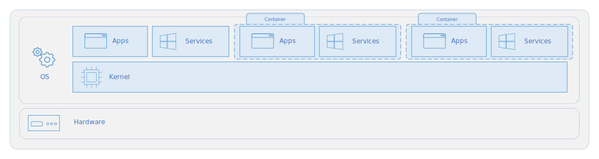
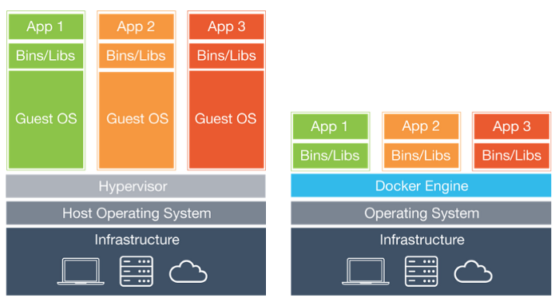
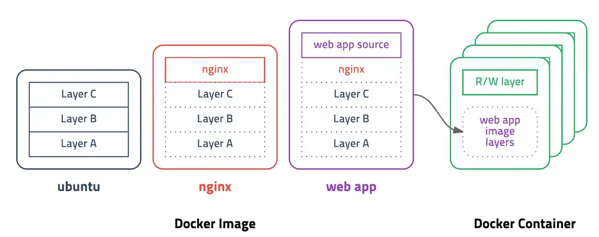

# 도커

## 도커란 무엇인가

- 컨테이너 기반의 오픈소스 가상화 플랫폼
- 다양한 프로그램, 실행환경을 컨테이너로 추상화하고 동일한 인터페이스를 제공 -> 프로그램의 배포 및 관리 단순화
- Local PC, AWS, Azure 등 어디서든 실행할 수 있다.
- Image : 컨테이너 실행에 필요한 파일과 설정값들을 포함하고 있는 것
- Image를 갖고 있으면 실행하기 위한 모든 정보를 갖고 있는 것 -> 이것저것 설치하고 컴파일 할 필요가 없다.

가상화? 가상화는 VM을 사용해봤다면 많이 들어봤을 얘기이다.

그리고 컨테이너는 또 뭐지? 이에 대해서 가상 머신과 비교해보면서 알아보자.

## Container VS VM

### Container Architecture

- 컨테이너는 격리된 공간에서 프로세스가 동작하는 기술
- 그림처럼 Host 운영 체제의 커널 위에서 빌드 된다.

### VM Architecture

- 컨테이너와 달리, 가상 머신은 자체 커널을 포함한 완전한 운영체제를 실행한다.

### vs Docker

이번엔 도커 컨테이너와 비교 해보자.

- VM은 Hypervisor가 가상화를 하여, 가상 하드웨어 위에 Guest OS가 운영을 하는 방식
- Container는 Docker-engine 위에 Application 실행을 위해 필요한 Binary만 올라간다.
- 커널 부분은 호스트의 커널 부분을 공유한다. -> 공간 절약, IO 처리가 굉장히 쉬워짐

### 그럼 두개가 뭐가 다른 거야?

- 용량도 엄청 작고, 가상 머신과 비교도 안되게 빠르다.
- 서로 다른 배포에서 환경을 동일하게 만들 수 있다.
- 컨테이너는 리소스가 더 적다 -> 쉽고 빠르게 배포 가능하며, 밀도가 높아지고, 동일한 하드웨어 장치에서 더 많은 서비스를 실행할 수 있으며 비용이 절감된다. -> MSA에 적합

### 장점만 있나?

- 컨테이너는 동일한 커널에서 실행되므로 VM보다 격리성은 떨어진다.(한 컨테이너가 뚫리면 같은 커널을 공유하므로 줄줄이 영향을 받을 것)

- Host OS와 전혀 다른 OS를 Container로 올릴 수 없다. -> OS 선택에 제약이 있음(도커는 리눅스에서 실행되는 것이 기본이며, MacOS 개발자는 Linux Container용 이미지만 만들 수 있다. Windows Container용 이미지 못만듦)

### 또 하나의 미친 기능

도커 이미지는 위에 설명했듯이 컨테이너 실행을 위한 모든 정보를 갖고 있으므로, 용량이 수백메가 정도 된다. 만약, 기존 이미지에 파일 하나 추가하는 경우에, 수백 메가의 이미지를 다시 받는 것은 굉장히 비효율 적일 것이다.

이 문제를 해결하기 위해 `Layer` 라는 개념을 사용하고, 유니온 파일 시스템을 이용하여 여러 개의 레이어을 하나의 파일 시스템으로 사용할 수 있게 해준다고 한다.

이게 무슨 얘기냐면, 예를 들어보자

- `ubuntu Image` : Layer A + B + C
- `ubuntu base Nginx Image` : Layer A + B + C + Nginx
- `nginx base webapp` : Layer A + B + C + Nginx + source

여기서 webapp 소스를 수정했을 때, 이 개념이 없다면, `Layer A + B + C + Nginx + source(v2)` 를 다시 다운 받아야 한다. 이게 얹어지면 용량이 엄청나게 커지고 비효율적이겠지?

근데 이 Layer 개념을 사용하면, `Layer A + B + C + Nginx` 는 제외하고 source layer를 soruce(v2) layer만 바꿔서 다운 받으면 된다. 굉장히 효율적으로 이미지를 관리할 수 있다.(미쳤다)

# Reference

[도커 공식문서](https://docs.docker.com/get-started/overview/)

[마이크로소포트 도커란 무엇인가요?](https://docs.microsoft.com/ko-kr/dotnet/architecture/microservices/container-docker-introduction/docker-defined)

[마이크로소프트 컨테이너와 가상 머신 비교](https://docs.microsoft.com/ko-kr/virtualization/windowscontainers/about/containers-vs-vm)

[도커란 무엇인가](https://www.redhat.com/ko/topics/containers/what-is-docker)
