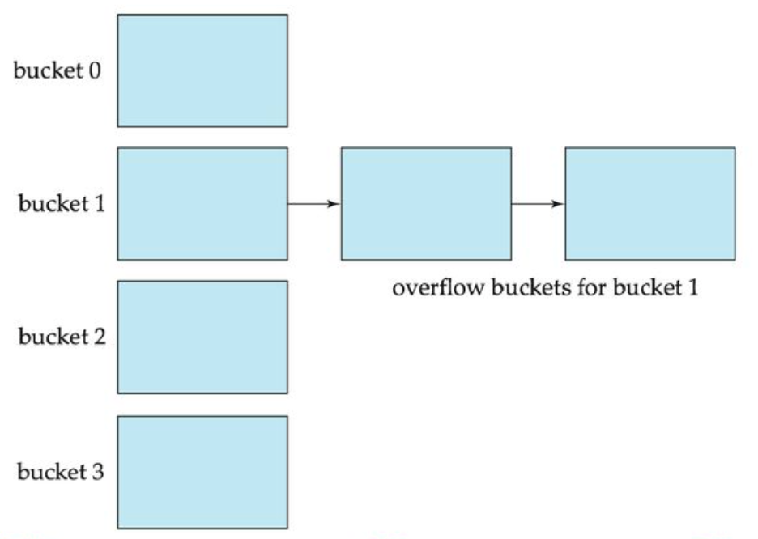
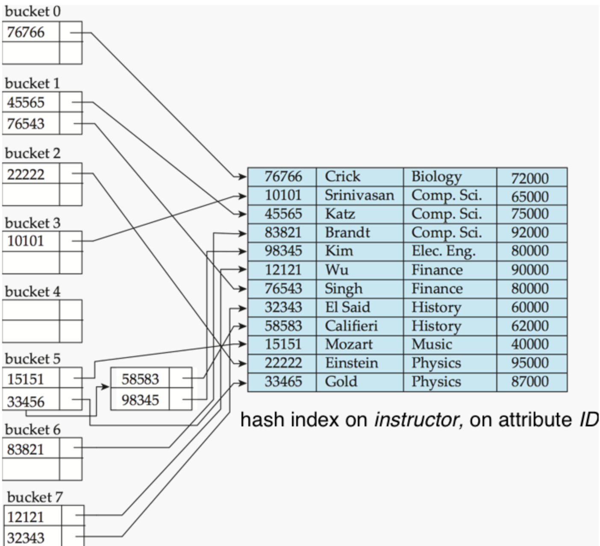
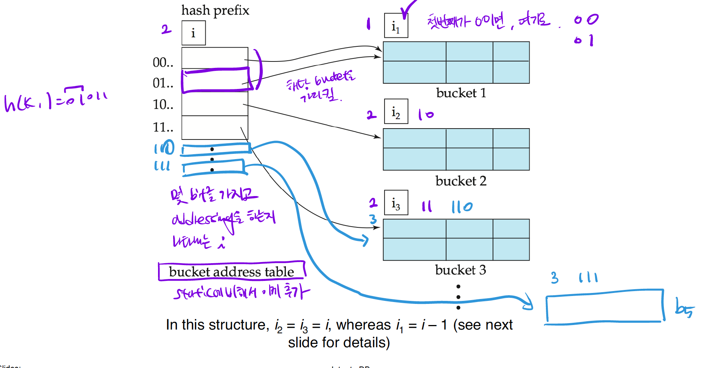

<!-- @format -->

# Static Hashing

## Basic Concepts

- h(Music) = 1
- h(History) = 2
- h(Physics) = 3
- h(Elec. Eng.) = 3
- h(Finance) = 4
- h(Biology) = 5
- h(Comp. Sci) = 6

### bucket

레코드들을 저장할 수 있는 저장공간이다.

`bucket`의 사이즈는 disk의 block의 크기와 같게 하는 것이 효율적이다.

> disk에서 block 크기만큼 메모리에 갖고오기 때문에, 하나의 buc이et이 2개의 block으로 나눠져있는 것은 굉장히 비효율적이다.

만약 특정 bucket에 데이터가 몰린다면..... `overflow`~!  
overflow를 방지하기 위해선 해쉬 결괏값을 정하는 hash function의 역할이 중요하다!

그러나 아무리 이상적인 hash function을 가져도 bucket의 overflow는 언젠가 발생할 수 있기 때문에 `overflow chaining`기법을 사용하여 해결한다.

### overflow chanining

overflow bucket들이 연결리스트로 연결되어있다.

### Hash function h

**h:K -> B**

- 모든 search-key value K를 bucket의 주소 B로 변환해주는 함수이다.
- 다른 search-key value들이어도 같은 bucket에 매핑될 수 있다.

`ideal hash function`

- uniform : hash function의 결괏값으로 나올 수 있는 결과들이 있을거 아님? 그게 균일하게 나오는 것을 의미한다. 즉 결괏값들끼리의 관계가 없는것!

- random : 모든 bucket에 레코드가 랜덤하게 퍼져서 같은 수의 레코드들을 가지는 것을 의미한다.

## Hash Index

`index entry`가 `bucket`에 들어가있다.

`search key`를 이용해 트리를 타고 내려가서 단말노드의 포인터까지 간 뒤 찾던 B+ Tree index와는 다르다.

`hash function`에 `search key`를 넣으면 해당 `bucket`의 어디에 원하는 `index entry`가 있는지 알 수 있다.

그래서 특정 레코드를 찾는데 걸리는 시간은 단 O(1) 이다.

그러나, sequential access를 할 수 없어서 range query에는 취약하다.

## Static Hashing의 단점

- 주소공간이 정해져 있으므로 search key의 공간도 정해져있다.

* 데이터베이스는 데이터가 삽입, 삭제가 빈번히 일어나며 동적인데, bucket address space는 한정적이다.

  1. 데이터의 수가 늘어날수록, `overflow`가 많이 일어나 성능이 저하될 것이다.

  2. 데이터의 수가 줄어들수록, 남는 bucket space가 많아 비효율적일 것이다.

* 만약 대부분의 bucket들이 Overflow가 나는 상태라면, 공간을 늘려야 한다.  
  bucket space를 2배로 키운 새로운 공간을 할당하였을 때, 모든 레코드들을 다시 해시함수에 돌려서 재배치를 해야한다. 너무 비효율적이다.

  해결 방법 : **_Dynamic Hashing_** !

# Dynamic Hashing

- hash function이 동적으로 수정될 수 있게 만들어 bucket space의 문제를 해결한다.

## Extendable hashing

- `Dynamic Hashing`의 한 종류

* bucket address table을 추가하여 bucket space를 동적으로 관리한다.

- 각각의 bucket들이 prefix bit i를 가진다. 이것은 첫 i bit만큼이 같은 값이면 같은 bucket에 존재한다는 것을 의미한다.

* 데이터가 늘어나, bucket의 크기가 늘어나야 한다면 prefix bit를 증가시켜 새로운 bucket을 추가한다. (파란색 부분)

**_그림에 대한 설명_**

해쉬값이 00, 01, 10, 11이 있을 때, prefix bit = 1 이라면 앞 비트 한개만 보는 것이므로,

bucket address table의 크기가 2일 것이며 bucket address table엔 0과 1만이 존재할 것이다.

그러므로 00, 01이 같은 bucket, 10, 11도 같은 bucket에 매핑될 것이다.

반면, prefix bit = 2 라면, bucket address table의 크기는 그림과 같이 4가 되며, 00, 01, 10, 11 은 전부 다른 bucket에 매핑될 것이다.

그러나 bucket 1을 보면 i1 = 1이므로 00과 01의 해쉬값을 가진 엔트리는 하나의 bucket으로 매핑되고 있다.

즉, bucket address table의 prefix bit는 가짓수(가능한 경우의 수)

bucket의 prefix는 실제 보는 수 라고 보면 이해하기 쉬울 것 같다.

- 만약 bucket3 에 많은 데이터들이 매핑되어 overflow가 발생하였다고 가정해보자.

1. bucket3를 110과 111로 나누고싶다. 그러므로 i3을 3으로 늘린다.

2. 이 때, bucket address table의 prefix bit는 아직 2이다.

3. 그러면 00, 01, 10, 11과 같이 110과 111을 구분할 수 없으므로.. bucket address table의 prefix bit를 3으로 증가시킨다.

### Search

search key값 K에 해당하는 레코드를 찾고싶을 때.

1. h(K) = X 를 계산한다.
2. 몇 비트를 보는지 bucket address table의 prefix bit를 확인한다. 해당 비트만을 보고 적절한 버킷으로 향하는 포인터를 따라간다.

### Insert

- NOT FULL

검색과 같은 과정을 거쳐서 bucket에 도달한 뒤 삽입한다.

- FULL

bucket이 꽉찼다면 나누어야 한다. 이 나누는 방식은 prefix를 늘려, 새로운 bucket을 가리키는 방식으로 나눈다.

1. bucket address table prefix > bucket prefix

이런 경우엔 가짓수가 실제 보는 자릿수보다 많으므로, 2개 이상의 포인터가 해당 버킷을 가리킬 것이다.

    i. bucket prefix를 1 늘리고, 같은 prefix를 가진 bucket을 새로 할당한다.

    ii. bucket address space에서 새로 생긴 버켓을 포함하고, 새로 설정된 prefix를 고려하여 기존의 포인터를 변경한다.

    iii. 마지막으로 기존의 bucket에 있던 데이터들을 전부 hash function으로 재연산하여 삽입한다.

2. bucket address table prefix == bucket prefix

bucket address table의 크기를 2배로 늘려버린다. (i += 1)

1번의 경우와 같으므로, 1번의 절차를 밟는다.

### 단점

- 원하는 레코드를 찾기 위해 한가지의 단계를 더 거쳐야 한다. (bucket address table)

- 데이터가 많아진다면 bucket address table이 엄청 커질 수 있다.

- bucket address table의 크기를 변경하는 것은 값비싼 연산이다.

# 나름의 정리

- `static hashing`의 경우엔 re-organization 이 필요하다.

  - overhead가 짱 크다.. 그러나, 삽입 삭제가 빈번하지 않는 정적인 데이터베이스라면 `static hashing` 자체의 속도가 빠르므로 유리할 것이다.

- hashing 기법은 worst case가 굉장히 느리므로, 이 부분을 개선해야할 필요가 있다.

  - 특정 bucket에 데이터가 몰려서 저장되어 매번 overflow가 일어나거나 하는 경우가 있겠다.

- hashing은 range query를 하게되면 굉장히 느리다.

  - hashing의 최대 단점
  - 그래서 mysql의 `inno` engine은 B+ Tree로 이루어져 있다.

# Reference

https://ju-hy.tistory.com/107

Database System Concepts - 7th, Silberschatz
