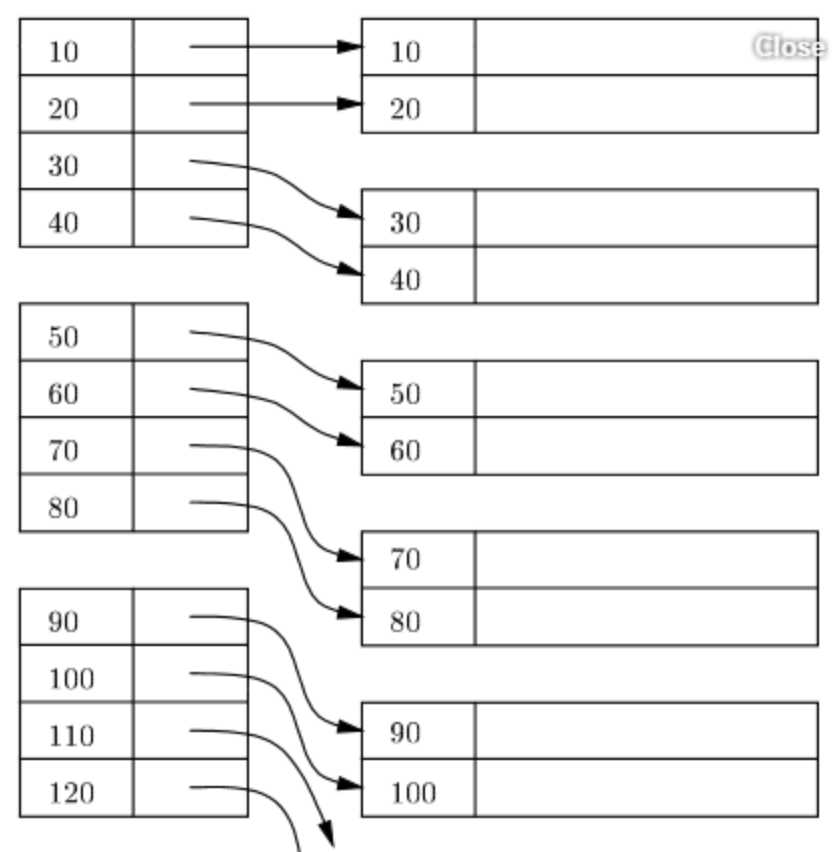
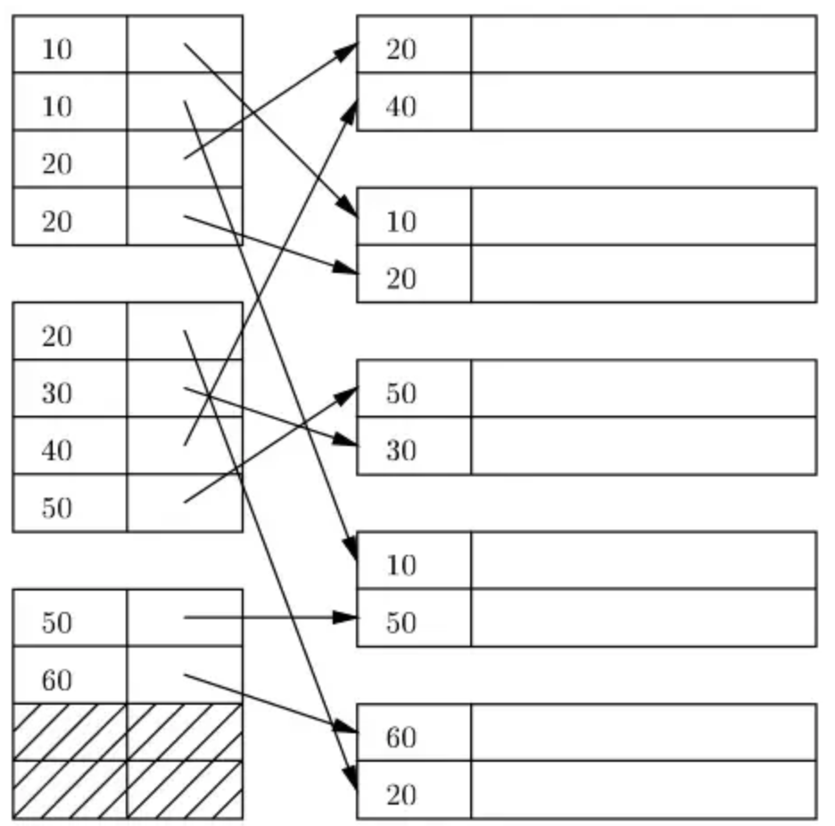

<!-- @format -->

# Basic Concepts

## Index

데이터베이스의 테이블의 검색속도를 향상 시키기 위한 자료구조

## Search Key

파일의 레코드를 찾을 때 사용되는 `attribute`

## Index File

`Search Key` + `Pointer` 로 이루어진 `Index Entry`로 구성되어있다.

# Ordered Indices

## Clustring index (Primary Index)

다음과 같이 `Search Key`가 파일에 데이터가 저장된 순서를 반영하는 인덱스를 `clustring index` 라고 한다.

보통 `clustering index`의 `search key`는 `primary key` 이나, 꼭 그래야만 하는 것은 아니다.

## Non-clustring index (Secondary Index)

다음과 같이 `Search Key`가 파일의 데이터가 저장된 순서를 반영하지 않는 인덱스를 `non-clustering index` 라고 한다.

e. g) search key = 학번 이라고 가정

데이터가 다음과 같을 때

| rid |  학번   |  이름  | 전공 |
| :-: | :-----: | :----: | :--: |
| 112 | B615125 | 유준환 |  EE  |
| 832 | B717122 | 홍길동 |  CS  |
| 991 | B911214 | 젠야타 |  CS  |
| 093 | C012314 |  소피  |  ME  |

인덱스가 다음과 같다면 이 인덱스는 `clustering index` 이다.

| search key | rid |
| :--------: | :-: |
|  B615125   | 112 |
|  B911214   | 832 |
|  C012314   | 093 |

-> search key가 데이터의 순서를 반영

반면, 인덱스가 다음과 같다면 이 인덱스는 `non-clustering index` 이다.

| search key | rid |
| :--------: | :-: |
|  B911214   | 832 |
|  B615125   | 112 |
|  B717122   | 832 |

-> search key가 데이터의 순서를 미반영

 

# Dense and Sparse Indices

## Dense index

### 삽입

### 삭제

## Sparse index

### 삽입

### 삭제

## Multilevel indices

## 정리

 

# B+ Tree

## 장점

## 구조

### 단말 노드

### 비 단말 노드

## 특징

## 정리

# QnA

# Reference

Database System Concepts 7th, Abraham Silberschatz

데이터베이스 시스템 3rd, Raghu Ramakrishnan

https://ko.wikipedia.org/wiki/%EC%9D%B8%EB%8D%B1%EC%8A%A4_(%EB%8D%B0%EC%9D%B4%ED%84%B0%EB%B2%A0%EC%9D%B4%EC%8A%A4)
