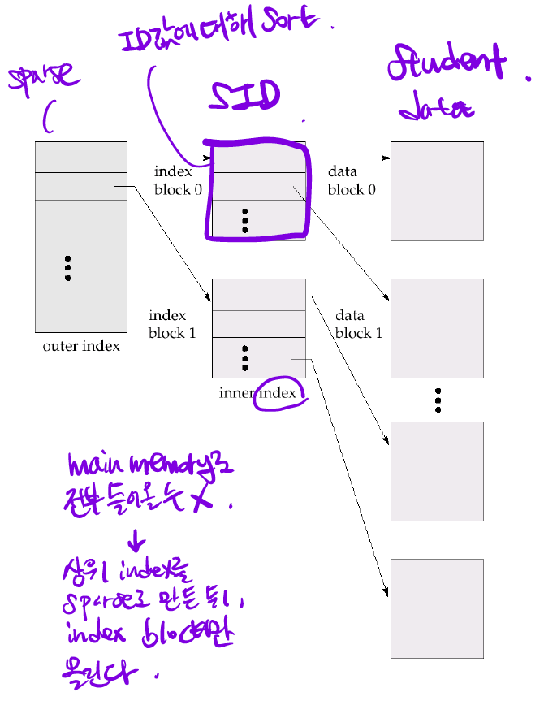

<!-- @format -->

# Basic Concepts

## Index

데이터베이스의 테이블의 검색속도를 향상 시키기 위한 자료구조이다.

## Search Key

파일의 레코드를 찾을 때 사용되는 `attribute`

## Index File

`Search Key` + `Pointer` 로 이루어진 `Index Entry`로 구성되어있다.

# Ordered Indices

## Clustring index (Primary Index)

다음과 같이 `Search Key`가 파일에 데이터가 저장된 순서를 반영하는 인덱스를 `clustring index` 라고 한다.

보통 `clustering index`의 `search key`는 `primary key` 이나, 꼭 그래야만 하는 것은 아니다.

## Non-clustring index (Secondary Index)

다음과 같이 `Search Key`가 파일의 데이터가 저장된 순서를 반영하지 않는 인덱스를 `non-clustering index` 라고 한다.

e. g) search key = 학번 이라고 가정

데이터가 다음과 같을 때

| rid |  학번   |  이름  | 전공 |
| :-: | :-----: | :----: | :--: |
| 112 | B615125 | 유준환 |  EE  |
| 832 | B717122 | 홍길동 |  CS  |
| 991 | B911214 | 젠야타 |  CS  |
| 093 | C012314 |  소피  |  ME  |

인덱스가 다음과 같다면 이 인덱스는 `clustering index` 이다.

| search key | rid |
| :--------: | :-: |
|  B615125   | 112 |
|  B911214   | 832 |
|  C012314   | 093 |

-> search key가 데이터의 순서를 반영

반면, 인덱스가 다음과 같다면 이 인덱스는 `non-clustering index` 이다.

| search key | rid |
| :--------: | :-: |
|  B911214   | 832 |
|  B615125   | 112 |
|  B717122   | 832 |

-> search key가 데이터의 순서를 미반영

## Index-sequential file

`search key`가 파일의 순서를 반영하는 `clustering index`와 `search key`의 순서대로 존재하는 `sequential file`의 조합이다.

`B+ tree`를 사용했을 때의 `entry sequential file`과 반대되는 개념이다.
인덱스를 통해 각 레코드에 접근 가능하다는 점과 데이터 파일의 레코드가 `search key`의 순서대로 정리되어 있다는 점이 다르다.

 

# Dense and Sparse Indices

## Dense index

모든 `search key`를 나타내는 `index`

### 삽입

만약 search key 값이 index에 존재하지 않는다면, 삽입된 search key를 가리키는 새로운 index entry를 index에 저장한다.

### 삭제

만약 이런식으로 모든 인덱스와 레코드가 1:1로 맵핑되는 dense index의 경우엔 index entry도 삭제해버리면 된다.

하지만 이런식으로 모든 search key를 인덱스가 가리키지만, 모든 레코드를 가리키지 않는 상태일 때도 존재한다.

만약 index entry의 포인터가 가리키고 있는 search key의 레코드가 지워진다면, 그 다음 레코드를 가리키며 다음 레코드의 search key와 지워지는 레코드의 search key가 다를 경우 해당 index entry도 제거한다.

e. g)

- Srinivasan 레코드 삭제 -> Comp.sci 포인터 Katz 레코드로 변경
- Crick 레코드 삭제 -> Biology index entry 삭제

## Sparse index

모든 `search key`를 나타내지 않고 몇몇의 `search key` 들만 나타내는 `index`

### 삽입

- 새로운 block이 생성될 때  
   새롭게 생성된 block의 첫번째 값을 가리키는 index entry가 index에 추가되어야 한다.

  > 추가되지 않으면, 새로 생긴 block을 가리키는 곳이 없으므로 이 레코드는 선택될 수 없다.

- 새로운 block이 생성되지 않을 때  
  아무 변화 없다.

### 삭제

- index entry가 가리키지 않는 search key 레코드가 지워졌을 때  
  Just Delete it!

- index entry가 가리키는 search key 레코드가 지워졌을 때

해당 search key를 가리키는 index를 제거하고, 다음 record를 가리키는 index entry를 index에 저장한다.

## Multilevel indices

모든 인덱스들을 메인 메모리에 올릴 순 없다.
상위 인덱스들을 sparse index로 만든 뒤, 이 index block들만 메인 메모리에 올린다.

## 정리

- index는 search를 할 때 좀 더 빠르고 효율적이게 할 수 있게 만들어준다.

  - 그러나, 공간을 좀 더 차지한다는 단점도 있다.

- non-clustering index는 dense index여야 한다.

  - non-clustering index가 sparse index라면, 포인터가 가리키지 않는 레코드들을 찾아야할 때, 모든 레코드를 찾아봐야 한다.

  - 반면, dense index라면 해당 레코드의 search key를 이용하여 파일에서 찾을 수 있다.

- 파일이 변경될 때마다 index도 변경되어야 한다.
  - 이러한 작업은 overhead로 다가올 수 있다.

 
이처럼 인덱스를 사용하여 데이터베이스를 구성하면 효율적으로 원하는 데이터에 접근할 수 있다.

그러나 한 block에 모든 index들을 저장한다면, 그것은 그냥 데이터가 들어있는 레코드와 다를 것이 없다. 그러므로 트리 구조를 만들어 O(logN) 의 시간안에 접근할 수 있도록 만들어 준다.

접근, 삽입, 제거하는데에 걸리는 시간들은 만들어진 트리의 높이에 비례할 것이다.

만약 인덱스 트리 구조가 unbalanced 하다면 원하는 데이터에 접근하는 데에 O(N)에 가까운 시간이 필요할 것이다.

그러므로 인덱스 트리 구조의 핵심은 `balaned` 이다.

balanced tree는 `Red-Black Tree`, `AVL Tree` 등 종류가 많다.

그러나 인덱스 트리 구조에선 `B+ Tree`를 채용했디.

why?

- `Red-Black Tree`는 한 노드에 하나의 데이터만을 넣을 수 있다.

- `AVL Tree`는 이진트리이기에, 높이가 굉장히 높아진다.

* `B+ Tree`는 한 노드에 여러 데이터가 들어갈 수 있고, 이진트리가 아니다.

 

# B+ Tree

    
    B+ Tree 노드의 구조 

## 특징

- balanced 되어서 루트노드에서 모든 단말노드까지의 거리가 같다.

- ⌈n/2⌉ ~ n개의 pointer를 가진다.

* 루트노드가 단말노드가 아니라면, 적어도 2개의 자식 노드를 가져야 한다.

* 포인터로 연결되어있으므로, 논리적으로 가까운 노드들이 물리적으로 가까울 필요는 없다.

## 단말 노드

leaf node끼리 연결되어있기 때문에 `sequential access`가 가능하기 때문에
`range query`도 가능하다.

- search key가 pk가 아닐 때  
   pk가 아니라면, 중복이 가능하다.  
   Brandt 라는 이름의 레코드가 2개 있다면,  
   어떤 Brandt를 단말노드의 포인터가 가리키는지 알 수 없으므로  
   새로운 bucket을 만들어서 해당 record 들을 가리킨다.

## 비 단말 노드

- 비 단말 노드들은 multi-level sparse index를 구성한다.

* B Tree와는 달리 데이터의 위치 또는 데이터를 갖고있지 않다.

# QnA

- 인덱스란?

  데이터베이스의 테이블의 검색속도를 향상 시키기 위한 자료구조이다.

- 왜 B+ Tree를 사용하는가?

  1. 인덱스를 트리구조로 만들었을 때, 데이터의 탐색, 삽입, 삭제 등의 작업들이 트리의 높이에 비례한다. 이 때, 트리의 최대높이를 최소화 시키려면 `balanced` 되어야 하기 때문에 `balanced` 트리 자료구조를 선택해야 한다.

  2. 다른 `balanced` 트리와는 달리 B+ Tree는 한 노드에 많은 데이터를 가질 수 있다. 또한, 트리의 높이가 이진트리에 비해 낮다.

- B+ Tree와 B Tree의 차이점?

  - B Tree  
    단말노드가 아니어도, search key와 그 search key에 대응하는 data를 가지고 있다.

  - B+ Tree  
    단말노드에만 `data`를 가지고, 비단말노드에는 search key만을 갖고있다.

* 인덱스 구조의 단점?

  1. 추가적인 공간이 필요하다.
  2. 삽입, 삭제에 overhead가 있다.

# Reference

- Database System Concepts 7th, Abraham Silberschatz

- 데이터베이스 시스템 3rd, Raghu Ramakrishnan

- https://ko.wikipedia.org/wiki/%EC%9D%B8%EB%8D%B1%EC%8A%A4_(%EB%8D%B0%EC%9D%B4%ED%84%B0%EB%B2%A0%EC%9D%B4%EC%8A%A4)
