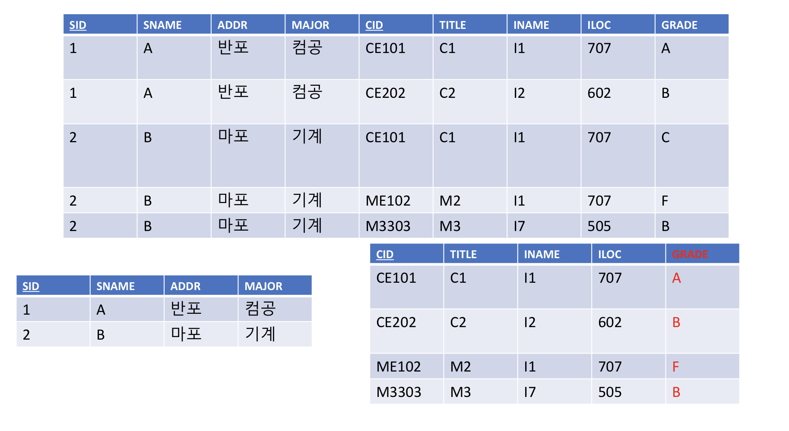
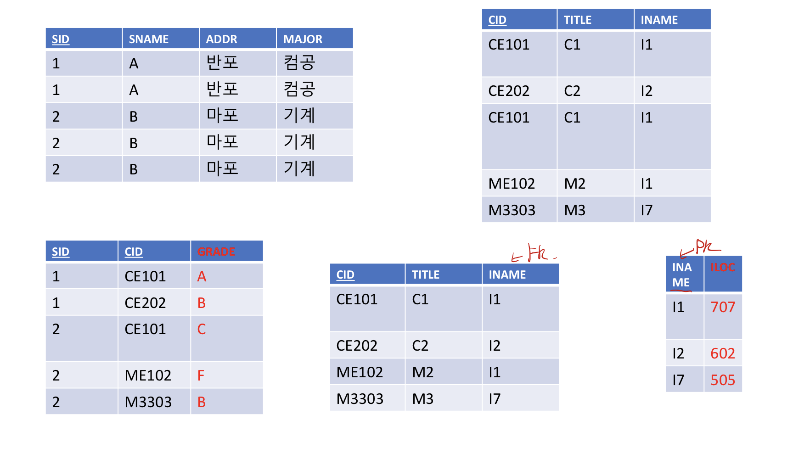
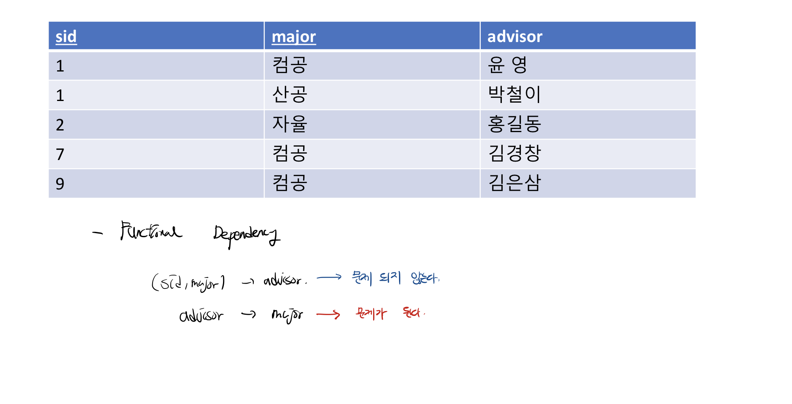
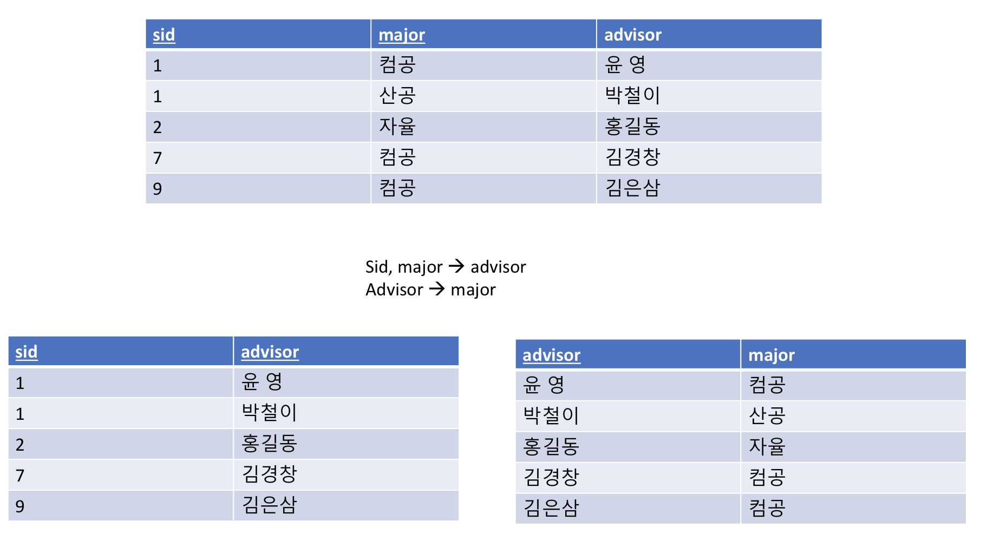

# 정규화

- 기본 목표 : 테이블 간 중복된 데이터를 허용하지 않기 위함
- 무결성 유지, 저장 용량 효율적
- 테이블을 어떻게 분해하느냐에 따라 정규화 레벨이 다르다.
- 모든 상위 레벨의 정규화는 하위 레벨의 정규화가 만족이 되었다는 것을 전제로 진행한다.

## 제 1 정규화

- 테이블의 컬럼이 하나의 값만을 갖도록 테이블을 분해하는 것이다.
- 예를 들면 내가 좋아하는 음식이 치킨, 피자가 있다고 하면 정환우 - 치킨, 피자 가 아니라 정환우 - 치킨, 정환우 - 피자 이렇게 분해해서 저장하는 것

## 제 2 정규화

- 완전 함수 종속을 만족하도록 테이블을 분해하는 것
- 이게 무슨 말이냐? 기본키의 부분집합으로 컬럼이 결정되면 안된다는 것이다.
- 글로는 이해가 안되므로 그림으로 이해해보자.

- 위에 가장 큰 테이블이 기준이다. 이 테이블의 기본키는 (SID, CID) 쌍이다.
- 그런데 기본키가 결정하는 것은 GRADE 밖에 없다. 나머지는 기본키의 부분집합으로 정해진다.
- 고로 이것을 테이블 2개로 나눠야한다. 근데 사실 2개가 아니라 3개로 나눠야 한다.
- SID → 결정 하는 테이블 1, CID → 결정 하는 테이블 2, SID,CID → 결정 하는 테이블 3

## 제 3 정규화

- a→b, b→c 를 결정할 때, a→c 가 성립되는 경우가 없어야 한다.
- 이 테이블에서 보면 기본키의 부분집합으로 결정되는 것이 크게 3가지가 있다.
  - SID → SNAME, ADDR, MAJOR
  - CID → TITLE, INAME, ILOC
  - SID,CID → GRADE
- 그런데, 자세히 보면 INAME이 ILOC을 결정하는 것을 찾을 수 있다.
- 즉, CID → INAME, INAME → ILOC이므로 CID → ILOC을 결정해버리는 Transitive Functional Dependency가 발생

고로 제3정규화를 만족하려면 테이블을 이렇게 분해해야 한다.

## BCNF 정규화(=3.5NF)

- Boyce-Codd 정규화라고 한다.
- 모든 결정자가 후보키가 되도록 테이블을 분해하는 것이다.

- 이 테이블에서 기본키는 (sid, major) 이다.
- (sid,major)는 advisor를 결정하고 있다. 하지만, 여기서 보면 advisor가 major를 정하고 있는 것도 보인다.(여기서는 과목 이름이 중복이라 눈에 확 안띌 수도 있다.)
- 즉, 후보키가 아닌데 결정자가 되어 있는 상태이다. 고로, 모든 결정자가 되도록 후보키를 분리해야 한다.

- 왼쪽 테이블은 (sid, advisor)이 기본 키가 되었고, 오른쪽은 advisor가 기본키이니 당연히 후보키다. 후보키가 결정자가 되도록 BCNF를 정상적으로 진행한 것이다.

# Reference

홍익대학교 윤영 교수님의 기초데이터베이스 강의

[망나니개발자님 블로그](https://mangkyu.tistory.com/110)
