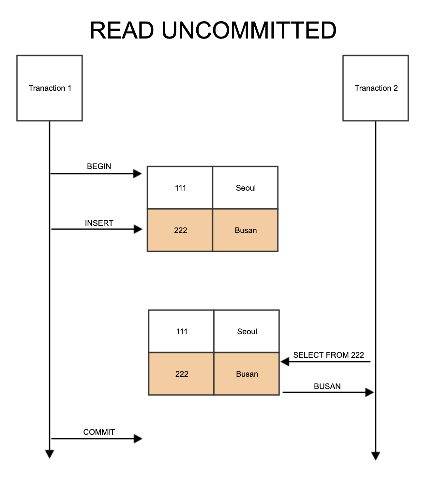
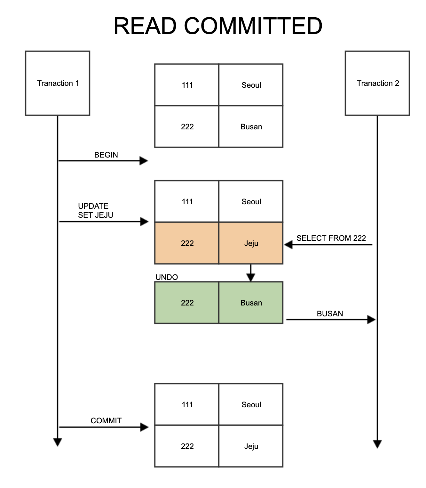
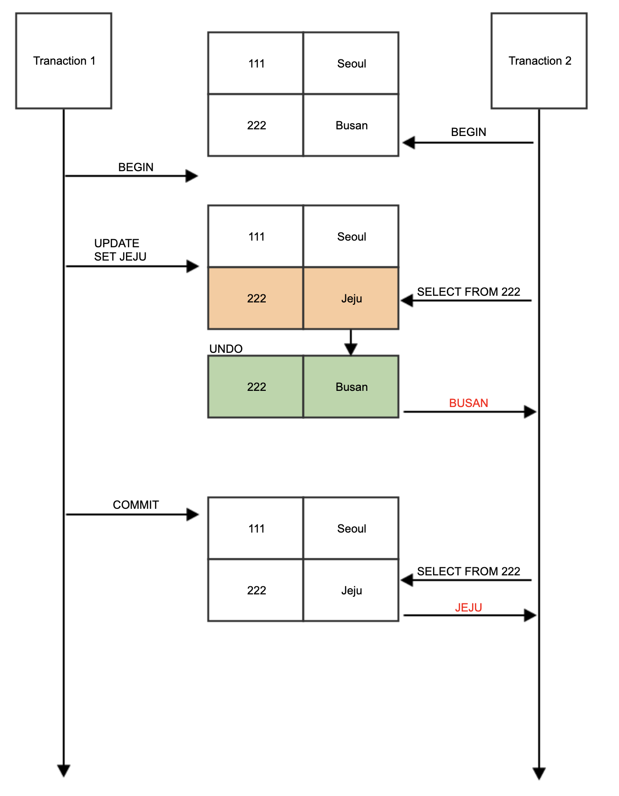

# Transaction Isolation Level

트랜잭션 격리 수준이란 여러 트랜잭션이 동시에 처리될 때, 트랜잭션 끼리 얼마나 고립되어 있는지를 나타내는 것이다.

이전에 트랜잭션에서 설명했던 것처럼, ACID 특징과 같이 독립적인 수행을 위해 잠금 프로토콜을 사용한 것을 볼 수있다.

하지만 무조건 잠금을 사용하여 순서대로 처리하는 방식으로 구현하게 되면 성능은 당연히 떨어질 수 밖에 없어서, 효율적으로 잠금을 사용하는 방법이 필요한데, 이 때 사용되는 것이 바로 Transaction Isolation Level 이다.

트랜잭션 격리 수준에는

- Read Uncommitted
- Read Committed
- Repeatable Read
- Serializable

이렇게 4가지가 존재한다.

## Read Uncommitted

  
    Read Uncommitted

- SELECT 문장이 수행되는 동안 해당 데이터에 `Shared Lock`이 걸리지 않는 계층
- 각 트랜잭션에서의 변경 내용이 `commit` 이나 `rollback` 여부에 상관 없이 다른 트랜잭션에서 값을 읽을 수 있다.
- 데이터베이스의 일관성을 유지하는 것이 불가능함.
- `Dirty Read` 발생하여 데이터 정합성이 떨어진다.
  - 예를 들면, A 트랜잭션 에서 1번 레코드값을 3->4 로 update함
  - B 트랜잭션에서 1번 레코드값을 조회 -> 4로 읽음
  - 이후 A가 Rollback 하면
  - B는 Rollback 한 3이 아니라 여전히 4로 생각하고 로직을 수행한다.

## Read Committed

- SELECT 문장이 수행되는 동안 해당 데이터에 `Shared Lock`이 걸리는 계층.
- `Oracle DBMS`, `SQL Server` 에서 기본으로 사용하는 Isolation Level이다.
- `Commit`이 이루어진 트랜잭션만 조회 가능
- 실제 테이블 값을 가져오는 것이 아니라 Undo 영역에 백업된 레코드에서 값을 가져온다.

  
    Read committed

그렇다면 이 방법은 문제가 없을까?

  
    Read committed의 정합성 문제

하지만 그림과 같이 read-committed도 하나의 트랜잭션 내에서 똑같은 SELECT 쿼리를 실행하면 항상 같은 결과를 가져와야 하는 `Repeatable Read` 정합성에 어긋난다.

이런 문제가 발생할 수 있기 때문에 격리 수준에 의해 실행되는 SQL 문장이 어떤 결과를 출력할 지 정확히 예측하고 사용해야 한다.

# Reference

[Neseoy Blog](https://nesoy.github.io/articles/2019-05/Database-Transaction-isolation)

[DR-Kim](https://dar0m.tistory.com/225)
