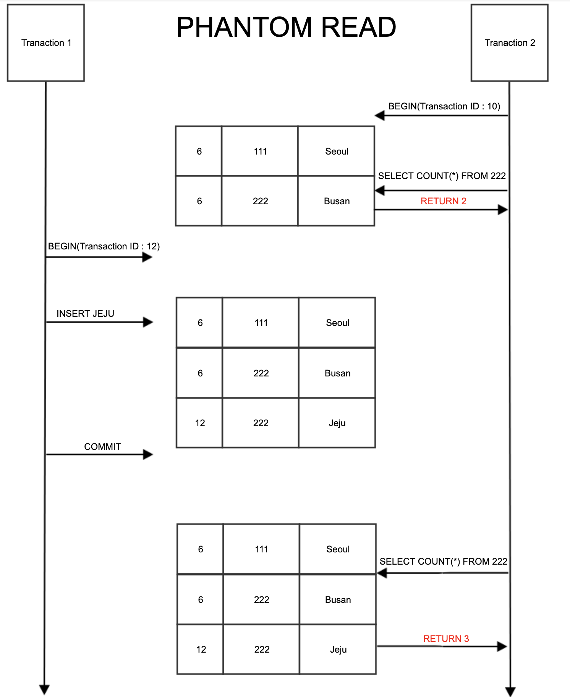

# Transaction Isolation Level

트랜잭션 격리 수준이란 여러 트랜잭션이 동시에 처리될 때, 트랜잭션 끼리 얼마나 고립되어 있는지를 나타내는 것이다.

이전에 트랜잭션에서 설명했던 것처럼, ACID 특징과 같이 독립적인 수행을 위해 잠금 프로토콜을 사용한 것을 볼 수있다.

하지만 무조건 잠금을 사용하여 순서대로 처리하는 방식으로 구현하게 되면 성능은 당연히 떨어질 수 밖에 없어서, 효율적으로 잠금을 사용하는 방법이 필요한데, 이 때 사용되는 것이 바로 Transaction Isolation Level 이다.

트랜잭션 격리 수준에는

- Read Uncommitted
- Read Committed
- Repeatable Read
- Serializable

이렇게 4가지가 존재한다.

## Read Uncommitted

  
    Read Uncommitted

- SELECT 문장이 수행되는 동안 해당 데이터에 `Shared Lock`이 걸리지 않는 계층
- 각 트랜잭션에서의 변경 내용이 `commit` 이나 `rollback` 여부에 상관 없이 다른 트랜잭션에서 값을 읽을 수 있다.
- 데이터베이스의 일관성을 유지하는 것이 불가능함.
- `Dirty Read` 발생하여 데이터 정합성이 떨어진다.
  - 예를 들면, A 트랜잭션 에서 1번 레코드값을 3->4 로 update함
  - B 트랜잭션에서 1번 레코드값을 조회 -> 4로 읽음
  - 이후 A가 Rollback 하면
  - B는 Rollback 한 3이 아니라 여전히 4로 생각하고 로직을 수행한다.

## Read Committed

- SELECT 문장이 수행되는 동안 해당 데이터에 `Shared Lock`이 걸리는 계층.
- `Oracle DBMS`, `SQL Server` 에서 기본으로 사용하는 Isolation Level이다.
- `Commit`이 이루어진 트랜잭션만 조회 가능
- 실제 테이블 값을 가져오는 것이 아니라 Undo 영역에 백업된 레코드에서 값을 가져온다.

  
    Read committed

그렇다면 이 방법은 문제가 없을까?

  
    Read committed의 정합성 문제

하지만 그림과 같이 read-committed도 하나의 트랜잭션 내에서 똑같은 SELECT 쿼리를 실행하면 항상 같은 결과를 가져와야 하는 `Repeatable Read` 정합성에 어긋난다.

이런 문제가 발생할 수 있기 때문에 격리 수준에 의해 실행되는 SQL 문장이 어떤 결과를 출력할 지 정확히 예측하고 사용해야 한다.

## Repeatable Read

- 트랜잭션이 완료될 때까지 SELECT 문장이 사용되는 모든 데이터에 Shared Lock이 걸리는 계층
- 다른 사용자는 트랜잭션 영역에 해당되는 데이터에 대한 수정 불가능
- MySQL에서는 트랜잭션마다 ID를 부여하여 그보다 작은 트랜잭션 번호에서 변경한 것만 읽게 된다.
- Undo 공간에 백업해두고 실제 레코드 값을 변경한다.
  - 백업된 데이터는 불필요하다고 판단되는 시점에 삭제한다.
  - 백업된 레코드가 많아지면 성능이 떨어질 수 있다.
- Non-Repeatable Read 부정합이 발생하지 않는다.

  
    Repeatable Read

그렇다면 이 방식은 문제가 없을까??
-> 아니다. `Phantom Read` 발생

### Phantom Read란?

- 다른 트랜잭션에서 수행한 변경 작업에 의해 레코드가 보였다가 안보였다 하는 현상.
- 이를 방지하기 위해서는 쓰기 잠금을 걸어야 한다.

  
    Phantom Read

## Serializable

- 트랜잭션이 완료될 때까지 SELECT 문장이 사용되는 모든 데이터에 Shared Lock이 걸리는 계층
- 가장 엄격한 격리 수준. 완벽한 읽기 일관성 모드를 제공한다.
- 다른 사용자는 트랜잭션 영역에 해당되는 데이터에 대한 수정 및 입력 불가능
- 성능적으로 동시 처리성능이 가장 낮으며, Phantom Read가 발새앟지 않지만 거의 사용되지 않는다.

## 정리

- Isolation level 선택시 고려사항 : 동시성과 데이터 무결성
- 레벨을 높게 조정할 수록 비용이 증가한다.
- 동시성과 데이터 무결성은 반비례한다.
- 무결성이란? **데이터의 정확성, 일관성, 유효성이 유지되는 것!**
- 낮은 단계 Isolation Level을 활용했을 때 발생할 수 있는 문제들 : `Dirty Read`, `Non-Repeatable Read`, `Phantom Read`

# Reference

[Neseoy Blog](https://nesoy.github.io/articles/2019-05/Database-Transaction-isolation)

[DR-Kim](https://dar0m.tistory.com/225)
