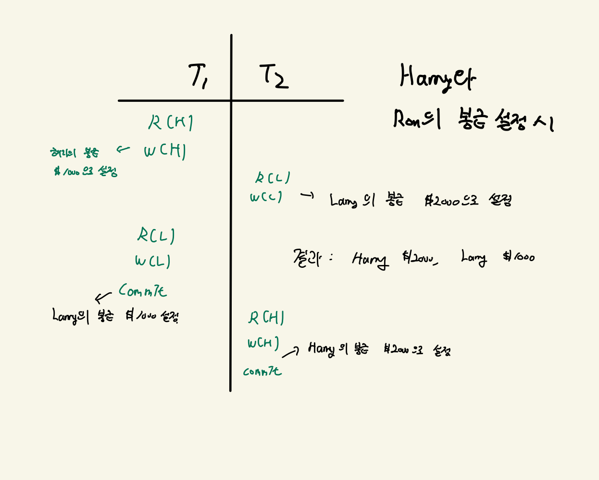
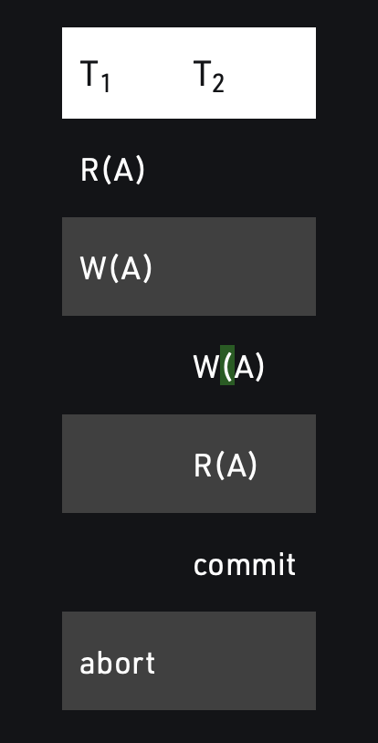
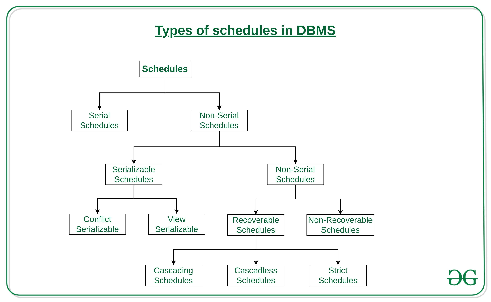
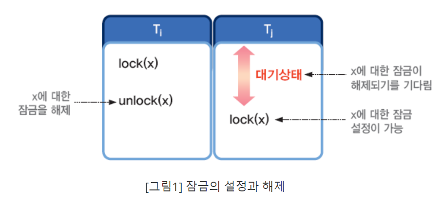
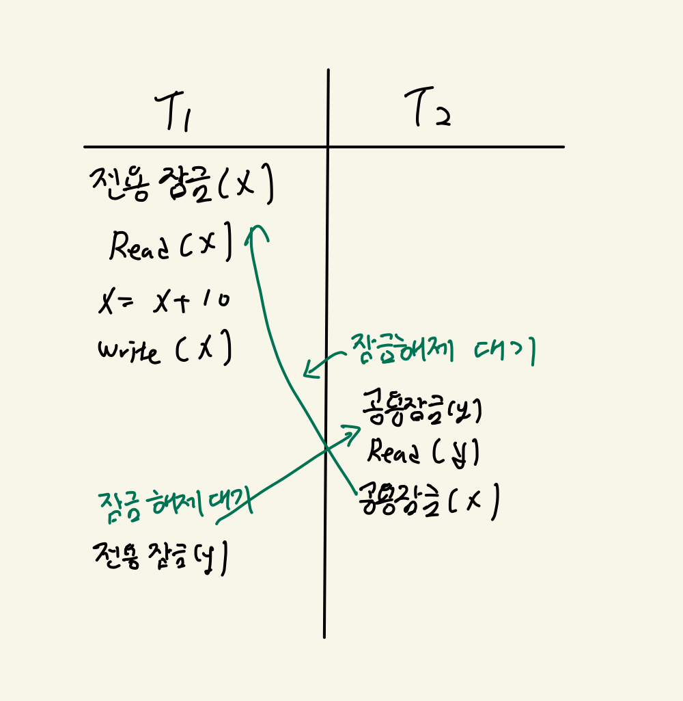
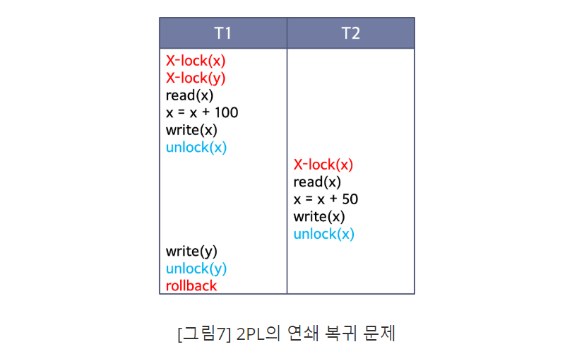

# Transaction(트랜잭션)

- 트랜잭션은 DBMS에서 사용자 프로그램의 일회 실행이다.(동일한 프로그램을 여러번 실행하는 것은 여러 개의 트랜잭션을 생성하게 된다)
- 트랜잭션은 DBMS에서 변경의 기본 단이이며, 부분적으로 수행된 트랜잭션들은 허용되지 않는다.

## 트랜잭션의 ACID 성질

트랜잭션의 중요한 성질 4가지를 ACID라고 부른다.

- `원자성(Atomicity)` : 사용자가 각 트랜잭션의 수행을 `원자적(Atomicity)`으로 생각할 수 있도록 해야 한다. (각 트랜잭션의 연산이 모두 수행되거나 아예 다 수행되지 않아야 한다는 것이다.)
- `일관성(Consistency)` : 트랜잭션의 단독 수행은 `일관성(Consistency)`을 보장해야 한다. (시스템이 가지고 있는 고정요소는 수행 전후 상태가 같아야 한다.)
- `고립성(Isolation)` : 각 트랜잭션은 동시에 스케줄된 다른 트랜잭션들의 영향으로부터 고립되거나 보호되어야 한다.
- `영속성(Durability)` : DBMS가 트랜잭션이 성공적으로 완료하였다는 것을 사용자에게 통보하자마자 그 트랜잭션의 효과가 디스크에 반영되기 전에 시스템에 장애가 발생한다 하더라도 지속적으로 남아있어야 한다.(영구적으로 반영되어야 한다는 뜻)

이렇게 네가지의 앞 글자를 따써 ACID라고 부른다고 한다.

# 동시성 제어(Concurrency Protocol)

다중 사용자 환경을 지원하는 DBMS에서 여러 트랜잭션 간의 간섭으로 문제가 발생하지 않도록 트랜잭션의 실행 순서를 제어하는 기법이다.

이게 왜 필요한지 알아보자

## 동시성 제어의 필요성 - 끼어들기로 인한 문제

다중 사용자 환경에서는 한 트랜잭션이 수행될 때 다른 트랜잭션이 끼어들어 실행할 수 있는데, 이 때 트랜잭션들이 서로 간섭하면서 문제가 발생할 수 있다. 문제가 무엇인지, 예를 보면서 알아보자.

1. `갱신 분실(lost update)` : 이전 트랜잭션이 데이터를 변경한 후 트랜잭션을 종료하기 전에 다른 트랜잭션이 동일한 데이터를 갱신하여 덮어쓰는 경우, 이전 트랜잭션은 갱신한 값을 잃어버리게 된다.

그림을 살펴보면서 이해해 보자.

  
    Lost Update

원래는 T1 -> T2로 수행한다면 전 직원의 봉급이 2000달러, 반대의 경우는 1000달러로 설정되어야 하지만, 이 결과는 어떠한 직렬 수행의 결과와도 일치하지 않는다. (일관성 위반)
T1 -> T2 순으로 트랜잭션이 종료 되었으므로 Larry의 봉급은 T2의 갱신을 반영해야하지만 T1의 반영이 갱신되었으므로, T2의 갱신이 분실 되었다.

2. `연쇄 복귀(cascading rollback)` or `회복 불가능(Unrecoverability)` : 특정 트랜잭션이 이전 상태로 rollback할 경우 아무 문제 없는 다른 트랜잭션까지 연달아 복귀하게 되는 문제를 말한다. 이때 한 트랜잭션이 이미 완료된 상태라면 지속성 조건에 따라 복귀가 불가능하다.

  
    Lost Update

-> 복구 가능 스케줄에서 트랜잭션들은 완료된 트랜잭션들만 읽는다. 그러면 그 스케줄은 복구 가능하며, 다른 트랜잭션들을 연쇄적으로 철회하지 않고 이루어지기 때문이다.

3. 불일치 분석(inconsistent analysis) : 여러 개의 트랜잭션이 끼어들기로 인해 트랜잭션의 일관성이 유지되지 못하는 상황을 말한다. 갱신 분실의 상황과 비슷하다.

4. 데이터 무결성 : 데이터 베이스내의 데이터가 얼마나 정확한지

## 끼어들기 문제들을 어떻게 해결해야 할까?

  
    Types of schedules

- 직렬 스케줄 혹은 직렬 가능한 스케줄로 만들어야 한다.
- 직렬 스케줄은 말 그대로 직렬로 실행되는 스케줄, 예를 들면 T1 -> T2 -> T3 이렇게 트랜잭션의 실행 순서롤 보장하는 스케줄이다.
- 그렇다면 직렬 가능한 스케줄은 무엇일까? -> 직렬 스케줄과 실행 결과가 동일한 스케줄을 말한다.
- 직렬 가능한 스케줄인지 판단하는 법 : 스케줄에 나타난 연산들의 순서를 전체적인 실행 결과에 영향을 끼치지 않으면서 교환하였을 때 직렬 스케줄로 변환되면 직렬 가능한 스케줄이다.
- 실행 순서룰 바꿀 수 있는 경우 : 서로 다른 데이터 항목에 대한 연산이거나, 같은 데이터 항목이라도 둘 다 `read 연산`인 경우에만 가능하다.

그러면 직렬 가능한 스케줄로 만드는 방법은 무엇이 있을까?

`Locking` 과 `TimeStamp` 두 가지 방법이 있는데, 대부분의 DBMS는 `Locking`을 사용한다고 한다.

트랜잭션의 실행 순서를 강제로 제어하여 직렬 가능한 스케줄로 보장하는 방법 중 하나인 `잠금(Locking)`에 대해서 알아보자.

## 잠금 프로토콜(locking protocol)

- 다른 사람들이 동일한 데이터를 동시에 접근하고 있다는 사실을 모를 정도로 자연스럽게 데이터의 동시접근을 계획하는 것은 DBMS에서 굉장히 중요한 임무 중 하나이다.(동시에 돈을 넣고 뺀다던가, 게시글을 읽고 수정하는 것 등등...)
- Locking Protocol은 이렇게 여러 트랜잭션들의 연산들이 `interleave` 하더라도, 실제 효과는 어떤 직렬 순서로 모든 트랜잭션들을 수행하는 것과 동일하다는 것을 보장하기 위해 각 트랜잭션이 준수해야 하는 규칙들의 모임이다.
- 하나의 트랜잭션이 데이터 항목에 대하여 잠금을 설정하면, 설정한 트랜잭션이 잠금을 해제할때 까지 독점적으로 사용할 수 있다.

  
    Locking Protocol

이러한 잠금에는 `Shared Lock` 과 `Exclusive Lock` 이렇게 두가지 종류가 있다.

### 공용 잠금(Shared Lock)

- 데이터 항목에 대해 `읽기 연산(read)`만 가능하다.
- 동시에 두 개의 다른 트랜잭션들에 의하여 소유될 수 있다.
- 다른 트랜잭션도 `읽기 연산(read)`만 가능하다.

### 전용 잠금 (Exclusive Lock)

- 다른 트랜잭션들이 이 객체에 어떠한 잠금도 소유할 수 없도록 한다.(하나의 데이터 항목에 대해선 하나의 전용 잠금, 하나의 트랜 잭션만)
- 데이터 항목에 대해서 `읽기 연산(read)`와 `쓰기 연산(write)`가 모두 가능하다.
- 다른 트랜잭션은 `읽기 연산(read)`와 `쓰기 연산(write)` 모두 불가능하다.

### 잠금 설정 규칙

- 트랜잭션은 데이터 항목 x에 대해 `read 연산`을 실행하기 전에 공용 잠금이나 전용 잠금 중 하나를 실행해야 한다.
- `write 연산`은 전용 잠금만 가능하므로 전용 잠금을 실행해야 한다.
- 연산 종료 후에는 잠금 해제(`unlock`)를 실행해야 한다.
- 연산 실행 후에만 잠금 해제가 가능하다.

그렇다면 잠금 단위는 어떻게 될까?

### 잠금 단위(Locking Granularity)

- 잠금의 대상이 되는 데이터 객체의 크기
- 작게는 레코드의 필드 값, 하나의 레코드, 디스크 블록이 될 수 있고, 크게는 테이블이나 데이터베이스까지 하나의 잠금 단위가 될 수 있다.

- 잠금 단위가 클수록 동시성 수준은 낮아지지만 제어 기법은 간단해진다.
- 반대로 잠금 단위가 작을수록 동시성 수준은 높아지지만 관리가 복잡해진다.

예를 들면 레코드를 잠금 단위로 설정하면 하나의 테이블에 연산을 수행할 때, 접근하는 레코드가 다르다면 동시에 실행이 가능하다. 하지만 레코드마다 잠금을 설정해야 하므로 관리가 복잡해진다.

하나의 테이블을 잠금 단위로 설정하면, 동시에 연산 실행이 불가능 하지만 테이블 하나에만 잠금을 설정하면 되므로 관리가 쉽다.

--> 여러 단계로 잠금 단위를 정해놓고 필요에 따라 혼용하는 것이 가장 좋다.

근데 단순 잠금에는 한계가 존재한다고 한다. 그 한계에 대해 알아보자.

### 잠금의 한계

- 직렬 가능한 스케줄이 항상 보장되지 않는다. -> 아까 위에서 갱신 분실의 예를 보면, 결과가 직렬하지 않다는 것을 알 수 있다. -> 2단계 잠금 규약을 이용하여 해결한다.
- 교착상태(deadlock)이 발생할 수 있다.

교착상태가 발생하는 예를 살펴보자.

  
    DeadLock 1

  
    DeadLock 2

모두 대기 상태에 들어가 진행하지 못하는 이러한 상태를 `교착상태(Deadlock)` 라고 한다.

## 엄격한 2단계 잠금 규약(Strict 2PL - Two-Phase Locking)

일반적인 2단계 잠금 규약으로는 교착 상태 문제를 해결할 수 없다. 연쇄 복귀 문제도 발생할 수
있다.

  
    연쇄 복귀 문제

그래서 사용하는 것이 엄격한 2단계 잠금 규약이다.

엄격한 2단계 잠금의 규칙 2가지는 다음과 같다.

1. 트랜잭션이 객체를 읽기를 원하면 그 객체에 대한 공용 잠금을, 쓰기를 원하면 전용 잠금을 요구한다.
2. 트랜잭션이 소유한 모든 잠금은 트랜잭션이 완료될 때 해제한다.

이렇게 하면 완료되지 않은 트랜잭션에 의해 갱신된 데이터를 다른 트랜잭션이 읽거나 쓰는 것을 원천적으로 봉쇄할 수 있어 연쇄 복귀 문제를 해결할 수 있다.

`Timeout` 을 이용하여 대기 시간을 체크해 교착상태라고 판단되면 트랜잭션을 철회하는 것으로 해결할 수 있다고 한다.

## 예상 질문

### 1. 트랜잭션의 특성에 대해 설명하시오

원자성, 독립성, 일관성, 지속성에 대해 정확히 이해하여 설명하기

### 2. 트랜잭션을 병행으로 처리할 때의 문제점

트랜잭션 A가 롤백될 때 연쇄적으로 다른 트랜잭션이 다 롤백이 되는 상황이 일어날 수 있다.(연쇄 복귀 문제) 교착상태도 발생할 수 있다 -> Strict 2PL 을 이용하여 해결 가능

# Reference

[동시성 제어 기법 - 잠금 기법](https://medium.com/pocs/동시성-제어-기법-잠금-locking-기법-319bd0e6a68a)

[Geeks for Geeks](https://www.geeksforgeeks.org/types-of-schedules-in-dbms/)

Database Management System 3rd Edition, Raghu Ramakrishnan
