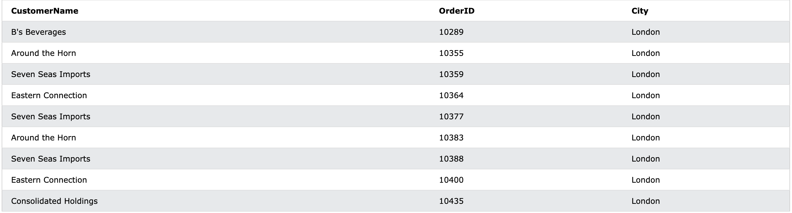
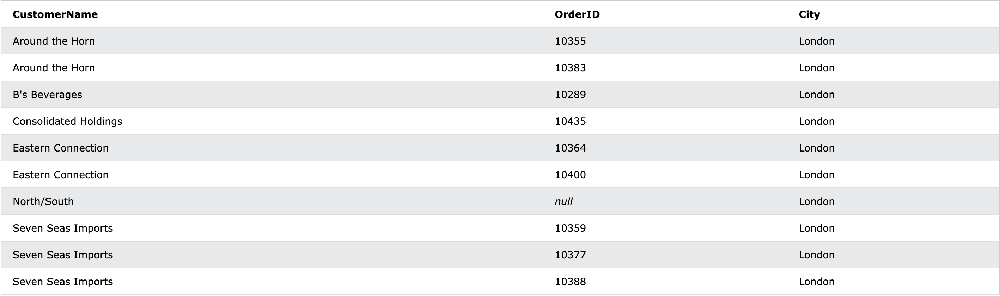
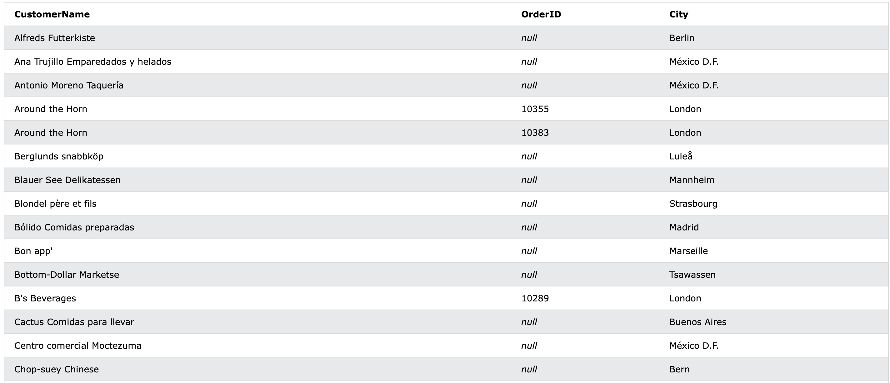

## JOIN(조인)

</br></br>

### 1) Join이란
: 두개 이상의 테이블의 레코드를 그들 사이에 **관련이 있는 컬럼을 기준**으로 합치는 작업입니다. 

</br></br>

- 조인의 종류  
   두 테이블의 비교기준은 관련된 컬럼(id, name ...)의 일치여부 입니다
  - **(INNER) JOIN** : 두 테이블의 공통된 레코드만 반환
  - **LEFT (OUTER JOIN** : 왼쪽 테이블의 모든 레코드와 오른쪽의 왼쪽과 공통된 레코드 반환  
  - **RIGHT (OUTER) JOIN** : 오른쪽 테이블의 모든 레코드와 왼쪽의 오른쪽과 공통된 레코드 반환
  - **FULL (OUTER) JOIN** : 두 테이블중 공통된 레코드와 겹치지 않는 레코드들 까지 반환


</br></br>

이 중 가장 많이 쓰이는 두 가지 조인에 대해서 더 자세히 알아보겠습니다!

</br></br></br>

### 2) Inner Join


- table 1 : Orders
  

- table 2 : Customers
  

  </br></br>


  두 테이블은 **CustomerID를 기준으로 관계**를 맺고있습니다. 만약 각 주문에 대한 주문자의 이름을 뽑아와야 한다면 inner조인으로 아래와 같은 테이블을 뽑아낼 수 있습니다.

  여기서 FROM에 있는 테이블이 왼쪽테이블이 됩니다. 그리고 INNER JOIN에 오는 테이블이 오른쪽 테이블이 됩니다. ON뒤에는 관련을 맺고있는 컬럼으로 비교문을 써줍니다.

  ```sql
  SELECT Orders.OrderID, Customers.CustomerName
  FROM Orders
  INNER JOIN Customers
  ON Orders.CustomerID = Customers.CustomerID;
  ```

  

</br></br></br>

### 3) Left Join


- table 1 : Customers
  

- table 2 : Orders
  

  </br></br>

  이번에는 반대로 **회원을 기준으로 주문내역**을 뽑아보겠습니다. 주문내역이 없는 손님들은 null이 뜹니다. 회원 중 주문을 하지 않아서 Orders테이블과 겹치는 것이 없더라도 left join이기때문에 **주문을 하지 않은 회원**까지 뽑아낼 수 있는 것입니다. 

  ```sql
    SELECT Customers.CustomerName, Orders.OrderID
    FROM Customers
    LEFT JOIN Orders ON Customers.CustomerID = Orders.CustomerID
    ORDER BY Customers.CustomerName;
  ```
  

    </br></br>

  모든 컬럼을 출력해보면 이런식으로 **겹치지 않는 레코드**들은 Customers쪽에 컬럼만 채워지고 **Order쪽 정보는 null**로 채워진 것을 확인할 수 있습니다
  

</br></br></br>

### 4) WHERE vs ON
</br>

  1. inner join
     -  inner join + WHERE조건
      ```sql
      SELECT CustomerName,OrderID, City
      FROM Customers
      INNER JOIN Orders
      ON Orders.CustomerID = Customers.CustomerID 
      WHERE Customers.City = "London";
      ```
      </br>

     - inner join + ON조건
      ```sql
      SELECT CustomerName,OrderID, City
      FROM Customers
      INNER JOIN Orders
      ON Orders.CustomerID = Customers.CustomerID 
      AND Customers.City = "London";
      ```
      </br>

      두 쿼리는 같은 결과를 출력합니다.
      

      </br></br>
    
1. left join

     - left join + WHERE조건
      ```sql
      SELECT CustomerName,OrderID, City
      FROM Customers
      LEFT JOIN Orders
      ON Orders.CustomerID = Customers.CustomerID 
      WHERE Customers.City = "London";
      ```

      
    
    </br>

    - left join + ON조건
    ```sql
    SELECT CustomerName,OrderID, City
    FROM Customers
    LEFT JOIN Orders
    ON Orders.CustomerID = Customers.CustomerID 
    AND Customers.City = "London";
    ```

    

 </br> </br>

  이 두쿼리의 결과를 보면 ON에서의 조건과 WHERE에서의 조건이 다르게 적용된다는 것을 알 수 있습니다. **ON**은 JOIN을 할때 적용되는 조건이고 **WHERE** 은 JOIN이 끝난뒤에 적용되는 조건입니다. 따라서 ON에서의 결과를 보면 Orders테이블과 조인이 된 레코드는 다 **<Orders.CustomerID = Customers.CustomerID AND Customers.City = "London">  이 조건을 만족**합니다. left기 때문에 나머지 customer에 orders정보는 null로 되어있습니다. 

 </br> </br> </br>


### 5) EQUI JOIN vs INNER JOIN

 1. INNER JOIN
  ```sql
  SELECT CustomerName, OrderID, City
  FROM Customers  
  INNER JOIN Orders
  ON Orders.CustomerID = Customers.CustomerID
  ```
   </br>

 2. EQUI JOIN
   ```sql
   SELECT CustomerName, OrderID, City
   FROM Customers, Orders
   WHERE Orders.CustomerID = Customers.CustomerID 
   ```

   </br> </br>
 
 1번쿼리는 2번쿼리로도 나태낼 수 있습니다. 심지어 두 쿼리는 똑같이 동작합니다. 하지만 **2번같은 쿼리는 지양**해야합니다. 왜냐면 JOIN은 무거운 연산이기 때문에 **병목**이 생기는 부분으로 의심해볼 수 있기때문에 JOIN이라는 키워드가 직접들어가게 쿼리를 짜줘야 나중에 성능개선시에 알아보기 쉽습니다. 
 
  </br> </br> </br> </br> </br>
  
참고
- https://developyo.tistory.com/121
- https://www.w3schools.com/sql/sql_join.asp

