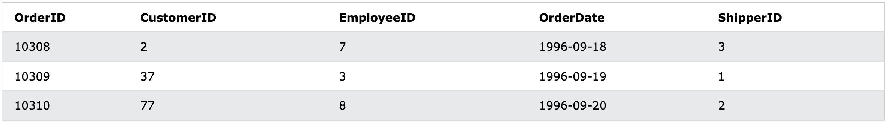
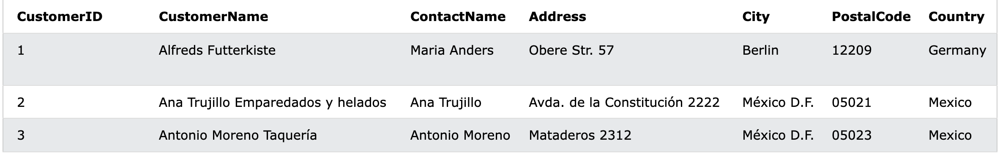
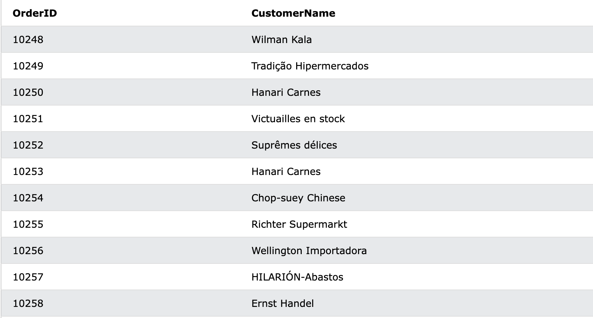
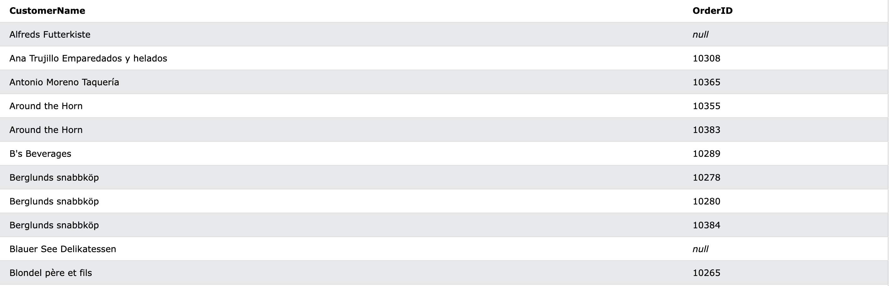

## JOIN(조인)

### 1) Join이란
: 두개 이상의 테이블의 레코드를 그들 사이에 관련이 있는 컬럼을 기준으로 합치는 작업입니다. 

- 조인의 종류  
   두 테이블의 비교기준은 관련된 컬럼(id, name ...)의 일치여부 입니다
  - (INNER) JOIN : 두 테이블의 공통된 레코드만 반환
  - LEFT (OUTER JOIN : 왼쪽 테이블의 모든 레코드와 오른쪽의 왼쪽과 공통된 레코드 반환  
  - RIGHT (OUTER) JOIN : 오른쪽 테이블의 모든 레코드와 왼쪽의 오른쪽과 공통된 레코드 반환
  - FULL (OUTER) JOIN : 


이 중 가장 많이 쓰이는 두 가지 조인에 대해서 더 자세히 알아보겠습니다!

### 2) Inner Join


- table 1 : Orders
  

- table 2 : Customers
  

  두 테이블은 CustomerID를 기준으로 관계를 맺고있습니다. 만약 각 주문에 대한 주문자의 이름을 뽑아와야 한다면 inner조인으로 아래와 같은 테이블을 뽑아낼 수 있습니다.

  여기서 FROM에 있는 테이블이 왼쪽테이블이 됩니다. 그리고 INNER JOIN에 오는 테이블이 오른쪽 테이블이 됩니다. ON뒤에는 관련을 맺고있는 컬럼으로 비교문을 써줍니다.

  ```sql
  SELECT Orders.OrderID, Customers.CustomerName
  FROM Orders
  INNER JOIN Customers
  ON Orders.CustomerID = Customers.CustomerID;
  ```

  


### 3) Left Join


- table 1 : Customers
  

- table 2 : Orders
  

  이번에는 반대로 회원을 기준으로 주문내역을 뽑아보겠습니다. 주문내역이 없는 손님들은 null이 뜹니다. 회원 중 주문을 하지 않아서 Orders테이블과 겹치는 것이 없더라도 left join이기때문에 주문을 하지 않은 회원까지 뽑아낼 수 있는 것입니다. 

  ```sql
    SELECT Customers.CustomerName, Orders.OrderID
    FROM Customers
    LEFT JOIN Orders ON Customers.CustomerID = Orders.CustomerID
    ORDER BY Customers.CustomerName;
  ```
  

  모든 컬럼을 출력해보면 이런식으로 겹치지 않는 값들은 Customers쪽에 컬럼만 채워지고 Order쪽 정보는 null로 채워진 것을 확인할 수 있습니다
  

