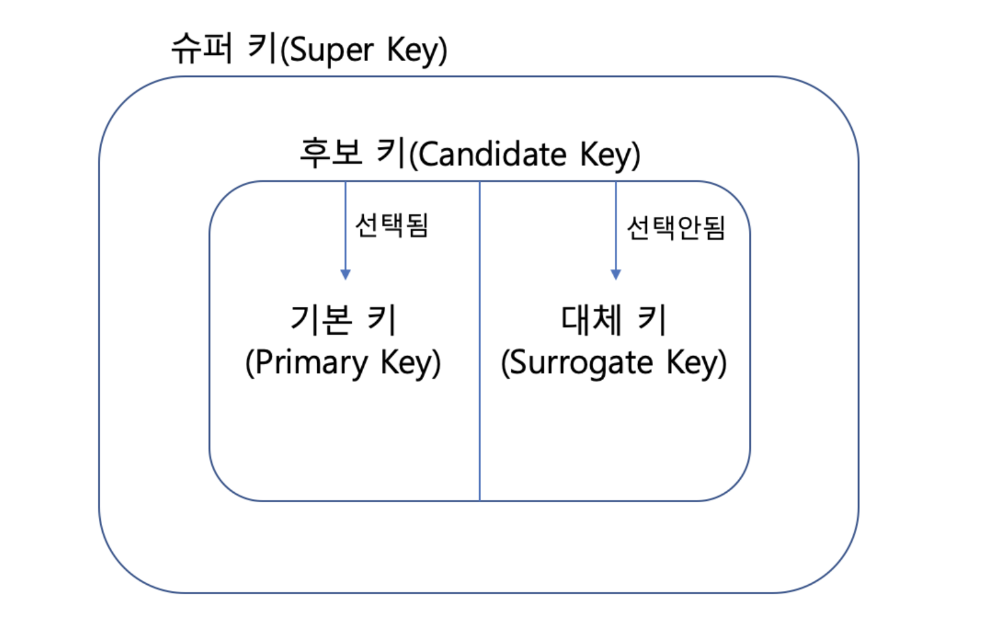

## 데이터베이스 key정리 

 

### 1) 키(Key)
: 릴레이션의 튜플을 유일하게 식별하는 속성의 모임

  

### 2) 키 종류
 
학생데이터베이스

|학번|회원번호|이름|나이|
|:---:|:---:|:---:|:---:|
|B924942|4958634|이나라|23|
|B690343|4959303|홍시연|26|
|C193482|9893984|김동준|20|
|B918342|0485834|최준기|23|
|B492904|3949503|김서연|28|

 

- 슈퍼키(Super Key) : 유일성을 만족하는 키 
  - ex) 학번 + 회원번호 , 학번 + 나이 , 이름, 학번...
- 복합키(Composite Key) : 2개이상의 속성으로 이뤄진 키 
  - ex) 학번 + 나이, 나이+이름...
- 후보키(Candidate Key) : 유일성과 최소성을 만족하는 키
  - ex) 학번, 회원번호
- 기본키(Primary Key) : 후보키 중에 선택된 키, NULL값이 올 수 없음
  - ex) 학번
- 대체키(Surrogate Key) : 보조키라고도 하며 후보키에서 기본키로 선택되지 않은 키 , 기존 기본키가 없어지면 대신 사용할 수 있음 
  - ex) 회원번호, 이름 

    

      
참고
- https://itwiki.kr/w/%EB%8D%B0%EC%9D%B4%ED%84%B0%EB%B2%A0%EC%9D%B4%EC%8A%A4_%ED%82%A4
- https://inpa.tistory.com/entry/DB-%F0%9F%93%9A-%ED%82%A4KEY-%EC%A2%85%EB%A5%98-%F0%9F%95%B5%EF%B8%8F-%EC%A0%95%EB%A6%AC#%EA%B-%B-%EB%B-%B-%ED%--%A--Primary%--Key-
- https://limkydev.tistory.com/108
  