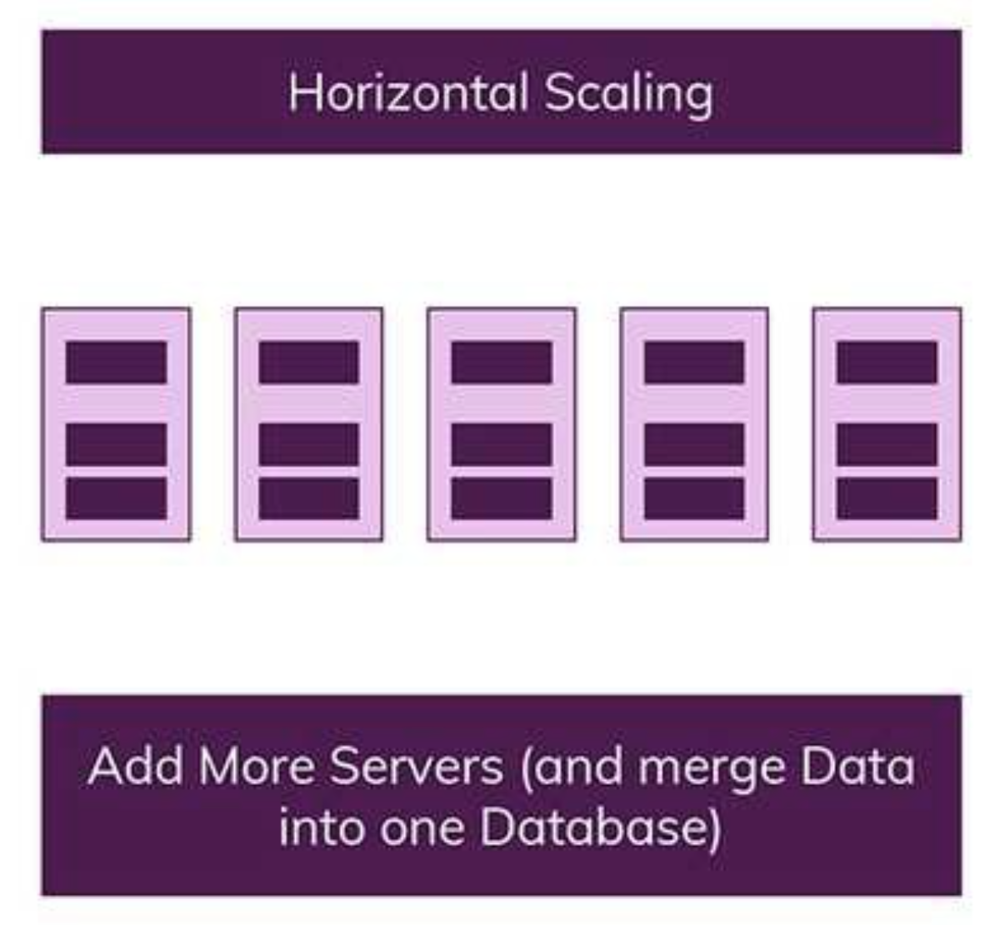

## SQL vs NOSQL
</br></br>

### 1) SQL(Structured Query Language)
: **관계형 데이터베이스 관리 시스템(RDBMS)의 데이터를 관리하기 위해** 설계된 특수 목적의 프로그래밍 언어이다. 초기에는 **SEQUEL**(Structured English Query Language)로 불렸으며 IBM에서 개발되었다. 

</br></br>

### 2) SQL종류 
</br>

- **데이터 정의 언어**(DDL : Data Definition Language)
  : 테이블과 인덱스구조를 관리합니다. 
  </br>

  - CREATE : 데이터베이스 객체(테이블...)생성
    ``` sql
    CREATE TABLE My_table(
        my_field1 INT,
        my_field2 VARCHAR(50),
        my_field3 DATE NOT NULL,
        PRIMARY KEY (my_field1, my_field2)
    );
    ```
    </br>
  - ALTER : 이미 만들어진 객체의 구조변경
    ``` sql
    ALTER TABLE My_table ADD my_field4 NUMBER(3) NOT NULL;
    ```
    </br>
  - TRUNCATE : 테이블에서 모든 **데이터를 빠르게 삭제**(롤백불가), 테이블자체를 삭제하는 것은 아님
  
    ```sql
    TRUNCATE TABLE My_table;
    ```
    </br>
  - DROP : 데이터베이스 **객체를 삭제**(롤백가능)
    ```sql
    DROP TABLE My_table;
    ```

- **데이터 조작 언어**(DML : Data Manipulation Language)
  - INSERT : 데이터삽입
  - UPDATE : 데이터수정
  - DELETE : 데이터삭제
  - SELECT : 데이터조회

</br>

- **데이터 제어 언어**(DCL : Data Control Language)
  - GRANT : 특정 데이터베이스 사용자에게 특정 작업 권한 부여
  - REVOKE : 부여한 권한 박탈
  - SET TRANSACTION : 트랜잭션 모드 설정
  - BEGIN : 트랜잭션 시작
  - COMMIT : 트랜잭션 실행
  - ROLLBACK : 트랜잭션 취소
  - SAVEPOINT : 무작위로 롤백 지점을 설정
  - LOCK : 자원차지 
  
</br></br>

### 3) 관계형 모델
: 데이터를 컬럼과 로우를 이루는 하나 이상의 테이블로 정리하며, 고유 키(PK)로 각 로우를 식별합니다. 로우는 튜플이나 레코드라고 불립니다. 각 테이블은 하나의 엔티티(상품, 고객..)과 매치됩니다. 

  -  용어
      |SQL용어|RDB용어|설명|
      |:---:|:---:|:---:|
      |로우(row)|튜플(tuple) or 레코드(record)|하나의 항목을 대표하는 데이터|
      |컬럼(column)|속성(attribute) or 필드(field)|튜플의 이름 요소|
      |테이블(table)|관계(relation)|같은 속성을 공유하는 튜플의 모임|

      </br>


    
</br></br>

### 4) SQL특징
- 표준 SQL문법이 존재해 DBMS의 종류에 얽매이지 않고 사용가능합니다.
- 대소문자를 구별하지않습니다
- 일반적으로 데이터베이스의 성능을 향상시키는 수직적 확장만을 지원합니다
 
  
- 엄격한 스키마 : 데이터는 테이블에서 레코드로 저장되며 각 레코드들은 명확하게 정의된 구조가 있습니다. 이런 구조를 지키지 못하면 레코드는 추가될 수 없습니다. 

- 관계 : 테이블들끼리 관계를 가지고 확장나갑니다. 따라서 사용자가 어떤 상품을 주문했다라는 데이터는 여러 테이블을 통해 저장되지만 각 테이블에 중복이 없이 관리될 수 있습니다.
  
  

</br></br>

### 5) NOSQL(non SQL or Not Only SQL)
: NOSQL데이터베이스는 관계형데이터베이스에 비해 덜 제한적이며 단순 검색 및 추가 작업을 위한 매우 최적화된 키 값 저장 공간이다. 따라서 빅데이터와 실시간 웹 애플리케이션의 상업적 이용에 널리 쓰입니다. SQL계열 쿼리 언어를 사용할 수 있다는 사실을 강조하는 면에서 "Not Only SQL"로 불리기도 합니다.

</br></br>

### 6) NOSQL의 특징
- 스키마가 존재하지 않음: 구조가 다른 데이터를 같은 컬렉션(SQL의 테이블)에 저장할 수 있습니다
- 관계가 없음 : 조인이라는 개념이 존재하지 않습니다. 관계가 있다면 해당 데이터를 정확히 복제하여 포함하도록 합니다. 이는 데이터가 중복되기 때문에 하나의 데이터가 수정되었을 때 다른 데이터는 업데이트 되지 않을 위험이 있습니다. 
  

- 더 많은 서버가 추가되어 데이터베이스가 분산되서 관리될 수 있는 수평적 확장을 지원합니다. 큰 데이터들을 여러서버로 쉽게 분리가능합니다.
    

</br></br></br></br>

참고
- https://ko.wikipedia.org/wiki/SQL
- https://gyoogle.dev/blog/computer-science/data-base/SQL%20&%20NOSQL.html
- https://ko.wikipedia.org/wiki/%EA%B4%80%EA%B3%84%ED%98%95_%EB%8D%B0%EC%9D%B4%ED%84%B0%EB%B2%A0%EC%9D%B4%EC%8A%A4=
- https://rebro.kr/147
- https://siyoon210.tistory.com/130
- https://ko.wikipedia.org/wiki/NoSQL