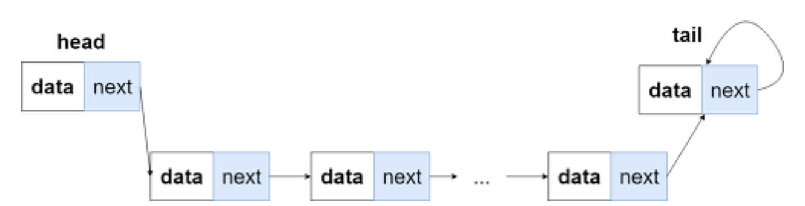

<!-- @format -->

- [배열](#배열)
    - [정리](#정리)
- [연결리스트](#연결리스트)
    - [정리](#정리-1)
- [QnA](#qna)
- [Reference](#reference)

# 배열

배열은 연속적인 메모리 위치에 저장되기 때에 논리적 저장순서와 물리적 저장순서가 일치한다. 따라서 원하는 데이터의 인덱스를 안다면 `O(1)`의 시간에 `Random Access`가 가능하다.

그러나 배열에는 큰 단점이 존재한다.

바로 삽입, 삭제에 `O(N)`의 시간이 소요된다는 것이다.

이는 앞서 말한 **논리적 저장순서와 물리적 저장순서가 일치** 한다는 장점에서 비롯된 단점이다.

- N(0 < k < N)의 크기를 가진 배열의 k번째 위치에 있는 데이터가 삭제된다고 가정하였을 때, k+1 ~ N-1 까지의 데이터들을 앞으로 한칸씩 옮겨주어야 한다.

- N(0 < k < N)의 크기를 가진 배열의 k번째 위치에 데이터가 삽입된다고 가정하였을 때, k+1 ~ N-1 까지의 데이터들을 뒤로 한칸씩 옮겨주어야 한다.

또한 연속적으로 메모리에 저장되기 때문에 `compile time`에 배열의 크기만큼 메모리가 할당된다(stack). 따라서 `runtime`에선 임의로 사용자가 배열의 크기를 바꿀 수 없다. (segmentation fault 위험)

### 정리

- 접근 `O(1)`
- 삽입, 삭제 `O(N)` (best)
- 삽입, 삭제 `O(N)` (worst)
- 메모리 언제 할당 : `compile time`
- 메모리 할당 위치 : `stack`
- 단순 메모리 사이즈, 효율성은 배열이 좋다.

# 연결리스트

`연결리스트(LinkedList)` 란 각 `노드`가 `데이터`와 `포인터`를 갖고 한 줄로 데이터를 저장하는 자료구조를 뜻한다.

제일 앞쪽에 있는 노드를 `head`, 뒷쪽에 있는 노드를 `tail` 이라고 칭한다.

연결리스트는 앞서 언급한 것 처럼 포인터를 갖고있기 때문에 배열처럼 논리적 저장순서와 물리적 저장순서가 일치하지 않아도 되고 다음 노드의 위치만을 알고있으면 된다.

메모리는 배열과 달리 연속적으로 메모리에 저장될 필요가 없고, 동적으로 할당될 수 있기 때문에 `runtime`에 할당된다(heap).

`배열`은 단순하게 데이터만을 저장하고, `연결리스트`는 데이터와 포인터 두가지를 저장하기 때문에 메모리 효율성 측면에선 `배열`이 효율적이라고 볼 수 있다. 하지만 데이터들의 크기를 모른다거나, 동적으로 변하는 데이터들을 저장하는 상황에선 이미 결정된 크기를 변경할 수 없는 `배열`보다 `연결리스트`가 보다 효율적일 수 있다.

연결리스트를 사용하여 원하는 데이터에 접근하기 위해선 도달하기까지 노드들을 순회해야한다. 따라서 접근시 소요되는 시간은 `O(N)` 이다.

연결리스트에서 원하는 노드에 데이터를 삽입, 또는 삭제시 단순히 앞 뒤 노드들의 포인터만을 변경하면 되므로 `O(1)` 시간에 해결할 수 있을 것 같다.

하지만 삽입, 삭제를 수행하려는 노드를 찾는 시간도 필요하므로 결국 원하는 노드를 삽입, 삭제하는데에 소요되는 시간은 `O(N)` 이다.

### 정리

- 접근 `O(1)` (best)
- 접근 `O(N)` (worst)
- 삽입, 삭제 (best) : `O(1)`
- 삽입, 삭제 (worst) : `search time + O(1)` = `O(N)`
- 메모리 언제 할당 : `runtime`
- 메모리 할당 위치 : `heap`
- 메모리 효율성 배열과 비교시 상황에 따라 다르다. 정적인 상황에선 배열이 유리

# QnA

- 배열과 연결리스트의 차이점은 무엇인가요?

  1. 접근  
     배열은 원하는 `random access` 가능, 연결리스트는 순회해야함.

  2. 삽입과 삭제  
     삽입, 삭제시 연결리스트는 포인터만 수정하면 됨  
     반면 배열은 영향받는 모든 데이터들의 인덱스를 옮겨주어야 한다.

  3. 메모리 할당  
     너와나의 메모리

- ArrayList와 Array의 차이점은?
- 배열은 메모리 영역 어디에 데이터를 저장하나요?
  - Stack
- 연결리스트는 메모리 영역 어디에 데이터를 저장하나요?
  - Heap
- 배열의 마지막 데이터를 삭제 시 수행하는데 걸리는 시간은 어떻게 되나요?
  - O(1)
- 배열의 첫번째 데이터를 삭제 시 수행하는데 걸리는 시간은 어떻게 되나요?

  - O(N)

- 원형 연결리스트임을 확인하는 방법?
  - 한 포인터는 2개씩, 한 포인터는 1개씩 노드를 이동하여 만난다면 원형 연결리스트.

# Reference

[geeksforgeeks](https://www.geeksforgeeks.org/linked-list-vs-array/)

https://github.com/JaeYeopHan/Interview_Question_for_Beginner/tree/master/DataStructure#array-vs-linked-list
