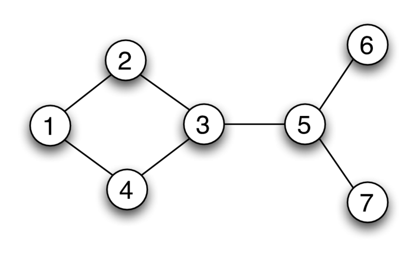
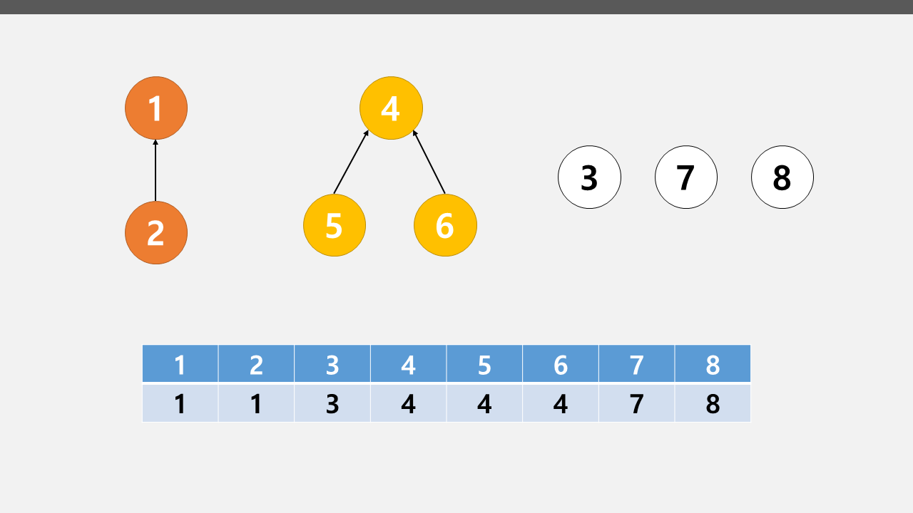
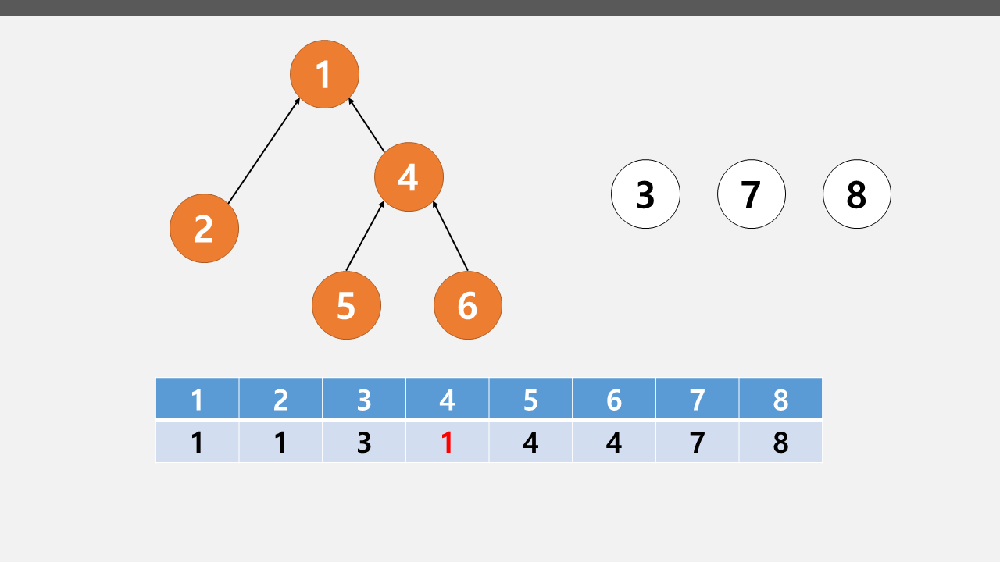
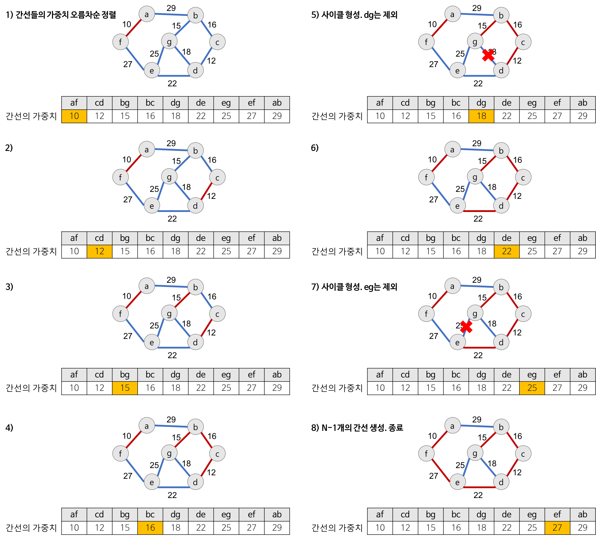

# Graph(그래프)

## Directed Graph 와 Unirected Graph

### Directed Graph

- 간선에 방향성이 포함되어 있는 그래프를 `Directed Graph` 라고 한다.
- <A,B> 와 <B,A> 는 다르다.(<A,B>는 A->B로만 갈 수 있다.)

cf) `트리(Tree)`는 사이클을 가질 수 없는 `Directed Graph`이다.

<p align="center">
  
  <br/> Directed Graph
</p>

### Undirected Graph

- 말 그대로 정점과 간선의 연결관계에 있어서 방향성이 없는 그래프를 `Undirected Graph` 라 한다.
- 간선을 통해서 양방향으로 갈 수 있다.
- (A,B)와 (B,A)는 동일하다.

<p align="center">
  
  <br/> Undirected Graph
</p>

## 그래프 구현 방법

2가지가 존재한다.

### 인접 리스트(Adjacency List)

- 모든 정점을 리스트에 저장하고, 각 정점에 인접한 정점들을 리스트에 추가한 것이다.
- 정점의 번호만 알면 이 번호를 배열의 인덱스로 하여 인접한 정점들에 쉽게 접근할 수 있다.
- 노드 수가 많을 때는 인접 리스트를 사용하는 것이 훨씬 효율적일 수 있다.(시간 복잡도가 줄어든다.)
- E개의 간선 정보를 저장하는데 O(E) 만큼의 메모리 공간이 필요하다.

위에 양방향 그래프 사진을 예로 들어보면, 이런식으로 배열이 형성될 것이다.

```
adj[1] : [2,4]
adj[2] : [1,3]
adj[3] : [2,4,5]
adj[4] : [1,3]
adj[5] : [3,6,7]
adj[6] : [5]
adj[7] : [5]
```

### 인접 행렬(Adjacency Matrix))

- 정점과 간선의 정보를 행렬로 표시하는 방법
- 무방향 그래프일 경우, 대칭 행렬이 된다.
- 정점의 개수가 N개인 경우, 간선의 개수와 무관하게 항상 N제곱개의 메모리 공간이 필요하다.
- 인접한 노드를 찾기 위해서 모든 노드를 전부 순회해야 한다.

```
adj[1] : [0,1,0,1,0,0,0]
adj[2] : [1,0,1,0,0,0,0]
adj[3] : [0,1,0,1,1,0,0]
adj[4] : [1,0,1,0,0,0,0]
adj[5] : [0,0,1,0,0,1,1]
adj[6] : [0,0,0,0,1,0,0]
adj[7] : [0,0,0,0,1,0,0]
```

### 그럼 둘중 뭐가 좋을까?

시간 복잡도를 따져 보면,

**두 노드가 연결 / 연결비용을 확인하는데 걸리는 시간**

- 인접 행렬 : `O(1)`
- 인접 리스트 : `O(V)`

**한 노드에 연결된 모는 노드들을 확인하는데 걸리는 시간**

- 인접 행렬 : `O(V)`
- 인접 리스트 : `O(E)`

보통의 경우에는 공간도 적게 사용하면서 탐색 시간도 빠른 인접 리스트가 훨씬 많이 사용된다고 한다.

실제로 코드를 구현하여 시간 복잡도를 비교해보았다.(노드 개수가 너무 적어 시간 차이가 미미하긴 하지만)

```python
# 인접 행렬
def dfs1(node, n):
    global answer
    if node == n:
        answer += 1
    else:
        for nxt in range(1,8):
            if adj_mat[node][nxt] == 1 and isvisited[nxt] == 0:
                isvisited[nxt] = 1
                dfs1(nxt, n)
                isvisited[nxt] = 0

# 인접 리스트
def dfs2(node, n):
    global answer
    if node == n:
        answer += 1
    else:
        for nxt in adj_list[node]:
            if isvisited[nxt] == 0:
                isvisited[nxt] = 1
                dfs2(nxt,n)
                isvisited[nxt] = 0

# 실행 시간
인접 행렬 : 2.09808349609375e-05 sec
인접 리스트 : 7.152557373046875e-06 sec
```

인접 리스트가 훨씬 빠른 것을 볼 수 있다.(약 3배 차이이다)

고로 DFS, BFS 관련 문제에서 인접 리스트를 주로 사용하는 것으로 고려해보자.

## MST(Minimum Spanning Tree)

### Spanning Tree란?

<p align="center">
  
  <br/> Spanning Tree
</p>

- `Spanning Tree(신장 트리)` : 하나의 그래프가 있을 때 모든 노드를 포함하면서 사이클이 존재하지 않는 부분 그래프

우리는 다양한 문제 상황에서 최소한의 비용으로 신장 트리를 찾아야 할 때가 생긴다.

ex) N개의 도시가 존재하는 상황에서 도시 A,B를 선택했을 때, A에서 B로 이동하는 경로가 반드시 존재하는 최소 비용을 구하라.

이런 경우에 최소 비용으로 만들 수 있는 신장 트리를 구해야 하고, 이를 구하는 알고리즘을 최소 신장 트리 알고리즘 이라고 한다.(MST)

MST를 구하는 대표적인 알고리즘 두 개를 알아볼 것인데, 알아보기 전에 `Union-find 자료구조`에 대해 알아야 한다.

### Union-find 자료구조

- 서로소 부분 집합들로 나누어진 원소들의 데이터를 처리하기 위한 자료구조
- 집합을 하나로 합치는 `Union` 연산과 특정 원소가 속한 집합이 어떤 집합인지 알려주는 `Find` 연산으로 조작한다.
- 트리를 이용하여 집합을 표현한다.

알고리즘은 다음과 같다.

1. 두 노드 A,B로 `Union` 연산을 한다. 이 때, 서로 연결된 두 노드 A,B를 확인한다.
   - A, B의 루트 노드 rootA, rootB를 각각 찾는다. 이때 루트가 같다면 연결할 필요가 없다.
   - rootA를 rootB의 부모 노드로 설정한다. (rootB가 root를 가리키도록 한다.)
2. 모든 `Union` 연산을 처리할 때까지 1번 과정을 반복한다.

그림으로 보면 다음과 같다.

<p align="center">
  
  <br/> (1,4) 두 노드 연결 전
</p>

<p align="center">
  
  <br/> 두 노드 연결 후
</p>

**Python 코드**

1. 개선 전 코드

```python
def find_parent(parent, x):
  if parent[x] != x:
    return find_parent(parent, parent[x])

  return x

def union_parent(parent, a, b):
  a = find_parent(parent, a)
  b = find_parent(parent, b)
  if a < b:
    parent[b] = a # b가 a를 부모노드로 가리킨다.
  else:
    parent[a] = b
```

이렇게 코드르 짜게되면, `1<-2<-3<-4<-5` 이런 식으로 노드가 연결이 되어 있을 때, 5번 노드의 부모를 찾기 위해서 5 -> 4 -> 3 -> 2 -> 1 다 한번씩 들러야 하게 되고, 노드의 개수가 V개 일때 최악의 경우 `O(V)` 의 시간 복잡도를 가질 수 있다.

따라서 간단하게 개선해보자.

2. 개선 된 코드

```python
def find_parent(parent, x):
  if parent[x] != x:
    return find_parent(parent, parent[x])

  return parent[x]  # *** 이 부분이 변경 되었다. ***

def union_parent(parent, a, b):
  a = find_parent(parent, a)
  b = find_parent(parent, b)
  if a < b:
    parent[b] = a # b가 a를 부모노드로 가리킨다.
  else:
    parent[a] = b
```

**Union Find 자료구조의 시간 복잡도**

노드의 개수가 V개이고, 최대 V-1개의 Union연산과 M개의 find연산이 가능 할 때 시간복잡도는

$$O(V + M(1 + \log_{2-M/V}V))$$

증명 과정은 책에서도 생략했다. 그냥 이렇다고만 알면 될 것 같다. 노드 개수가 1000개 이하면 1000만 번 가량의 연산이 소요 된다 정도로.

그렇다면 이 알고리즘이 왜 필요할까? --> 바로 사이클을 판별하기 위해서다.

1. 각 간선을 확인하며 루트 노드를 확인한다.
   - 루트 노드가 서로 다르다면 `union` 연산을 한다.
   - 같다면 사이클이 발생한 것!
2. 모든 간선에 대하여 1번 과정을 수행한다.

이 개념이 크루스칼 알고리즘에 사용되는 것이다.

## MST를 구하기 위한 알고리즘

### 크루스칼 알고리즘(Kruskal Algorithm)

크루스칼 알고리즘을 사용하면 MST를 구할 수 있으며, Greedy 알고리즘으로 분류 된다.

간단하게 설명하면, 모든 간선에 대하여 정렬을 수행하고 가장 거리가 짧은 간선부터 포함 시킨다. 이 때 사이클을 발생시킬 수 있는 간선은 포함시키지 않는다.

구체적인 프로세스를 알아보자.

1. 간선 데이터를 비용에 따라 오름차순으로 정렬한다.
2. 간선을 하나씩 확인하며 현재의 간선이 사이클을 발생시키는지 확인한다.

   - 사이클을 발생하지 않는 경우는 최소 신장 트리 집합에 포함시킨다.
   - 발생하는 경우 포함시키지 않는다.

3. 모든 간선에 대하여 2번의 과정을 반복한다.

그러니까 오름차순으로 정렬하고, 간선 하나씩 확인하면서 `union-find 자료구조` 를 이용하면 되는 것이다.

그림으로 살펴 보자.

<p align="center">
  
  <br/> 크루스칼 알고리즘의 진행 과정
</p>

간단하게 흐름만 코드로 나타내보자.

**Python Code**

```python
# Union-Find 코드는 위에 잘 설명되어 있으므로 생략

a,b,cost = map(int,input().split()) # a, b 노드를 연결하는 간선의 비용 cost
edges.append(cost,a,b)

edges.sort()  # 간선의 비용을 오름차순으로 정렬

total_cost = 0

# 간선을 확인하면서, 사이클을 만들지 않으면 집합을 만들고 비용을 더한다.
for edge in edges:
  cost, a, b = edge
if find_parent(parent,a) != find_parent(parent,b):
  union_parent(parent,a,b)
  total_cost += cost
```

**시간 복잡도**

- 간선의 개수가 E개일 때, `O(ElogE)` 의 시간 복잡도를 가진다.
- `이유?` : 비용을 오름차순으로 정렬할 때 `O(ElogE)`의 시간복잡도를 갖는데, `union-find 자료구조`의 시간복잡도는 그보다 작기 때문에 무시한다.

### 위상 정렬(Topology Sort)

- 방향 그래프의 모든 노드를 방향성에 거스르지 않도록 순서대로 나열하는 것

## Reference

동빈북 ( 이것이 코딩테스트다 with Python 나동빈 저 )

[그래프란](https://gmlwjd9405.github.io/2018/08/13/data-structure-graph.html)

[유니온 파인드](<https://ip99202.github.io/posts/유니온-파인드(Union-Find)/>)
