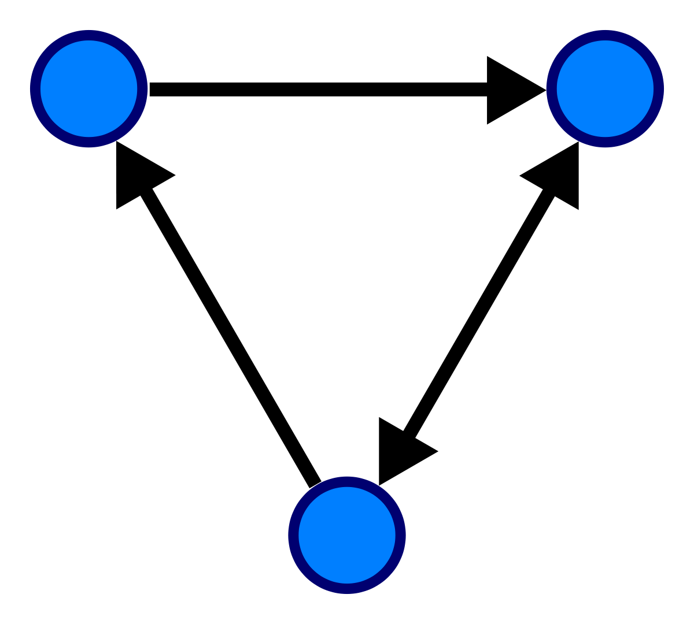

# Graph(그래프)

## Directed Graph 와 Unirected Graph

### Directed Graph

- 간선에 방향성이 포함되어 있는 그래프를 `Directed Graph` 라고 한다.
- <A,B> 와 <B,A> 는 다르다.(<A,B>는 A->B로만 갈 수 있다.)

cf) `트리(Tree)`는 사이클을 가질 수 없는 `Directed Graph`이다.

### Undirected Graph

<p align="center">
  
  <br/> Directed Graph
</p>

- 말 그대로 정점과 간선의 연결관계에 있어서 방향성이 없는 그래프를 `Undirected Graph` 라 한다.
- 간선을 통해서 양방향으로 갈 수 있다.
- (A,B)와 (B,A)는 동일하다.

<p align="center">
  
  <br/> Undirected Graph
</p>

## 그래프 구현 방법

2가지가 존재한다.

### 인접 리스트(Adjacency List)

- 모든 정점을 리스트에 저장하고, 각 정점에 인접한 정점들을 리스트에 추가한 것이다.
- 정점의 번호만 알면 이 번호를 배열의 인덱스로 하여 인접한 정점들에 쉽게 접근할 수 있다.
- 노드 수가 많을 때는 인접 리스트를 사용하는 것이 훨씬 효율적일 수 있다.(시간 복잡도가 줄어든다.)
- 정점의 수가 N개이고 간선의 수가 E라면 N+E만큼의 공간만 필요하다.

위에 양방향 그래프 사진을 예로 들어보면, 이런식으로 배열이 형성될 것이다.

```
adj[1] : [2,4]
adj[2] : [1,3]
adj[3] : [2,4,5]
adj[4] : [1,3]
adj[5] : [3,6,7]
adj[6] : [5]
adj[7] : [5]
```

### 인접 행렬(Adjacency Matrix))

- 정점과 간선의 정보를 행렬로 표시하는 방법
- 무방향 그래프일 경우, 대칭 행렬이 된다.
- 정점의 개수가 N개인 경우, 간선의 개수와 무관하게 항상 N제곱개의 메모리 공간이 필요하다.
- 인접한 노드를 찾기 위해서 모든 노드를 전부 순회해야 한다.

```
adj[1] : [0,1,0,1,0,0,0]
adj[2] : [1,0,1,0,0,0,0]
adj[3] : [0,1,0,1,1,0,0]
adj[4] : [1,0,1,0,0,0,0]
adj[5] : [0,0,1,0,0,1,1]
adj[6] : [0,0,0,0,1,0,0]
adj[7] : [0,0,0,0,1,0,0]
```

### 그럼 둘중 뭐가 좋을까?

시간 복잡도를 따져 보면,

**두 노드가 연결되었는지 확인하는데 걸리는 시간**

- 인접 행렬 : `O(1)`
- 인접 리스트 : `O(V)`

**한 노드에 연결된 모는 노드들을 확인하는데 걸리는 시간**

- 인접 행렬 : `O(V)`
- 인접 리스트 : `O(E)`

보통의 경우에는 공간도 적게 사용하면서 탐색 시간도 빠른 인접 리스트가 훨씬 많이 사용된다고 한다.

실제로 코드를 구현하여 시간 복잡도를 비교해보았다.(노드 개수가 너무 적어 시간 차이가 미미하긴 하지만)

```python
# 인접 행렬
def dfs1(node, n):
    global answer
    if node == n:
        answer += 1
    else:
        for nxt in range(1,8):
            if adj_mat[node][nxt] == 1 and isvisited[nxt] == 0:
                isvisited[nxt] = 1
                dfs1(nxt, n)
                isvisited[nxt] = 0

# 인접 리스트
def dfs2(node, n):
    global answer
    if node == n:
        answer += 1
    else:
        for nxt in adj_list[node]:
            if isvisited[nxt] == 0:
                isvisited[nxt] = 1
                dfs2(nxt,n)
                isvisited[nxt] = 0

# 실행 시간
인접 행렬 : 2.09808349609375e-05 sec
인접 리스트 : 7.152557373046875e-06 sec
```

인접 리스트가 훨씬 빠른 것을 볼 수 있다.(약 3배 차이이다)

고로 DFS, BFS 관련 문제에서 인접 리스트를 주로 사용하는 것으로 고려해보자.

## MST

- `Spanning Tree` : 그래프 내의 모든 정점을 포함하는 트리

## Reference

[그래프란](https://gmlwjd9405.github.io/2018/08/13/data-structure-graph.html)
