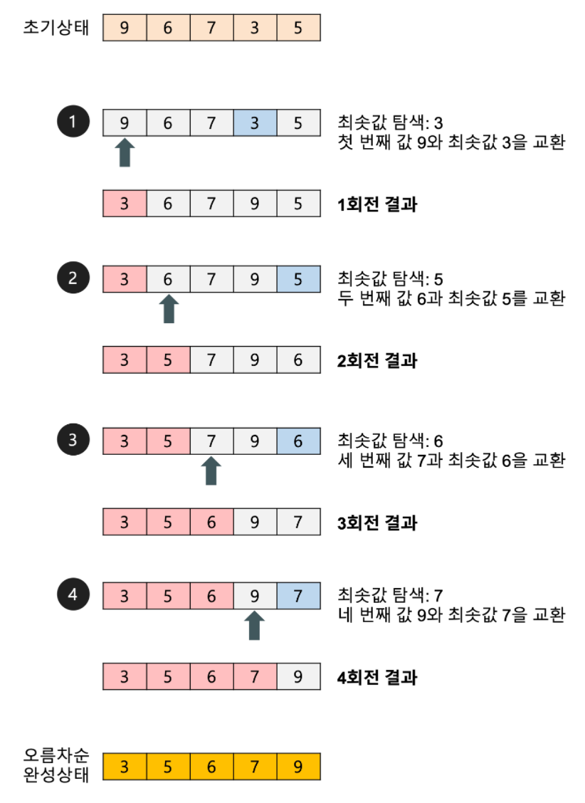
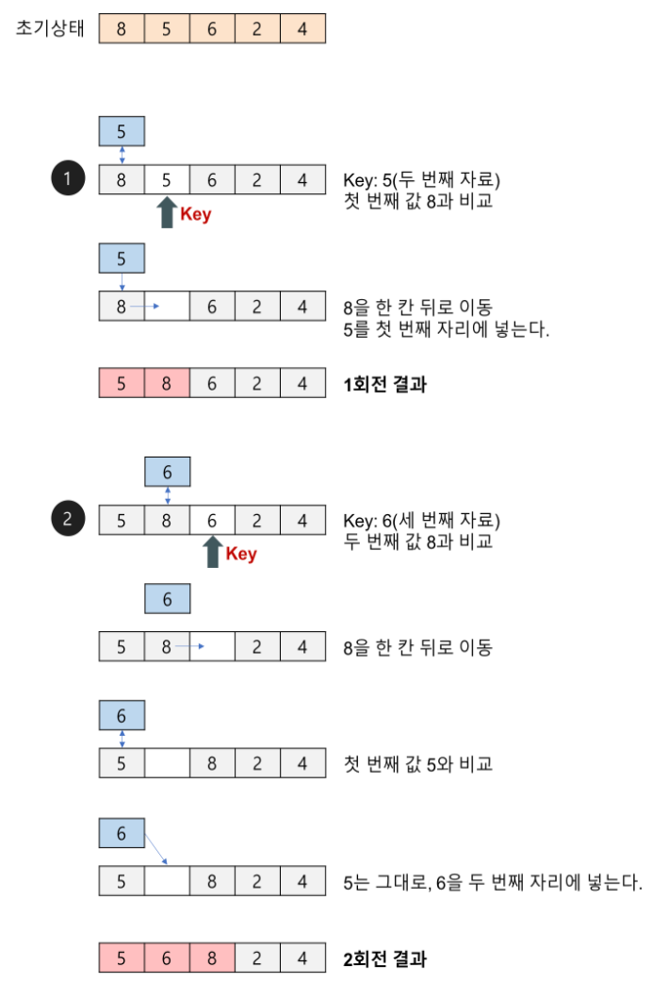
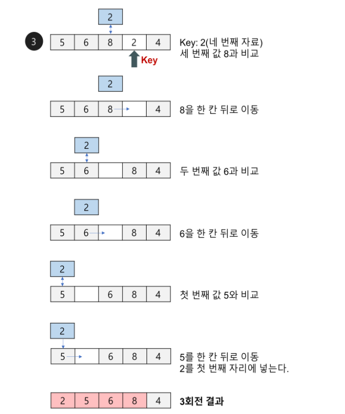
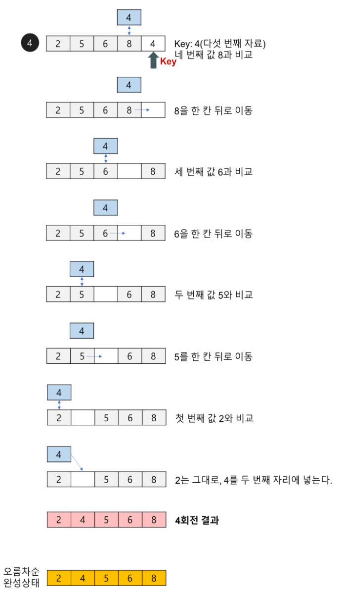
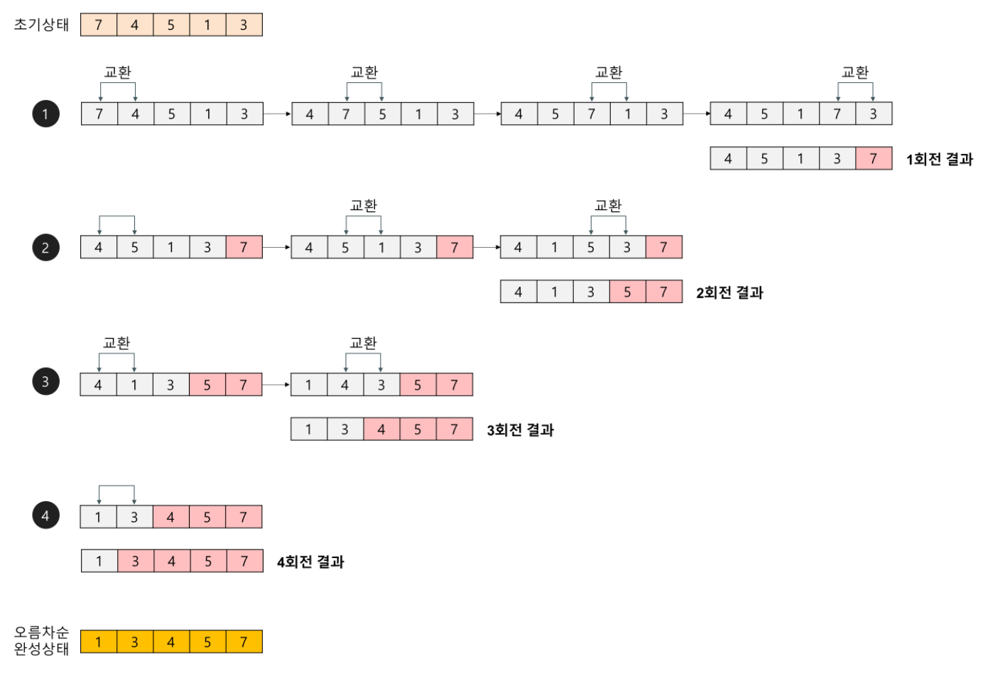
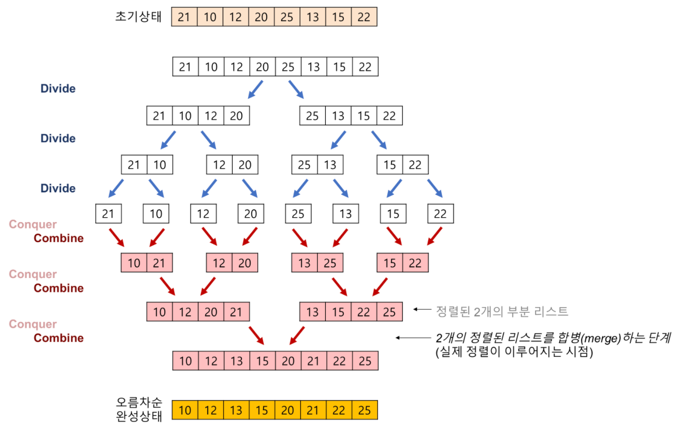
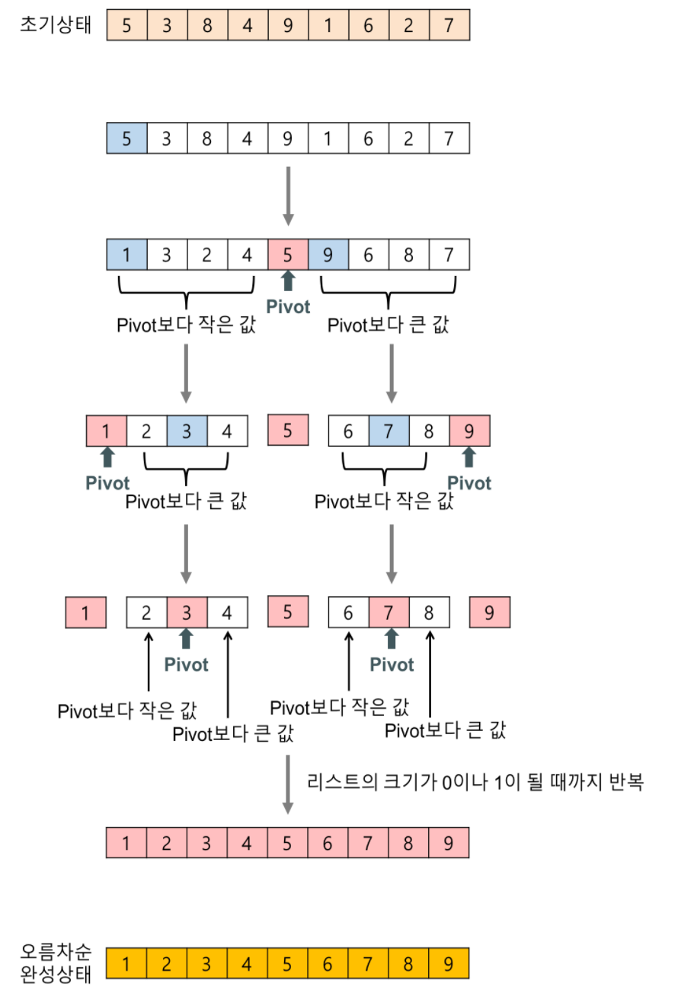

<!-- @format -->

- [선택정렬 (Selection Sort)](#선택정렬-selection-sort)
  - [동작 원리](#동작-원리)
  - [특징](#특징)
  - [pseudo code](#pseudo-code)
  - [시간복잡도](#시간복잡도)
    - [최악의 경우](#최악의-경우)
    - [최선의 경우](#최선의-경우)
    - [평균](#평균)
- [삽입정렬 (Insertion Sort)](#삽입정렬-insertion-sort)
  - [동작 원리](#동작-원리-1)
  - [특징](#특징-1)
  - [pseudo code](#pseudo-code-1)
  - [시간복잡도](#시간복잡도-1)
    - [최악의 경우](#최악의-경우-1)
    - [최선의 경우](#최선의-경우-1)
    - [평균](#평균-1)
- [버블정렬 (Bubble Sort)](#버블정렬-bubble-sort)
  - [동작 원리](#동작-원리-2)
  - [pseudo code](#pseudo-code-2)
  - [시간복잡도](#시간복잡도-2)
- [병합정렬 (Merge Sort)](#병합정렬-merge-sort)
  - [동작 원리](#동작-원리-3)
  - [특징](#특징-2)
  - [pseudo code](#pseudo-code-3)
  - [시간복잡도](#시간복잡도-3)
- [퀵 정렬 (Quick Sort)](#퀵-정렬-quick-sort)
  - [동작 원리](#동작-원리-4)
  - [특징](#특징-3)
  - [pseudo code](#pseudo-code-4)
  - [시간복잡도](#시간복잡도-4)
    - [최악의 경우](#최악의-경우-2)
    - [최선의 경우](#최선의-경우-2)
    - [평균](#평균-2)
- [힙정렬 (Heap Sort)](#힙정렬-heap-sort)
  - [동작 원리](#동작-원리-5)
  - [pseudo code](#pseudo-code-5)
  - [시간복잡도](#시간복잡도-5)
    - [최악의 경우](#최악의-경우-3)
    - [최선의 경우](#최선의-경우-3)
    - [평균](#평균-3)
- [기수정렬 (Radix Sort)](#기수정렬-radix-sort)
  - [동작 원리](#동작-원리-6)
  - [pseudo code](#pseudo-code-6)
  - [시간복잡도](#시간복잡도-6)
    - [최악의 경우](#최악의-경우-4)
    - [최선의 경우](#최선의-경우-4)
    - [평균](#평균-4)
- [계수정렬 (Count Sort)](#계수정렬-count-sort)
  - [동작 원리](#동작-원리-7)
  - [pseudo code](#pseudo-code-7)
  - [시간복잡도](#시간복잡도-7)
    - [최악의 경우](#최악의-경우-5)
    - [최선의 경우](#최선의-경우-5)
    - [평균](#평균-5)
- [정리](#정리)
- [QnA](#qna)
- [Reference](#reference)

# 선택정렬 (Selection Sort)

## 동작 원리



정렬되지 않는 배열들 중 가장 작은 인덱스를 가진 원소와 최솟값을 가지는 원소를 교환하여 정렬하는 정렬 알고리즘 이다.

## 특징

- `in-place` 한 정렬이다.

  > `in-place` 란 추가적인 메모리가 필요없는 상태를 의미한다.

- `unstable` 한 정렬이다.

> unstable 이란 같은 값을 가진 원소들이 정렬 후에 같은 값을 가진 원소들 사이의 상대적 위치를 유지하는 것이 보장되지 않는 것을 의미한다.

- 자료의 이동횟수가 `3(n-1)` 로 정해져있다.

> swap 함수의 작업이 3번의 이동을 필요로 하며, (n-1)개의 자료에 swap이 일어나므로 3(n-1) 이다.

## pseudo code

```
for i <- 0 to n-2 do {
    min <- i
    for j <- i+1 to n-1 do {         // unsorted list A[i+1]...A[n-1]
        if(A[j]<A[min]) min <- j    // A[j]가 A[min]보다 작다면 min을 j로 덮어씌우고 for문을 지속한다.
    }
    swap(A[i], A[min])              // 최종적인 최솟값 A[min]와 A[i]의 값을 바꿈
}                                   // 이 과정을 반복하면 정렬이 됨.
```

## 시간복잡도

첫번째 원소는 `n-1`번 탐색..  
두번째 원소는 `n-2`번 탐색..  
...

n-1번째 원소는 `1`번 탐색

(n-1) + (n-2) + ... + 1 = n(n-1)/2

따라서 `O(N^2)` 이다.

최악, 최선의 경우에도 무조건 탐색을 하기 때문에 변함 없다.

### 최악의 경우

- O(N^2)

### 최선의 경우

- O(N^2)

### 평균

- O(N^2)

<br />

# 삽입정렬 (Insertion Sort)

## 동작 원리





배열을 정렬되지 않은 부분과 정렬된 부분으로 나눈 후, 정렬되지 않은 부분에 있는 데이터를 정렬된 부분의 특정 인덱스에 `삽입` 하며 정렬을 진행하는 알고리즘이다.

## 특징

- 원소가 이미 정렬되어 있는 경우엔 효율적이다.
- `in-place` 정렬이다.

- `stable` 정렬이다.

  > `stable` 이란 같은 값을 가진 원소들이 정렬 후에 같은 값을 가진 원소들 사이의 상대적 위치를 유지하는 것이 보장되는 것을 의미한다.

- 같은 시간복잡도`O(N^2)`를 가진 정렬 알고리즘들보다 빠르다.

  > 데이터들이 정렬되었을 때 O(N)의 시간복잡도를 가지므로, O(N^2) 시간복잡도를 가지는 정렬들 중에선 비교적 빠르다고 할 수있다.

## pseudo code

오름차순 정렬을 기준으로 한다.

```
int i, j, data

for i = 1 to n-1
    data = arr[i]   // 정렬안된 데이터 중 고름

    for j = i-1 to 0
        if arr[j] > data
        // 고른 데이터가 해당 인덱스 데이터보다 값이 작다면
        // 해당 인덱스 데이터를 뒤로 옮김 (데이터가 삽입될 수 있는 자리를 만들어줌)
            then arr[j+1] = arr[j]
        else
        // 크거나 같다면, 이곳에 삽입된다!
            break

    arr[j+1] = data
```

## 시간복잡도

### 최악의 경우

오름차순 정렬을 하는 삽입정렬일 때, 배열이 내림차순으로 (역순으로) 되어있을 때 최악의 경우이다.

매번 내부의 for문을 전부 순회하므로  
1번째엔 1번  
2번째엔 2번  
...
n-1번째엔 n-1번을 탐색한다.

따라서 총 `n(n-1)/2`번 탐색하며 이를 Big-O 표기법으로 나타내면

`O(N^2)`가 된다.

### 최선의 경우

전부 정렬이 되어있을때가 최선의 경우이다.
`pseudo code`의

```if
if arr[j] > data
```

이 부분을 항상 만족하지 못하므로 전부 break가 되어 `O(N)`의 시간복잡도를 가진다.

### 평균

`O(N^2)`

<br />

# 버블정렬 (Bubble Sort)

## 동작 원리



인접한 두 데이터를 비교해가며 정렬을 진행하는 방식이다.

오름차순으로 정렬한다고 가정하였을 때, 오른쪽 데이터가 더 작다면 swap하는 방식으로 정렬한다.

사실 할 말은 별로 없다.

## pseudo code

```
int i, j
for i = 0 to n-2
    for j = 0 to n-i-2
        if arr[j] > arr[j+1]
            then
                temp = arr[j]
                arr[j] = arr[j+1]
                arr[j+1] = temp
```

## 시간복잡도

i = 0 일 때 (n-1)번 탐색
i = 1 일 때 (n-2)번 탐색
...
i = n-2 일 때 1번 탐색

(n-1) + (n-2) + (n-3) + ... + 1 = n(n-1)/2

`O(N^2)`

# 병합정렬 (Merge Sort)

## 동작 원리



> 8개의 데이터를 정렬하는 것 보다, 4개의 데이터를 정렬하는 것이 더 쉽고, 또 이들 각각을 다시 한번 둘로 나눠서 2개의 데이터를 정렬하는 것이 더 쉽다.

`병합정렬`은

1. 분할
2. 정복
3. 결합

의 과정을 거치는 정렬 방법이다.

병합정렬은 1개의 데이터가 남을 때까지 분할한다. `log2N`

분할한 뒤, 나뉘어진 두 배열들을 합치며 정렬한다.

수도코드에 자세히 써놓았다.

## 특징

- `stable`한 정렬이다.

> 만약 [1, 3, 2], [2, 6, 9] 두 배열을 병합한다고 가정해보자.  
> `stable` 하기 위해선 값이 같은 원소들의 상대적 위치가 동일해야 한다.  
> 즉 왼쪽에 있는 2가 오른쪽에 있는 2보다 정렬된 배열에서도 왼쪽에 있어야 한다는 것이다.

```
while(lIdx <= mid && rIdx <= right) {
    // 서로 비교하여 작은것들을 결과 배열에 넣어준다.
    if arr[lIdx] <= arr[rIdx]
      then
        result[sortIdx++] = arr[lIdx++]
```

병합할 때 결과 배열에 데이터가 정렬되어 넣어주는 과정이다.  
여기서 `<=`를 사용한 것을 볼 수 있는데, 이 부분 때문에 같을 때 왼쪽 배열의 원소를 먼저 결과에 넣어주므로 상대적으로 왼쪽에 있게 되고 상대적 위치가 유지되므로 `stable` 하다는 것을 알 수 있다.

- 데이터 분포의 영향을 덜 받는다.
  > 어떤 데이터가 와도 O(NlogN)의 시간이 소요된다.

* 데이터들이 배열로 구성되었을 시 추가적 메모리가 필요하므로 `in-place` 정렬이 아니다.

* 하지만 연결리스트로 구성되었다면, 인덱스만 바꾸어주면 되므로 `in-place` 정렬이 될 수 있다.

## pseudo code

두 배열을 분할하고 다시 병합하는 병합정렬 코드이다.

```
mergeSort(arr, left, right) {
  mid = (left+right)/2
  // 왼쪽 분할
  mergeSort(arr, left, mid)

  // 오른쪽 분할
  mergeSort(arr, mid+1, right)

  // 여기까지 왔을 때의 arr은 왼쪽끼리 정렬, 오른쪽끼리 정렬 된 배열
  // [1, 6, 3, 5, 4, 2] -> [1, 3, 6, 2, 4, 5]
  merge(arr, left, mid, right)
}
```

두개의 배열을 합쳐서 정렬하는 코드이다.

```
merge(arr, left, mid, right) {
  // arr은 각각 정렬된 배열이 합쳐져있는 배열이다.
  // [left, ... , mid] + [mid+1, ... , right]
  lIdx = left
  rIdx = mid+1
  sortIdx = left

  while(lIdx <= mid && rIdx <= right) {
    // 서로 비교하여 작은것들을 결과 배열에 넣어준다.
    if arr[lIdx] <= arr[rIdx]
      then
        result[sortIdx++] = arr[lIdx++]
    else
      result[sortIdx++] = arr[rIdx++]
  }

  // 오른쪽 배열의 어떤 원소보다 왼쪽 배열의 모든 원소가 다 작아서
  // 왼쪽 배열이 결과 배열에 전부 다 들어갔을 때
  // e. g) [1, 2, 3, 4, 5], [6, 7, 8, 9, 10]
  if lIdx > mid
    then
      for i=rIdx to right
        result[sortIdx++] = arr[i]
  else
    for i=lIdx to mid
      result[sortIdx++] = arr[i]
}

```

## 시간복잡도

데이터 수가 N개일 때 각 병합의 단계마다 최대 N번의 비교연산이 일어나고, 단계는 log2N번 존재한다.

`O(NlogN)`

# 퀵 정렬 (Quick Sort)

## 동작 원리



한 원소를 선택하여 `pivot`으로 선택한 후 `pivot`보다 작은 값들은 왼쪽 배열로, `pivot`보다 큰 값들은 오른쪽 배열로 분할한 뒤, 정렬하고 병합하면서 전체 배열이 정렬이 되는 정렬 방식이다.

## 특징

- `unstable` 한 정렬이다.
- `merge sort`와 달리 비균등하게 분할한다.

## pseudo code

```
// partition 부분
while(low <= right) {
  // pivot보다 큰 부분을 찾는 과정
  while(pivot > arr[low])
    low++

  // pivot보다 작은 부분을 찾는 과정
  while(pivot < arr[high])
    high--

  if(low <= high)
    swap(low, high)
}

swap(left, high)
return high
```

```
// quicksort
if(left <= right)
  then
    // pivot을 기준으로 나뉨
    pivot = partition(left, right)
    quicksort(left, pivot-1) // 왼쪽 부분을 정렬
    quicksort(pivot+1, right) // 오른쪽 부분을 정렬
```

## 시간복잡도

### 최악의 경우

`O(N^2)`

### 최선의 경우

`O(NlogN)`

### 평균

`O(NlogN)`

# 힙정렬 (Heap Sort)

## 동작 원리

## pseudo code

## 시간복잡도

### 최악의 경우

### 최선의 경우

### 평균

# 기수정렬 (Radix Sort)

## 동작 원리

## pseudo code

## 시간복잡도

### 최악의 경우

### 최선의 경우

### 평균

# 계수정렬 (Count Sort)

## 동작 원리

## pseudo code

## 시간복잡도

### 최악의 경우

### 최선의 경우

### 평균

# 정리

# QnA

# Reference

윤성우의 열혈 자료구조

https://gmlwjd9405.github.io/2018/05/06/algorithm-selection-sort.html

https://gmlwjd9405.github.io/2018/05/06/algorithm-bubble-sort.html

https://gmlwjd9405.github.io/2018/05/08/algorithm-merge-sort.html
