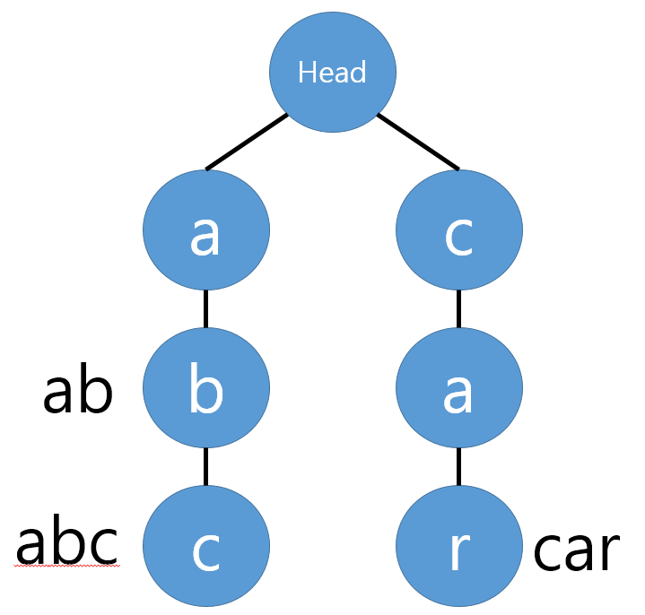
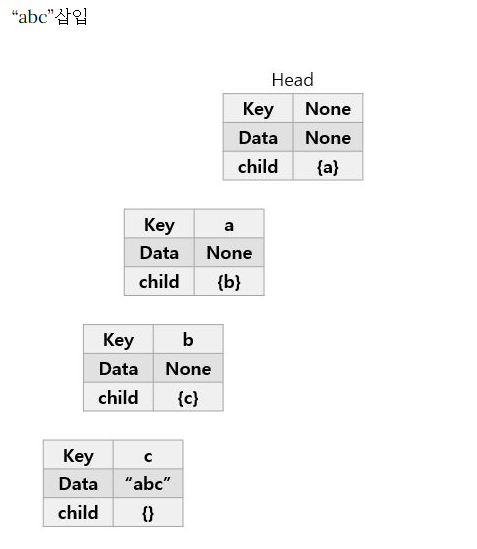
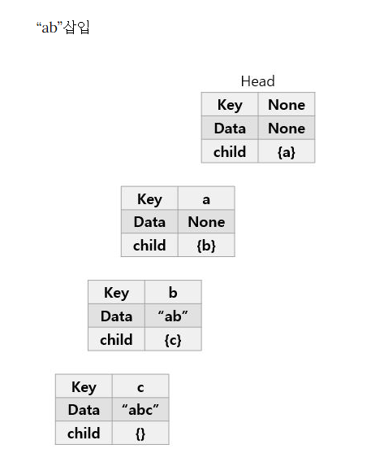
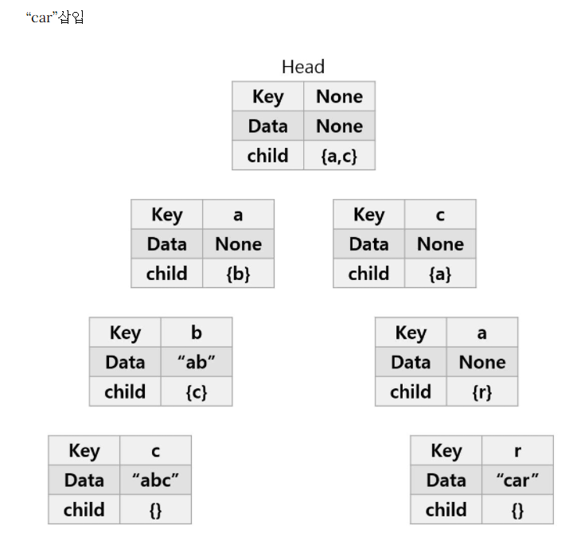

# Trie(트라이)

## 트라이란?

- 문자열을 저장하고 효율적으로 탐색하기 위한 트리 형태의 자료구조이다.
- 자동완성 기능, 사전 검색 등과 같이 문자열을 저장하고 탐색하는데 특화되어있는 자료구조이다.
- `radix tree`, `prefix tree`, `retrieval tree` 라고 부르기도 한다.

## 장단점

- 문자열 검색을 빠르게 한다.(저장, 탐색에 특화되어 있으니 당연하다)
- 문자열을 탐색할 때, 전부 비교하면서 탐색을 하는 것보다 시간 복잡도 측면에서 훨씬 더 효율적이다. (뒤에서 자세히 다뤄보겠다.)
- 각 노드에서 자식들에 대한 포인터들을 모두 배열로 저장하고 있다는 점에서 저장 공간의 크기가 커진다. (메모리 측면에서 비효율적일 수 있다.)

## 트라이 동작 방식

예를 들면서 이해해 보자.

**`abc`, `ab`, `car` 이라는 단어 세개를 트라이에 저장하려고 하는 경우라고 가정해보자.**

  
    트라이 구조

결과는 이렇게 될 것인데, 어떻게 이렇게 동작하는 지 분석해보자.

### `abc` 를 삽입할 때

- 첫 번째 문자는 `a`이다. 초기에 트라이 자료구조 내에는 아무것도 없으므로 `Head(Root)`의 자식 노드에 `a`를 추가한다.
- `a`노드에서 자식이 하나도 없으므로 자식노드에 `b`를 추가 한다.
- 마찬가지로 `b`노드에도 자식노드에 `c`를 추가 한다.
- `abc` 단어가 여기서 끝났으므로, 현재 노드에 `abc`라는 것을 표시 한다. (Data에 추가)

  
    'abc' 삽입 후

### `ab`를 삽입할 때

- 현재 Head의 자식노드로 `a`가 이미 존재한다. 따라서 추가하지 않고 자식 노드로 이동한다.
- `b`도 `a`의 자식노드로 이미 존재하므로 `b` 노드로 이동한다.
- 여기서 단어가 끝이 나므로 마찬가지로 `ab`를 현재 노드에 표시한다.

  
    'ab' 삽입 후

### `car` 삽입할 때

- Head의 자식노드로 `c`가 존재하지 않기 때문에, `c`를 자식노드로 추가한다.
- 맨 처음 `abc`가 생성된 것과 같은 프로세스로 `car`를 추가한다.

  
    'car' 삽입 후

## 시간 복잡도

제일 긴 문자열의 길이를 `L`, 문자열들의 수를 `N`이라 가정한다.

두 가지 경우를 비교해 보자.

### 문자열을 전부 비교하는 경우

- 단순하게 일일이 비교하는 경우, 최악의 경우 `O(NL)`의 시간 복잡도가 소요 된다.
- 만약 이 문자열들을 정렬 시킨 뒤, 이진 탐색 알고리즘을 사용하면 `O(LlogN)` 로 단축시킬 수 있지만, 이진 탐색은 문자열들이 정렬이 되어 있어야 하므로 정렬하는 과정 자체에 `O(NLlogN)` 의 시간이 걸린다.

### 이진 탐색을 사용하는 경우

- 트리 노드를 찾으러 가는 시간 복잡도는 `O(logN)`만큼 걸린다.
- 하지만 문자열의 비교에는 길이에 비례하는 시간이 걸린다 -> 문자열 최대 길이를 곱한 `O(LlogN)`의 시간복잡도가 된다.

### 트라이를 사용하는 경우

- 가장 긴 문자열의 길이만큼만 트리를 타고 들어가면 되기 때문에 `O(L)`만에 끝나게 된다.

**참고자료**

[velog](https://velog.io/@kimdukbae/자료구조-트라이-Trie)

[github blog](https://twpower.github.io/187-trie-concept-and-basic-problem)

[tistory](https://soobarkbar.tistory.com/71)

[wiki](https://namu.wiki/w/트라이)
