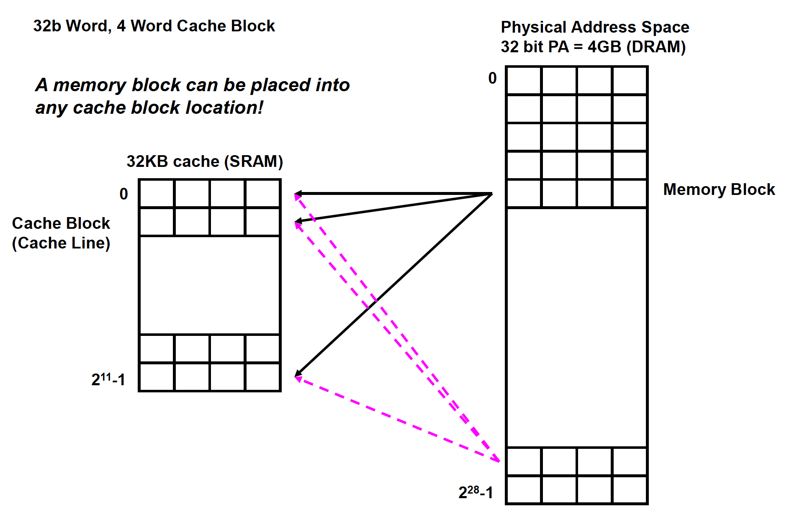
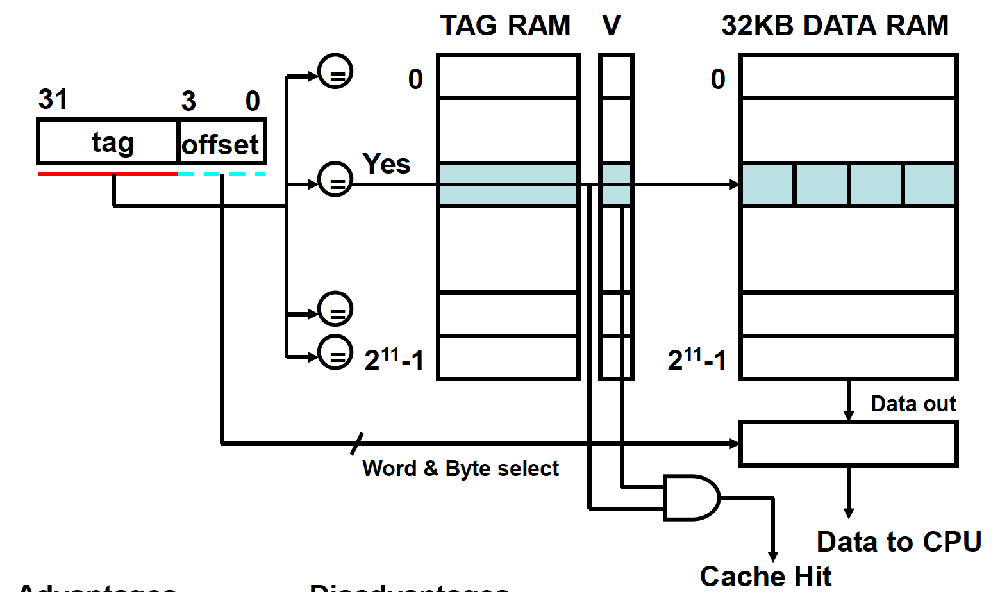
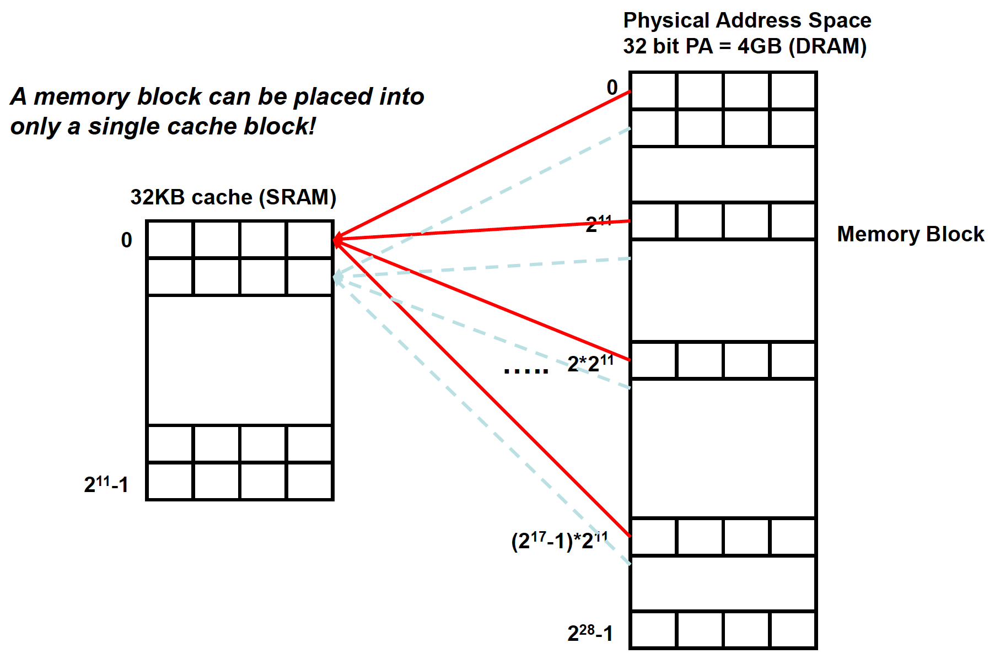
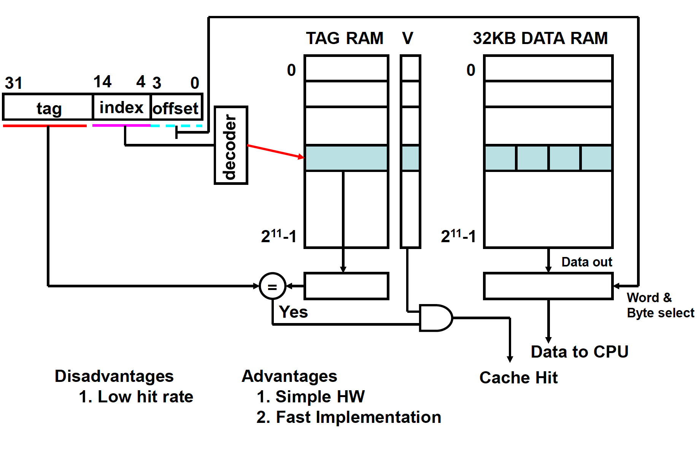
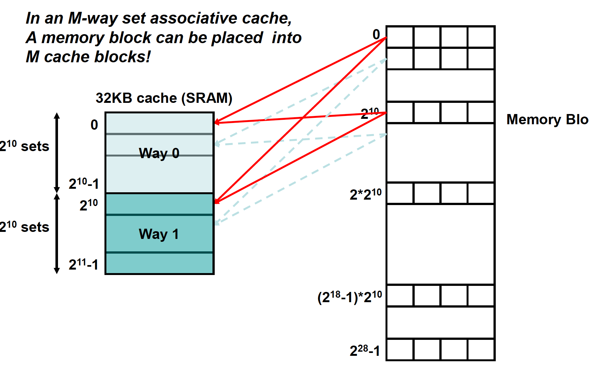
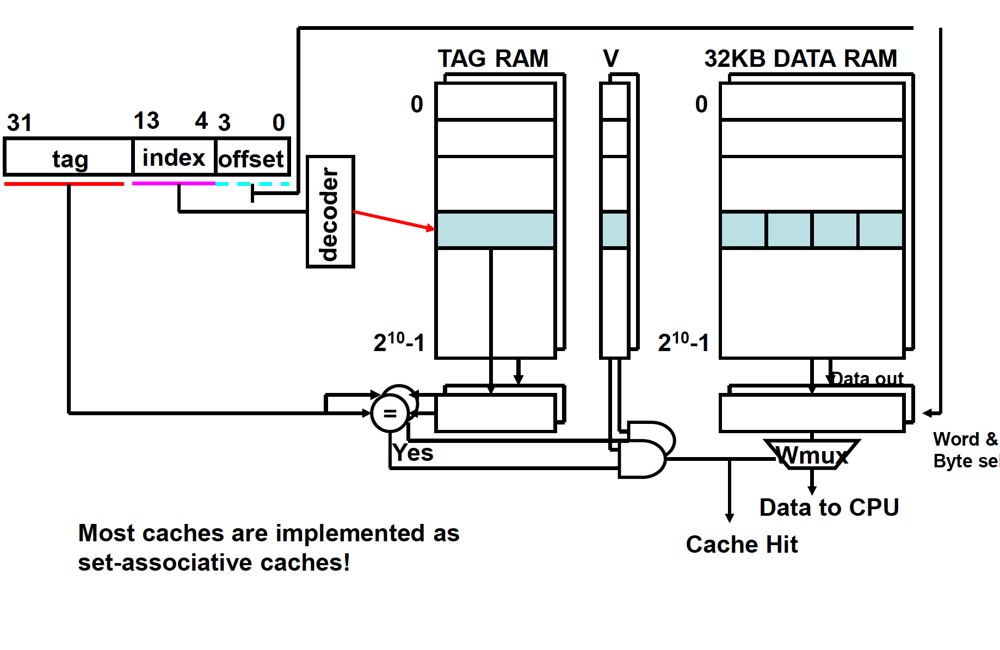

<!-- @format -->

# Cache

## 장점

# Cache Placement Strategies

## Fully Associative Cache

## Direct Mapped Cache

## Set Associative Cache

# Cache Block Replacement

- Random

  - 그냥 랜덤으로 한 block을 대체한다.

- LRU (least recently used)

  - timestamp 저장 필요

# Types of Cache Miss

- Cold-start Misses

  - 첫 접근은 무조~건 miss가 발생한다. why? 캐시에 없으니깐!

- Capacity Misses

  - 캐시의 크기보다 현재 프로그래밍 필요로 하는 `Memory block`이 더 클 경우 발생 가능!

  * Fully-Associative Cache여도 발생할 수 있는 Cache Miss이다.

- Conflict Misses

  - Direct-Mapped Cache, Set-Associative Cache 에서만 발생

  * Full-Associative Cache에선 발생 X

  * 여러 block들이 하나의 Cache block에 Mapping 되었을 때 발생하는 Cache Miss이다.

- Invalidation Misses

  - Cache에 데이터를 저장했는데, 원본이 수정이 되었을 때 발생하는 Cache Miss 이다.

# Reference

https://www.geeksforgeeks.org/types-of-cache-misses/
