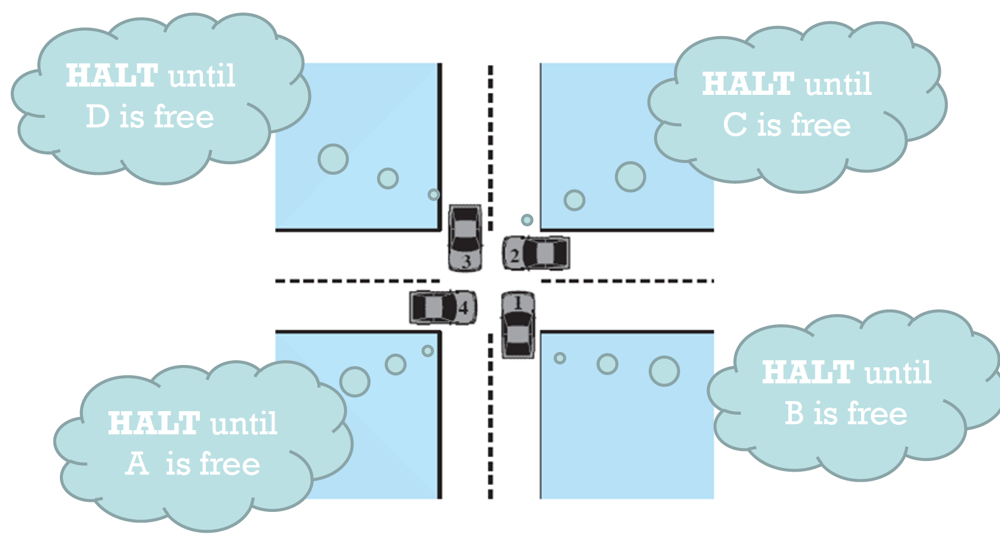

<!-- @format -->

# Deadlock



두 개 이상의 작업이 서로 상대방의 작업이 끝나기 만을 기다리고 있기 때문에 결과적으로 아무것도 완료되지 못하는 상태를 가리킨다.

# Deadlock 발생 조건

- 상호배제 (Mutual exclusion)

  하나의 프로세스가 자원을 동시에 사용하지 못하는 것을 의미한다.

- 점유대기 (Hold and Wait)

  자원을 가지고 있으면서 다른 자원을 요청하는 것을 의미한다.

- 비선점 (No preemption)

  한 프로세스가 갖고있는 자원을 강제로 뺏지 못하게 하는 것을 의미한다.

- 환형대기 (Circular wait)

  각각의 프로세스들이 자원을 갖고있으면서 동시에 다른 다음 프로세스의 자원을 필요로 할 때를 말한다.

  즉 `Circular Chain`이 만들어지게 기다리는 것을 의미한다.

# Deadlock을 해결하기 위한 정책

- Deadlock prevention

  완전히 보수적인 정책이다. 앞서 언급된 발생조건 4가지 중 한 가지를 발생하지 않게 차단하는 것이다.

- Deadlock avoidance

  약간 중도 느낌의 정책이다. 데드락이 발생하지 않게 자원을 할당하는 정책이다.

- Deadlock detection

  완전 프리한 정책이다. 데드락이 발생하였으면(감지되면) RollBack하는 정책이다.

# Deadlock Prevention

Deadlock Prevention은 발생조건 4가지 중 한 가지를 발생하지 않게 만드는 것이므로, 각 조건들을 부정하는 방법들에 대해 알아볼 것이다.

- 상호배제 (Mutual exclusion)

  이건 차단할 수가 없다.

- 점유대기 (Hold and Wait)

  처음에 시작하자마자, 자신이 필요한 자원들을 모두 요청해서 모두 할당을 받으면 실행하고, 아니면 기다리는 방식으로 `Hold and Wait`이 발생하지 않게 할 수 있다.

- 비선점 (No preemption)

  만약 A 프로세스가 어떤 자원 B를 요청했을 때  
   그 자원이 다른 프로세스 C가 점유하고 있다면, A가 갖고있는 자원을 전부 반납하게 하고,  
   이전에 A가 사용하던 자원 + 할당을 요청한 자원(아마도 B)를 모두 할당받게 되어야 다시 프로세스가 수행되게 하는 방법을 통해 `No Preemption`이 발생하지 않도록 할 수 있다.

  또는 OS가 그냥 뺏어서 줘버릴수도 있다.

- 환형대기 (Circular wait)

  sequence를 정하여 순서대로만 접근 가능하게 강제하는 방식으로 `Circular wait`이 발생하지 않도록 할 수 있다.

# Deadlock avoidance

만약 허락한다면, 데드락이 발생될 수 있는가?를 확인한다.

- 프로세스 시작 거부

  프로세스의 자원 요청들이 데드락을 일으킨다면, 프로세스를 시작시키지 않는다.

  그러나 이 방식은 각 프로세스가 어떤 자원들을 필요로 하는지를 알아야 수행할 수 있다.

- 자원 할당 거부
  - banker's algorithm

# Deadlock detection

- Deadlock 발견 알고리즘

- Deadlock 회복 알고리즘

# Dining Philosophers problem

- 세마포어를 이용한 해결 방법

```cpp

/* 첫번째 방법 */

semaphore fork [5] = {1};
int i;
void philosopher(int i) {
    while(1) {
        think();
        wait(fork[i]);
        wait(fork[(i+1)%5]);
        eat();
        signal(fork[(i+1)%5j]);
        signal(fork[i]);
    }
}

int main() {
    parbegin(philosopher(0), philosopher(1), philosopher(2), philosopher(3), philosopher(4))
}
```

```cpp

/* 첫번째 방법 */

semaphore fork[5] = {1};
semaphore room = {4};
int i;
void philosopher(int i) {
    while(1) {
        think();
        wait(room);
        wait(fork[i]);
        wait(fork[(i+1)%5]);
        eat();
        signal(fork[(i+1)%5]);
        signal(fork[i]);
        signal(room);
    }
}

int main() {
    parbegin(philosopher(0), philosopher(1), philosopher(2), philosopher(3), philosopher(4))
}
```

- 모니터를 이용한 해결 방법

```cpp
monitor dining_controller;
cond forkReady[5];
bool fork[5] = {true};

void get_forks(int pid) {
    int left = pid;
    int right = (++pid)%5;
    if(!fork[left]) {
        cwait(forkReady[left]);
    }
    fork(left) = false;
    if(!fork[right]) {
        cwait(forkReady[right]);
    }
    fork[right] = false;
}

void release_forks(int pid) {
    int left = pid;
    int right = (++pid)%5;

    if(empty(forkReady[left])) {
        fork[left] = true;
    } else {
        csignal(forkReady[left]);
    }

    if(empty(forkReady[right])) {
        fork[right] = true
    } else {
        csignal(forkReady[right])
    }
}

void philosopher[k=0 to 4] {
    while(1) {
        <think>;
        get_forks(k);
        <eat spaghetti>
        release_forks(k);
    }
}
```

# Reference

https://ko.wikipedia.org/wiki/%EA%B5%90%EC%B0%A9_%EC%83%81%ED%83%9C

Operating Systems Internals and Design Principles 8th, William Stallings
