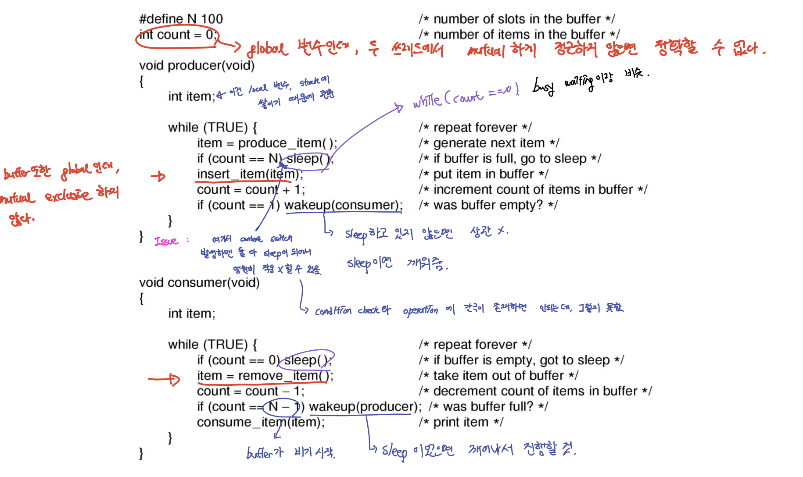

# Critical Region(임계 구역)과 Race Condition

`Critical Region`은 자원이 공유될 수 있는 코드 블럭을 의미한다.

`Race Condition(경쟁 조건)`의 의미는, 두 개 이상의 프로세스/스레드가 공유 자원을 동시에 사용할 때 그 순서에 따라 결과가 달라지는 문제를 얘기한다.
예를 들면, 내 은행계좌에 2만원 밖에 없는데, 1번 ATM기기와 2번 ATM기기에서 동시에 2만원을 출금하려고 할 때, 접근 제어를 하지 않으면 2만원짜리 계좌에서 4만원이 출금되는 일이 발생한다.

이러한 문제를 해결하기 위해 임계 구역에 대한 여러가지 제어를 하게 된다.

## Critical Regions의 4가지 조건

- `Mutual Exclusion`(상호 배제) : 한 프로세스가 임계 구역에 진입 했다면, 다른 프로세스는 진입할 수 없다.
- `Bounded Waiting` : 한 프로세스가 임계 구역에 진입 하기 위해 무한히 대기하는 일은 발생하면 안된다.
- 임계 구역 외부에서 실행되고 있는 프로세스가 다른 프로세스들을 블록시켜서는 안된다.
- CPU 개수나 속도에 대한 어떠한 가정도 하지 않는다.

이 조건과 관련된 문제의 예시를 들어보면 아래 그림과 같다. 아래 그림은 생산자 - 소비자 문제이다.(Sleep and Wake Up)

이 임계구역 문제를 해결하기 위해 사용되는 것들 중 대표 적인 것이 뮤텍스와 세마포어 이다.

# Mutex

# Semaphore
