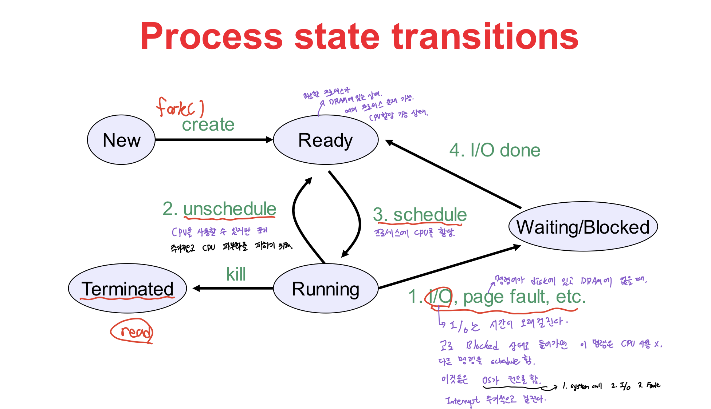

# PCB
내용 추가 예정

# Context Switch

OS가 실행중인 프로세스를 멈추고, 다른 프로세스에 CPU를 할당하는 것을 Context Switch라고 한다.

## Context Switch가 발생하는 경우

위 그림은 Process State가 변화하는 과정을 나타낸 그림인데, 이처럼 Process의 상태 변화가 일어날 때 Context Switch가 발생한다.
(`Ready -> Running` , `Running -> Ready` , `Running -> Block` 될 때 처럼)

## Context Switch 비용

Context Switch가 발생하게 되면 다음과 같은 Cost가 소모된다.

1. Cache 초기화
2. Memory Mapping 초기화
3. 메모리에 접근 하므로 Kernel은 항상 실행되어야 한다.

Context Switch는 항상 높은 Cost를 요구하므로 성능 저하를 야기시킨다.

## 시간 할당량

프로세스들의 시간 할당량은 시스템 성능의 중요한 역할을 한다. 시간 할당량이 적을 수록 사용자는 여러 개의 프로세스가 동시에 수행되는 느낌을 갖게 되지만 CPU를 할당하는 작업이 계속 발생 -> `Interrupt`가 증가한다.
또한, 프로세스의 실행을 위한 부가적인 활동을 `Overhead`(간접 부담 비용)이라고 하는데, 이 또한 같이 증가한다.

## Mode-Switch vs Context-Switch
### 공통점 
- 두 가지 작업 모두 현재 레지스터 값을 저장함과 동시에 사용할 레지스터 값을 복원한다.
### 차이점
- `Mode Switch`는 User Mode에서 프로세스가 작동하다가 System Call이나 Interrupt에 의해 커널 모드로 진입시에 User Mode에서의 레지스터 컨텍스트가 프로세스의 커널 스택에 저장 되고, 커널 스택에 저장되어 있던 프로세스의 커널 레지스터 컨텍스트가 복원된다.
- `Context Switch`는 이미 프로세스가 Kernel Mode인 상태이다. 그리고 프로세스의 커널 레지스터 컨텍스트가 메모리에 저장되고 다음번 스케줄될 프로세스의 커널 레지스터 컨텍스트가 복원되는 것이다.

그림을 보면서 조금더 이해하면 좋을 것 같다.
