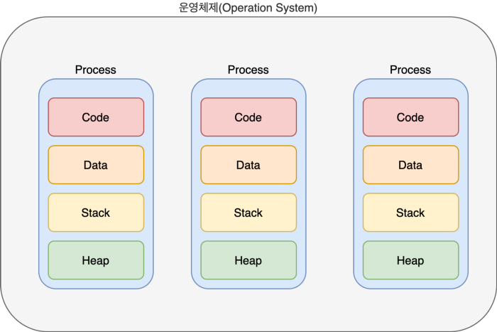
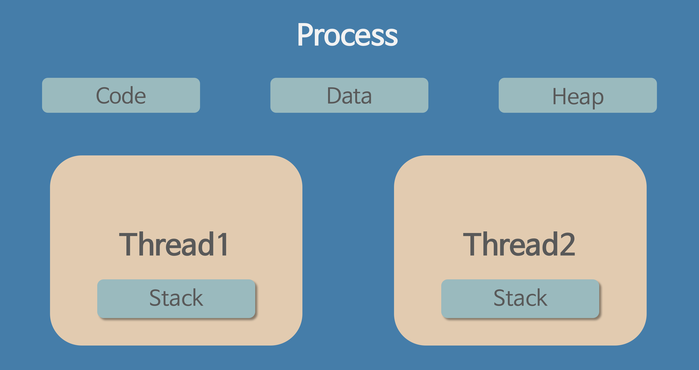
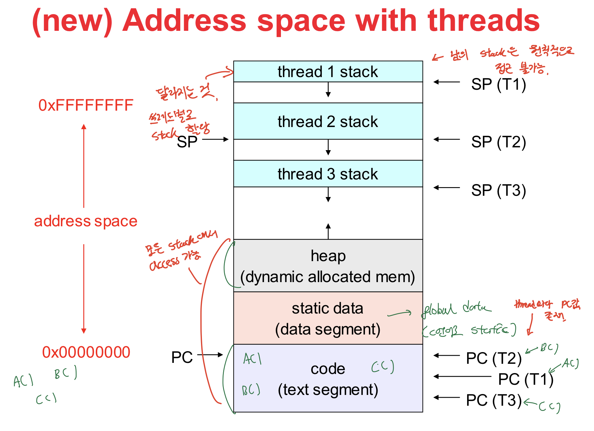
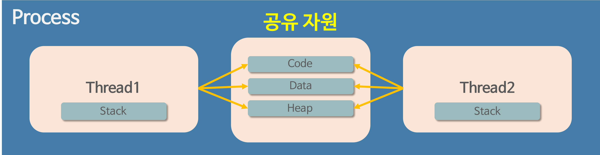

# 프로세스와 스레드

## 프로세스(Process)
- 컴퓨터에서 연속적으로 실행 되고 있는 프로그램을 의미 한다.
- 디스크로부터 메모리에 적재되어 CPU에 할당을 받은 작업의 단위.
- 운영체제로부터 시스템 자원(`주소 공간`, `CPU 시간`, `파일`, `메모리` 등)을 할당 받는다.

### 프로세스의 특징
- 프로세스마다 **최소 1개의 스레드**를 갖는다.(이 하나의 스레드는 메인 스레드다.)
- 그림처럼 각각 별도의 메모리 영역(`Code`, `Data`, `Stack`, `Heap` 주소 공간)을 할당 받는다.
- 한 프로세스는 다른 프로세스의 변수나 자료구조에 접근할 수 없으며, 접근하려면 `IPC(Inter-Process Communicaiton)`를 사용해야 한다. (파이프, 파일, 소켓 등을 이용한 통신 방법 이용)

## 스레드(Thread)

- 한 프로세스 내에서 동작되는 여러 실행 흐름
- 프로세스 내의 주소 공간이나 자원을 공유할 수 있다. -> 한 스레드가 프로세스의 자원을 변경하면 다른 스레드도 그 변경 결과를 즉시 확인할 수 있다.
- 프로세스 내의 다른 영역은 공유하고 **`Stack` 영역만 따로 할당받는다.** -> 원칙적으로 다른 쓰레드의 Stack은 접근 불가능하다.
- 쓰레드의 구성 요소 : `ID`, `PC(Program Counter)`, `레지스터`, `스택`

위에 그림은 대략적으로 구조를 나타낸 것이고, 자세하게 주소값을 다뤄보면서 살펴보면 아래 그림과 같다.

**스택을 스레드마다 독립적으로 할당하는 이유**

스택은 함수 호출 시 전달되는 인자, 되돌아갈 주소값 및 함수 내에서 선언하는 변수 등을 저장하기 위해 사용되는 메모리 공간이므로 스택 메모리 공간이 독립적이라는 것은 독립적인 함수 호출이 가능하다는 것이고 이는 독립적인 실행 흐름이 추가되는 것이다. 따라서 스레드의 정의에 따라 **독립적인 실행 흐름을 추가하기 위한 최소 조건**으로 독립된 스택을 할당한다.

**PC Register 를 스레드마다 독립적으로 할당하는 이유**

PC 값은 스레드가 명령어의 어디까지 수행하였는지를 나타나게 된다. 스레드는 CPU 를 할당받았다가 스케줄러에 의해 다시 선점당한다. 그렇기 때문에 명령어가 연속적으로 수행되지 못하고 어느 부분까지 수행했는지 기억할 필요가 있다. 따라서 PC 레지스터를 독립적으로 할당한다.

# 멀티 프로세스와 멀티 스레드

## 멀티 프로세스(Multi Process)
- 하나의 응용프로그램을 여러 개의 프로세스로 구성 -> 하나의 프로세스가 하나의 작업을 처리한다.

### 장점
- 여러 개의 프로세스 중 한 프로세스가 죽는다고 해서 다른 프로세스에 영향이 가지 않는다. (안전성이 높다)

### 단점
- 작업량이 많을 수록 Context Switching으로 인한 성능 저하, 오버헤드 많이 발생(공유 자원이 없으므로 캐시 초기화와 같은 무거운 작업을 계속 해줘야 한다.)

## 멀티 스레드(Multi Thread)
- 하나의 응용프로그램을 하나의 프로세스, 여러 개의 스레드로 구성 -> 하나의 스레드가 하나의 작업을 처리한다.

### 장점
- 프로세스를 생성하여 자원을 할당하는 시스템 콜이 줄어들어 자원을 효율적으로 관리할 수 있다.
- 스레드 사이의 작업량이 작아 Context Switching이 빠르다.
- 프로세스 내의 Stack을 제외한 모든 메모리 공유 -> 통신 부담이 적다.

### 단점
- 자원 공유의 문제(동기화 문제)가 존재한다.
- 하나의 스레드에 문제가 발생하면 나머지 스레드도 작동이 불가능하다. (스레드 문제가 발생 -> 하나의 프로세스가 영향을 받음)

**멀티 프로세스 대신 멀티 스레드를 사용하는 이유**

앞에 장단점과 중복되는 내용이 있지만,

- 프로세스를 생성하여 자원을 할당하는 `System Call`이 줄어들어 자원을 효율적으로 관리할 수 있다.
- Context Switching 시, 캐시 메모리를 비울 필요가 없어 비용이 적고 더 빠르다.
- 서로 간의 데이터 전달이 훨씬 간단하다. -> 비용이 적고 빠르다.

`Context Switching` 과 멀티 스레드의 자원 공유 문제를 해결하기 위한 `Critical Region`에 대한 내용을 바로 다음에 다뤄보도록 해야겠다.