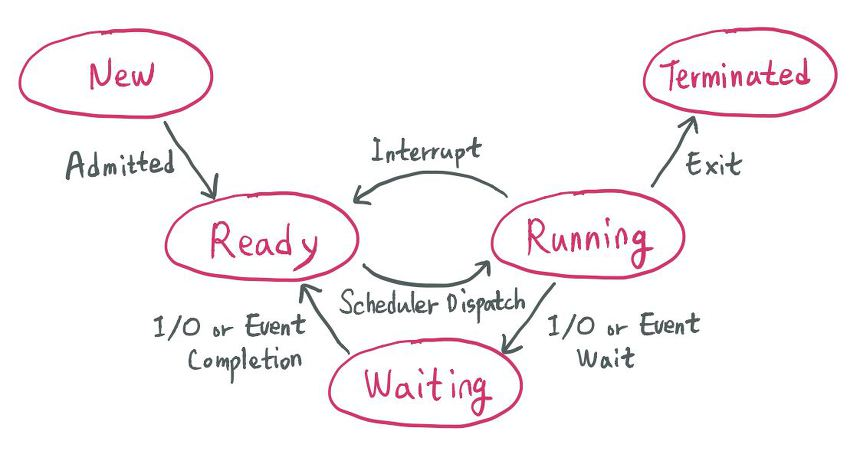

# CPU 스케줄링

- CPU를 가장 효율적으로 사용하기 위해 여러 스케줄링 알고리즘을 사용하여 CPU는 프로세스를 스케줄링 한다.

## 프로세스 상태

  
   
  프로세스의 상태

- Ready : 프로세스가 실행할 준비가 되어 있지만 다른 프로세스가 실행 중이던가 등의 이유로 대기 중인 상태.
- Waiting : 프로세스가 실행 중에 입출력 등의 요청을 받으면 대기 상태가 된다. 완료 요청을 받기 전까지 지속 되며, 완료 요청을 받으면 준비 상태로 전이된다.
- Running : 실행 상태. 준비 상태에 있는 프로세스가 스케줄링 정책에 따라 스케줄 되어 명령어를 실행 중인 상태다.

# 스케줄링 알고리즘

## 비선점형 방식(Non-preemptive)

- 프로세스가 스스로 CPU 소유권을 포기하는 방식으로, 강제로 프로세스를 중지하지 않는다.
- Context switching으로 인한 부하가 적다.(강제로 프로세스를 중지하지 않으므로)

### FCFS(= FIFO)

- 가장 먼저 온 것을 가장 먼저 처리하는 알고리즘. 단순하고 구현이 쉬우나, `convoy effect` 발생
- `convoy effect` : CPU를 많이 필요로 하지 않는 프로세스들이 CPU를 오랫동안 사용하는 프로세스가 끝나기를 기다리는 현상

### SJF

- 실행 시간이 가장 짧은 프로세스를 먼저 실행하는 알고리즘
- 모든 작업이 동시에 도착하면 optimal한 알고리즘이다.
- 하지만 그렇지 않으면 똑같이 `convoy effect` 발생할 수 있다.
- 긴 시간을 가진 프로세스들이 실행하지 않는 경우가 발생한다.(`starvation`)
- 실제로는 실행 시간을 알 수 없기 때문에 과거의 실행했던 시간을 토대로 추측해서 사용한다.

### HRN(Hightest Response-ratio Next)

- 오래된 작업일수록 우선순위를 높인다.
- 우선순위를 계산하여 SJF의 단점인 점유 불평등을 보완한 방법
- 우선순위 = (대기시간 + 실행시간) / 실행시간

## 선점형 방식(preemptive)

### Round Robin

- 현대 컴퓨터가 쓰는 우선순위 스케줄링의 일종이다.
- `Quantum`이라는 작업이 실행되는 일정 시간을 부여하고,그 시간 안에 끝나지 않으면 다시 준비 큐의 뒤로 가는 알고리즘이다.
- 할당 시간이 너무 크면 FCFS와 똑같이 작동하고, 할당 시간이 짧으면 응답 시간 기준 성능 자체는 매우 좋아지나, Context Switching이 잦아져서 오버헤드가 매우 커진다.

### 다단계 큐

- 작업들을 여러 종류의 그룹으로 나누어 여러 개의 큐를 이용하는 기법
- 각 큐마다 다른 `Quantum`이나 스케줄링 알고리즘을 설정해준다.(우선 순위가 높은 큐는 작은 Quantum, 낮은 큐는 높은 Qunatum)

### 다단계 피드백 큐

- 다단계 큐에서 자신의 `Quantum` 안에 실행하지 못하면 한 단계 아래의 준비 큐에 들어간다.
- 단계가 내려갈 수록 Quantum이 증가 한다.
- 가장 하위 큐는 FCFS 스케줄링
- 맨 아래 큐에서 너무 오래 대기하면 상위 큐로 이동한다.(starvation 예방)

## 면접 예상 질문

1. Round Robin에 대해 설명하시오

2. 프로세스 상태 변화 과정에 대해 설명하시오

# Reference

https://cocoon1787.tistory.com/124

https://github.com/gyoogle/tech-interview-for-developer/blob/master/Computer%20Science/Operating%20System/CPU%20Scheduling.md
