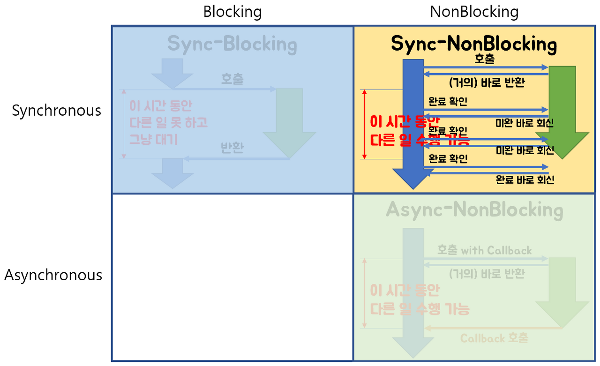

# Sync, Async, Blocking, Non-blocking

동기와 비동기, 블록킹과 논블록킹의 차이에 대해서 설명할 수 있는가?

## 기본 개념

잘 이해가 가지 않지만, 한 가지 약속을 하고 가야할 것이 있다.

- Sync, Async : 결과값의 반환에 관한 것
- Blocking, Non-blocking : 제어권의 반환과 관련된 것

그러니까 동기 비동기는 결과값, 블록킹 논 블록킹은 제어권과 관련된 얘기라고 약속을 하고 가자.

## Sync

- `Sync(동기)` : A 함수가 B 함수를 호출할 때, B 함수의 결과를 A 함수가 처리하는 것.
- 그러니까 B의 결과값을 A가 직접 처리하기 위해, B의 종료를 계속 확인하게 되는 것이다.
- A,B의 시작 시간 또는 종료 시간이 일치하는 것도 동기라고 한다. (자바에서 `CyclicBarrier`, `Synchronized`, `BlockingQueue`)

## Async

- `Async(비동기)` : A 함수가 B 함수를 호출할 때, B 함수의 결과를 B 함수가 처리하는 것.

- 결과값의 관점에서 보면, A 함수는 B 함수의 결과값을 처리할 필요가 없으므로 B의 종료를 확인 하지 않는다. 나중에 B 함수가 A 함수에게 `Callback`으로 종료를 알리며 리턴 값을 주는 방식이다.

그러니까 동기는 결과값이 필요하므로 작업의 주체가 A한테 있는 것이고, 비동기는 필요 없으므로 주체가 B한테 있다고 생각하면 될 것이다.

## Blocking

- A 함수가 B 함수를 호출할 때 B 함수에게 제어권을 넘겨주고, B 함수는 작업이 종료되기 전까지 A에게 제어권을 넘겨 주지 않는다.
- 따라서 작업의 주체가 누구냐에 상관 없이 제어권을 돌려받을 때까지 A 함수는 멈추게 된다.

## Non-blocking

- A 함수가 B 함수를 호출할 때, 제어권을 넘겨주었다가 바로 돌려받는다고 생각하면 된다. 제어권을 A가 갖고 있으므로 B 함수와 관계 없이 자신의 작업을 계속 진행할 수 있다.

이 4가지 개념은 같이 쓰이므로, 예를 보면서 확인해보자.

## Sync + Blocking

  
   
  Sync Blocking I/O

Blocking이므로 당연히 다른 작업을 진행할 수 없고, Sync이므로 결과를 가져오는 시간과 리턴하는 시간이 일치한다.

## Async + Non-blocking

  
   
  Async + Non-blocking

Non-blocking이므로 당연히 다른 작업을 진행할 수 있고, Async이므로 작업의 종료 여부를 callback을 이용하여 받는다.

성능적으로 최대의 효율을 뽑을 수 있는 모델이다.

조금 더 보기 쉽게 두가지를 그려보면,

  
   
  Sync-Blocking, Async-NonBlocking

이렇게 될 수 있겠다.
여기까지는 직관적으로 이해가 가능한데, 나머지 두 가지 모델이 굉장히 헷갈린다.

## Sync + Non-blocking

  
   
  Sync Non-Blocking I/O

  
   
  Sync NonBlocking Model

위 두 그림을 살펴보자.

우리가 앞서 얘기했던 것처럼, Sync는 함수의 주체, 결과값에 신경을 쓰고, NonBlocking은 제어권에 대해 신경을 쓴다고 하였다.

그리하여, NonBlocking이므로 제어권을 곧바로 가져와 다른 작업을 수행할 수 있다. 그러나, Sync이므로 A 함수가 B 함수의 주체이므로, 주기적으로든 어떻게든 B 함수의 종료를 계속 확인해 주어야 한다.

중간 중간 리턴 받는 것도, **아직 종료가 되어 있지 않다는 결과값**을 받은 것 이라고 생각하면 이해하기 쉬울 것 같다.

## Async + Blocking

이 모델은 직관적으로 생각해봐도 굉장히 비효율적이라 사용하지 않는다. 다만, 의도치 않게 이러한 모델로 동작하는 경우가 있는데, 바로 Node.js + MySQL이 대표적인 예라고 한다.

Node.js는 Async로 동작하게 되는데, DB 작업 호출 시에는 MySQL에서 제공하는 드라이버를 이용하게 된다. 이 때, MySQL 드라이버가 Blocking 방식이라, Async-Blocking 방식을 사용하게 된다.

Java의 JDBC 또한 마찬가지라고 한다. 하지만 Node.js는 싱글 쓰레드 루프 기반이고, Java는 멀티 쓰레드 루프 기반이므로 Java의 Servlet 컨테이너보다 심각하게 보일 뿐이지만 JDBC + MySQL도 이러한 문제점이 있다는 것을 알아두자.

Java의 Blocking 해결법은 R2DBC를 사용하는 것이 있는데, Spring MVC 와 조합보다는 Spring WebFlux + R2DBC를 많이 사용하는 것 같다. 아마 Spirng MVC + JDBC 조합을 대체할 수 없는 것 같다.

# Reference

https://velog.io/@codemcd/Sync-VS-Async-Blocking-VS-Non-Blocking-sak6d01fhx

https://wbluke.tistory.com/49

https://jh-7.tistory.com/25

[우테코 테코톡](https://www.youtube.com/watch?v=oEIoqGd-Sns)
