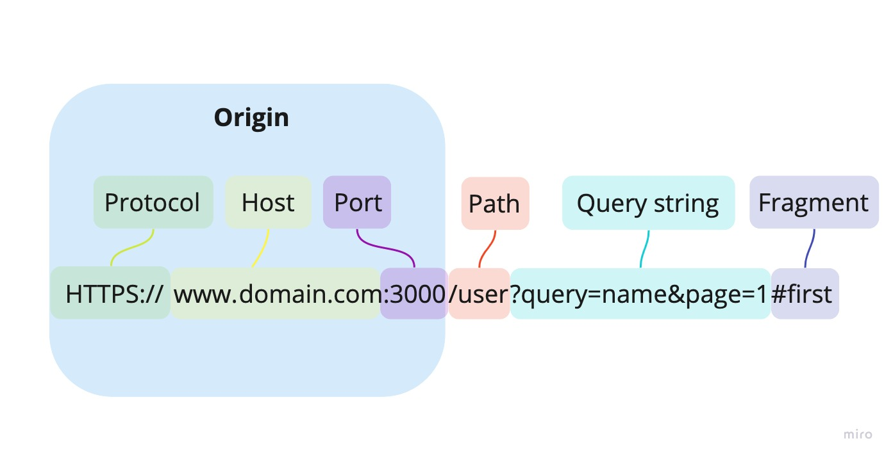
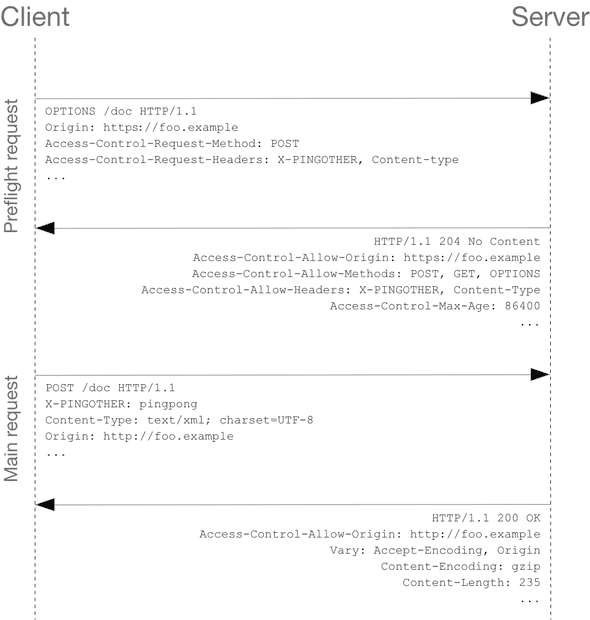

# CORS

## CORS 란?

- Cross Origin Resource Sharing, 직역하면 교차 출처 리소스 공유
- 추가 HTTP 헤더를 이용하여, 한 출처에서 실행 중인 웹 어플리케이션이 다른 출처의 리소스에 접근할 수 있는 권한을 부여하도록 브라우저에 알려주는 체제
- 즉, **Browser(브라우저)**에 포함되어 있는 정책인 것이다. 고로, 서버끼리 통신할 때는 이 정책이 적용되지 않는다.

## 출처(Origin)란?

우리가 네이버나 구글에 접속하는 상황을 생각해보자.
`https://www.google.com` 과 같은 URL을 입력하여 접속할 것이다. 이 URL은 단 하나의 문자열 같아 보이지만, 사실 이 URL 안에는 정말 여러가지 내용들이 담겨있다.

- 출처 : 도메인(Domain), 프로토콜(Protocol), 포트(Port) 등
- 포트 번호는 생략가능하다.
- 그림에서 Domain = Host 이다.

### 같은 출처의 기준은?

예시를 들어보자. 대충 비슷한 URL 4개가 있던 경우를 가정해보자.

- `https://github.com/`(기준으로 삼자)
- `https://github.com/token?name=a`
- `http://github.com`
- `https://gaemihell.github.com/`

이렇게 4가지 URL이 있을 때, 같은 출처란 무엇이 있을까?

- 2번은 path가 다를 뿐, host, protocol, domain이 같으므로 같은 출처이다.
- 3번은 protocol이 `http`로 다르다. 고로 다른 출처이다.
- 4번은 `domain`이 다르다. 고로 다른 출처이다.

출처에 대한 설명은 이정도면 간단하게 이해가 됐을 것이다. 그러니까, 지금 까지의 내용을 정리해보면 보안 상의 이유로 브라우저는 스크립트에서 교차 출처 HTTP 요청을 제한한다. 즉, `https://domain-a.com`의 프론트 엔드 JavaScript 코드가 Request를 이용하여 `https://domain-b.com/data.json` 에 요청을 날리는 것을 제한한다는 것이다. 이것이 다른 출처인 이유는 위의 예제를 이해했다면 충분히 이해했을 것이다.

그렇다면 우리가 백엔드, 프론트엔드를 실제 프로젝트에 적용할 때, 다른 출처에 있는 리소스에 Request를 날리는 경우가 비일비재 할 것인데, 다 불가능 한가? 절대 그렇지 않다.
특정 출처를 허용하는 등의 방식으로 다른 출처에 있는 리소스를 가져올 수 있다. 이 방법에 대해서 오늘 알아보려고 한다!

## SOP(Same-Origin Policy)

CORS를 설명하기 전에 SOP에 대해 잠깐 알아보자.

Same Origin Policy, 이름만 봐도 같은 출처만 허용한다는 느낌이 들지 않는가?

SOP는 2011년 RFC 6454에서 처음 등장한 보안 정책으로, "같은 출처에서만 리소스를 공유할 수 있다" 라는 규칙을 가진 정책이다.

하지만 요즘 같이 MSA가 널리 쓰이고 있는 환경에서, 다른 출처에 있는 리소스를 가져오지 않고 웹사이트를 운영하는 것은 불가능하다. 그래서 몇 가지 예외 조항을 두기로 했는데, 그 중 하나가 오늘 얘기하는 CORS 이다.

## CORS를 사용하는 이유?

현재, 크롬 개발자 도구를 이용하면 웹 사이트에서 제공하는 리소스와 자바스크립트 코드등 대부분의 것들이 개방되어 있다. 그렇기 때문에, 다른 출처에 있는 리소스를 제한 없이 마음대로 열람할 수 있는 것은 굉장히 위험한 환경이다. 소스 코드가 유출 되어 `CSRF`나 `XSS`를 이용한 공격을 당하게 된다면 상황은 심각해 진다. 그렇기 때문에 기본적으로 SOP 정책을 사용하고, 예외로 CORS 를 사용할 수 있도록 하여 공격 당할 위험을 최소화 하는 것이다.

어떤 사이트에서 구글 광고 url로 보이는 출처를 허용한 모습이다.

## CORS 동작 방식

CORS 동작 방식에는 크게 3가지가 있다고 한다.

### Preflight Request

- 이 시나리오에 해당하면 브라우저는 요청을 한번만 보내는 것이 아니라 예비 요청과 본 요청으로 나누어서 전송한다.
- 예비요청 : Prefilght
- 예비요청에는 HTTP Method 중 `OPTION` Method가 사용된다고 한다.
- 예비요청을 보낸 후 요청이 안전한다고 판단되면, 본 요청을 보내게 된다.

### Simple Request

- Preflight와 다르게, 단순하게 요청을 보내는 방법.
- 충족해야 하는 조건이 3가지가 있다.
  - 메서드는 GET, POST, HEAD 중 하나
  - 헤더는 Accept, Accept-Language, Content-Language, Content-Type 만 허용
  - Content-Type 헤더는 application/x-www-form-urlencoded, multipart/form-data, text/plain만 허용

### Credential Request

- 인증 관련 헤더를 포함할 때 사용하는 요청
- XMLHttpRequest나 Fetch API는 별도의 옵션 없이 쿠키 정보나 인증 관련 헤더를 요청에 담지 않는다.
- 고로 Credentails 옵션을 변경하지 않으면 cookie를 주고 받을 수 없다.
- 옵션 :
  - omit : 절대로 cookie 전송하거나 받지 않는다.
  - same-origin : 동일 출처라면 user crendtials를 전송 한다.
  - include : cross-origin 호출이어도 언제나 user crdentials를 전송한다.

또한, Crendtial 설정을 include로 변경하면, **Access-Control-Allow-Origin을 '\*'로 지정할 수 없다.** 특정 출처를 정확히 명시해야 한다.

## CORS 해결 방법

1. Access-Contorl-Allow-Origin 설정

- 정석대로 서버에서 설정해 주는 방법
- 와일드 카드는 CORS를 적용하는 의미가 없다. -> 잠재적인 보안 문제
- 유명한 백엔드 프레임워크는 이 설정을 위한 세팅이나 미들웨어를 지원하므로 어렵지 않을 것이다.

2. Webpack Dev Server로 리버스 프록싱

- CORS는 프론트엔드 개발자가 로컬에서 개발할 때 가장 많이 마주치는 문제
- 로컬 환경의 개발에서 api통신에 문제가 없게 하기 위해 프록시 기능을 이용한다.
