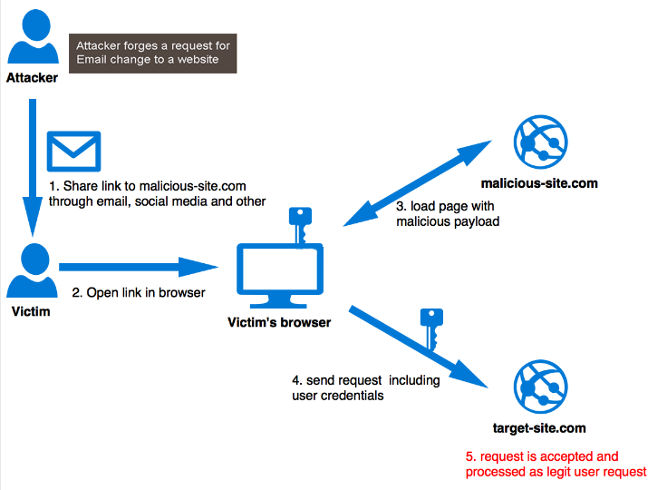
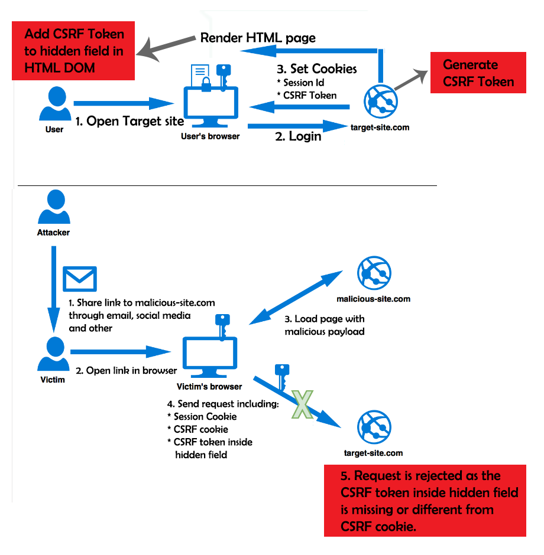

# CSRF(= XSRF)

- Cross Site Request Forgery
- 웹 어플리케이션 취약점 중 하나로, 인터넷 사용자가 자신의 의지와는 무관하게 공격자가 의도한 행위를 특정 웹사이트에 요청하게 만드는 공격
- 서버를 대상으로 하는 공격이다. 목적은 권한 도용
- 즉, 희생자의 권한을 도용하여 중요 기능들을 실행하는 것이다.(ex : SNS 계정으로 자동으로 글을 올리도록 하는 것)
- 컴퓨터가 감염되거나 서버를 해킹하는 공격이 아니라, 권한 도용이다.

## 조건

- 희생자의 권한을 도용할 서비스에 희생자가 로그인이 되어 있어야 한다.(권한이 있어야 한다)
- 해커가 만든 피싱 사이트에 희생자가 접속해야 한다.

이 조건들은 생각보다 만족시키기가 매우 쉬운게, 요즘에는 개인 PC에 자동 로그인을 설정해 놓는 경우가 많고, 피싱 사이트는 피싱 메일, 음란 사이트, 비슷한 url(예를 들면 narnu.wiki 라던가)를 이용하여 잘못 누르기 쉽다.

이 시나리오를 그림으로 나타내면 다음과 같다.



## 예시

요청의 예시를 직접 들어보자.

만약 은행에 100달러 이체 요청을하는 GET Request가 이렇게 생겼다고 가정해보자.

```html
GET http://netbank.com/transfer.do?acct=PersonB&amount=$100 HTTP/1.1
```

공격자는 이 스크립트를 이렇게 수정할 수 있을 것이다. 본인의 계좌로 100달러가 오는 링크다.

```html
GET http://netbank.com/transfer.do?acct=AttackerA&amount=$100 HTTP/1.1
```

그리고 공격자는 피싱 사이트에다가 이러한 하이퍼링크를 첨부해놓는 것이다.

```html
<a href="http://netbank.com/transfer.do?acct=AttackerA&amount=$100"
  >Read more!</a
>
```

**어? 그렇다면 POST Request로 하면 href 태그로 POST Request를 할 수 없으니 상관없겠네요!?**

절대 아니다. javascript의 <form> tag를 이용한 공격이라면 가능하다.

```jsx
<body onload="document.forms[0].submit()">
  <form action="http://netbank.com/transfer.do" method="POST">
    <input type="hidden" name="acct" value="AttackerA" />
    <input type="hidden" name="amount" value="$100" />
    <input type="submit" value="View my pictures!" />
  </form>
</body>
```

이런식으로 말이다.

그렇다면 방어는 어떻게 이뤄지고 있을까?

## 방어 방법

### 사용자 입장

사용자가 할 수 있는 실용적인 방법은 다음과 같다.

- 사용하지 않고 있는 서비스는 로그아웃 하기
- 아이디, 비밀번호를 안전하게 지키기
- 브라우저에서 비밀번호 저장 기능을 사용하지 않기
- 어떤 서비스에 로그인 되어 있을 때는 다른 웹서핑 하지 않기

이런 방법 등등이 있는데, 서버 입장에서 사용자한테만 조심해! 라는 식으로 무책임하게 굴순 없지 않나.

고로 서버에서 방어하는 방법도 알아보자

### 서버 입장

1. `Referrer` 검증 :
   - 서버에서 Request의 referrer를 확인하여 도메인이 일치하는 지 검증하는 방법이다.
   - 즉, 페이스북에 요청을 보낸다고 했을 때, 페이스북이 아닌 다른 도메인에서 요청을 보내는 것을 차단하는 방법이다.
   - 이 방법만으로 대부분의 CSRF 공격을 방어할 수 있으나, 도메인 내의 페이지에 XSS 취약점이 있는 경우에는 취약할 수 있다고 한다.
   - 그럴 때는 도메인 단위 검증에서 세밀한 페이지 단위까지 검증을 하면 예방할 수 있다고 한다.
2. `CSRF Token` 사용

   

   - Referrer 검증이 불가한 환경에서 사용하기 좋은 방법
   - 사용자의 세션에 임의의 값을 저장하고, 사용자의 요청마다 해당 난수 값을 포함하여 전송하게 한다.
   - Backend에서는 사용자의 요청이 올때마다 이 난수 값과 요청 파라미터에 전달되는 난수 값이 일치하는지 확인한다.
   - 이 방법또한 도메인 내에 XSS 취약점이 있는 경우에는 취약할 수 있다고 한다.

3. `Double Submit Cookie` 검증



- 세션을 사용할 수 없는 환경에서 사용할 수 있는 방법
- 기본 원리 : Web Browser 에서 Same Origin 정책으로 인하여 JavaScript로 타 도메인의 쿠키 값을 확인/수정 하지 못한다는 것을 이용함
- 요청 시 난수 값을 생성하여 쿠키에 저장 → 동일한 난수 값을 파라미터로도 전송 → 서버에서는 쿠키와 파라미터 값이 일치하는 지 비교
- 서버에 저장할 데이터가 없어 개발 공수가 적다고 한다.

위에서 자꾸 ‘도메인 내의 페이지에 XSS 취약점’ 이라는 얘기가 자꾸 나오는데, XSS는 뭔지도 알아보자

# XSS

- Cross Site Scripting
- 관리자 권한이 없는 사용자가 웹 사이트에 스크립트를 삽입하는 기법
- 클라이언트를 대상으로 하는 공격이며, 쿠키-세션 갈취, 웹사이트 변조 등이 목적이다.
- 악의적으로 스크립트 삽입 → 사용자의 쿠키가 유출 → 공격자가 탈취한 쿠키를 이용해 통신을 하이재킹 한다.
- 크게 `Reflected XSS`, `Stored XSS`, `DOM Based XSS` 이렇게 3가지가 있다.

## Reflected XSS

- URL의 변수 부분처럼 스크립트 코드를 입력하는 동시에 결과가 바로 전해지는 공격 기법
- 브라우저 자체에서 차단하는 경우가 많아 상대적으로 공격하기 어렵다(=방어가 잘되어있다)
- 피싱 공격에서 주로 사용된다.(스크립트를 포함한 URL을 눌러야 공격이 진행된다.)

## Stored XSS

- 가장 일반적인 공격 유형이다.
- 정상적인 평문이 아니라 스크립트 코드를 입력해놓고 → 사용자가 게시물을 열람하면 이 스크립트가 실행이 되어 쿠키와 같은 중요한 정보가 유출 되거나 공격 당한다.
- 공격자가 웹 어플리케이션을 속여 데이터베이스에 악의적인 코드를 저장하도록 하는 수법이다. 저장되기 때문에 공격이 지속적으로 일어난다.
- 블로그 댓글에 악성코드를 게시하는 것도 똑같은 예이다.
- 고로, 가장 위험하고 흔한 XSS 공격 유형이라고 할 수 있다.

## DOM Based XSS

- DOM Based XSS(=type-0 XSS)는 피해자의 브라우저에서 DOM 환경을 수정하여 클라이언트 측 코드가 예상치 못한 방식으로 공격 구문이 실행되는 공격
- 즉, 페이지 자체(HTTP 응답)는 변경되지 않지만, 페이지에 포함된 클라이언트 측 코드는 DOM환경에서 발생한 악의적인 변조로 인해 공격 구문이 실행된다.

## 방어 방법

- 입력 값 제한 : 사용자의 입력값을 제한하여 스크립트를 삽입하지 못하게 한다.
- 입력 값 치환 : 기본적으로 스크립트를 이용한 공격이기 때문에, 태그 문자 등 위험한 문자를 입력할 시 문자 참조로 필터링하고, 서버에서 브라우저로 전송시 문자를 인코딩한다. 인코딩 되면 스크립트로 해석되지 않아 실행되지 않는다.(Spring에서는 Lucy XSS Servlet Filter가 있다고 한다.)
- XSS 방어 라이브러리, 브라우저 확장 앱 사용 : 여러 회사에서 제공하는 Anti XSS 라이브러리를 사용하는 것도 하나의 방법이다.
- 쿠키 HttpOnly 옵션 활성화 : 이 옵션이 활성화 되면 쿠키에 저장된 정보에 클라이언트가 접근하는 것을 막을 수 있다.

# Reference

[Impera](<[https://www.imperva.com/learn/application-security/csrf-cross-site-request-forgery/](https://www.imperva.com/learn/application-security/csrf-cross-site-request-forgery/)>)

[kkd927님 블로그](<[https://itstory.tk/entry/CSRF-공격이란-그리고-CSRF-방어-방법](https://itstory.tk/entry/CSRF-%EA%B3%B5%EA%B2%A9%EC%9D%B4%EB%9E%80-%EA%B7%B8%EB%A6%AC%EA%B3%A0-CSRF-%EB%B0%A9%EC%96%B4-%EB%B0%A9%EB%B2%95)>)

[Ashif Mohamed Medium Article](<[https://medium.com/@ashifm4/protection-from-cross-site-request-forgery-csrf-9cf4f542e268](https://medium.com/@ashifm4/protection-from-cross-site-request-forgery-csrf-9cf4f542e268)>)

[Shine Myself] [https://ddungkill.tistory.com/135](https://ddungkill.tistory.com/135)

[https://overcome-the-limits.tistory.com/510](https://overcome-the-limits.tistory.com/510)
