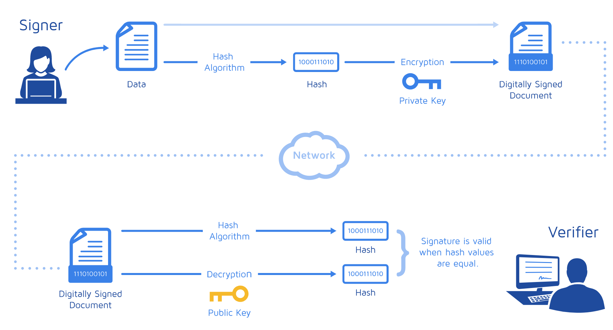
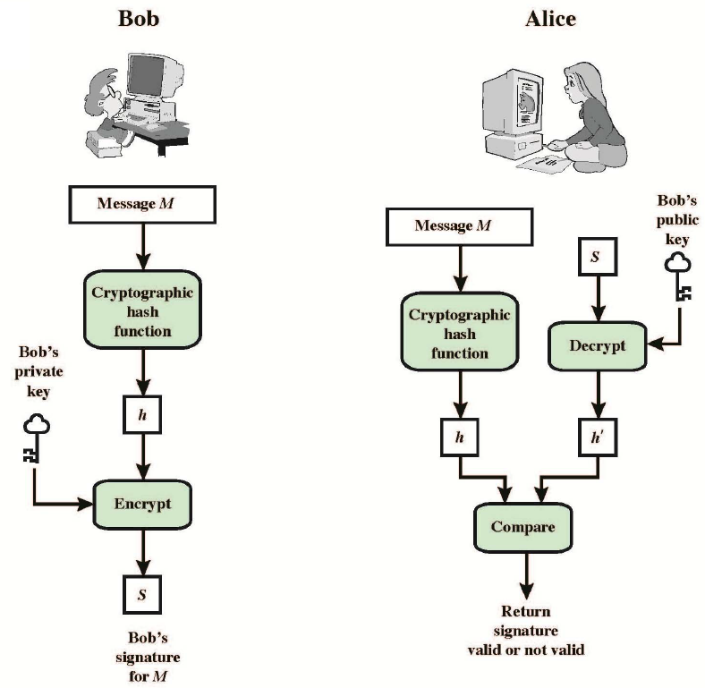
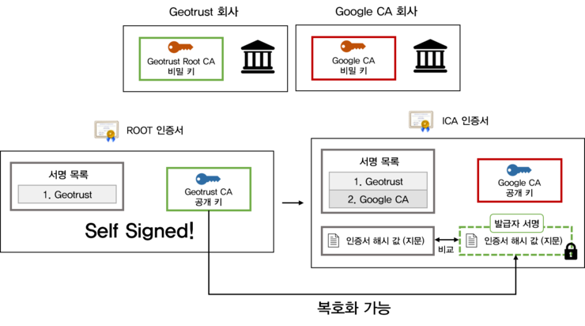

# HTTP & HTTPS

HTTP와 HTTPS 가 무엇이고 차이가 무엇인지 알아봅시다.

  
   
  HTTP와 HTTPS

## HTTP(Hyper Text Transfer Protocal)

- 웹 서버와 클라이언트 간의 문서를 교환하기 위한 통신 규약
- 웹에서만 사용하는 프로토콜이다.
- 텍스트 교환이므로, 누군가 네트워크에서 신호를 가로채면 내용이 노출될 수 있다.
- TCP/IP 기반으로 서버와 클라이언트 간의 요청과 응답을 전송한다.
- 사용자의 요청 하나가 들어오면 하나의 응답을 하는 방식이다. -> 서버가 먼저 응답하지 않는다.
- 비연결 지향적이다.(사용자의 요청으로 서버와 접속하여 요청에 대한 응답 데이터를 전송 후, 연결을 종료한다.)
  - 간단하고 자원이 적게든다.
  - 연결이 지속적이지 않기 때문에 연결 종료 후 추가적인 요청시 어떤 사용자의 요청인지 모른다.
  - 여러 사용자가 요청할 시 요청을 구분할 수 없어서 제대로 된 응답 데이터를 전송할 수 없다.
  - 해결 방법 : `Cookie`, `Session`, `Hidden Form Field` 등

## HTTPS(Hyper Text Transfer Protocal Secure)

- 이름에서 알 수 있듯이 HTTP + Secure
- 인터넷 상에서 정보를 암호화하는 TLS/SSL 프로토콜을 사용해 클라이언트와 서버가 자원을 주고 받을 때 사용하는 통신 규약.
- HTTPS는 데이터를 암호화해서 전송하기 때문에, 누군가 신호를 가로채도 해독할 수 없다.

### 대칭 키, 비대칭 키 암호화

**대칭 키 암호화 방식**

- 암호화와 복호화에 같은 키를 사용한다.(공유키)
- 발송자-수신자가 대화를 하려면 둘 다 공유키를 갖고 있어야 한다.
- 그렇다면 공유키를 언젠가 전달 해야함 -> 전달하는 과정에서 키가 유출될 위험이 있다.

**비대칭 키 암호화 방식**

- 공개 키와 비공개 키가 존재 한다. 비공개 키로 암호화를 하면 공개 키로 복호화할 수 있고(거의 사용하지 않는다.), 공개 키로 암호화하면 비공개 키로 복호화 할 수 있다.
- 대표적인 암호화 방식은 RSA
- 처리 알고리즘이 대칭키 보다 느린 단점이 있다.

### 그렇다면 HTTPS의 암호화 방식은 어떻게 될까?

  
   
  HTTPS 암호화 방식 

데이터의 암호화에는 대칭 키 암호화 방식을 사용한다.
공유키 교환에는 비대칭 키 암호화를 사용하여 처리 속도가 느린 문제를 해결하고 있다.

1. 서버는 서버가 제공한 공개 키와 증명서에 부합하는 요청을 클라이언트가 보냈는지를 확인합니다. 클라이언트가 공통 키를 서버가 제공한 공개 키로 암호화해 서버에게 보낸 첫 번째 요청을 복호화 하는 과정을 `Handshake` 라고 한다. 이 과정이 끝나면 실제 요청과 정보를 교환하는 과정이 이어진다.
2. 서버가 제공하는 비대칭 키 공개 키를 사용하여 클라이언트는 서버에게 보낼 공통 키를 암호화한다.
3. 서버는 클라이언트가 보낸 암호화된 요청을 비대칭 키 개인 키를 사용하여 복호화한다.
4. 결론 : 클라이언트-서버는 서버가 제공한 비대칭 키를 통해 암호화된 공통 키로 통신한다.

## SSL 디지털 인증서

- SSL(Secure Socket Layer)와 TLS(Transport Layer Security)는 같은 것이라고 볼 수 있다.
- SSL은 TCP/IP 암호화 통신에 사용되는 규약으로써 넷스케이프에서 만들었다. SSL 3.0 버전부터 IETF에서 표준으로 정해서 TLS 1.0이 되었다. 하지만 보통 SSL로 많이 불린다.

### 인증서의 장점

- 클라이언트가 접속하려는 서버가 신뢰할 수 있는 서버인지 확인 가능하다.
- SSL 통신에 사용할 공개키를 클라이언트에게 제공한다.
- 통신 내용이 노출, 변경되는 것을 방지한다.

## 디지털 서명

  
   
  디지털 서명 방식

1. 정보를 해싱한다. (정보 해싱은 필수적인 부분은 아니다.)
2. 해시된 정보에 메시지 발신자의 서명을 작성한다(공개키로 암호화 된다). 이때의 서명에서 개인 키가 포함되지 않는 경우, 메시지 수신자는 유효성을 검증하기 위해 상응하는 공개 키를 사용할 수 없다. 공개키와 개인키는 모두 메시지 발신자에 의해 생성되야하고, 수신자에게는 공개키만 공유된다.
3. 메시지 수신자는 발신자가 제공한 공개키를 통해 디지털 서명의 유효성을 확인할 수 있다. 이는 발신자만이 공개키에 상응하는 개인키를 가지고 있기 때문이다.

### 디지털 서명이 중요한 이유

- 데이터 무결성: 수신자는 발신자의 메시지가 전송되는 과정에서 변경되지 않았음을 검증할 수 있다. 메시지가 수정되면 전혀 다른 서명이 생성되기 때문.
- 진위성: 발신자의 개인 키가 안전하게 보관되는 한, 수신자는 해당 디지털 서명이 다른 이가 아닌 발신자에 의해 생성됐음을 확신할 수 있다.
- 부인방지: 발신자의 개인키가 노출되지 않는 이상, 발신자는 서명 사실을 부정할 수 없다.

## 인증 기관

  
   
  인증 기관을 통한 인증 방식

1.  HTTPS로 웹서비스를 제공하려는 사람이 자신의 공개키와 개인키를 생성(공개키와 개인키를 생성하는 작업은 보통 CA에서 대신 생성해주기도 한다.)
2.  공개키를 인증기관에 송부
3.  인증기관은 보내온 공개키, 유효기관, 도메인 등의 정보를 포함하여 인증기관의 개인키로 전자서명한 인증서를 발급
4.  웹 서비스를 제공하려는 사람은 발급 받은 인증서와 자신의 캐인키를 웹 서버에 설정하여 HTTPS 통신을 할 수 있게 한다.

### 인증서의 내용물

- 인증서의 소유자 이름,
- 인증서 소유자의 공개 키 (당연히 비밀 키는 소유자가 가지고 있다),
- 인증서의 유효 기간,
- 고유한 UID
- **인증서의 기타 모든 값들을 해시화한 값 (지문)**

기타 모든 값들을 해시화 한 값을 갖고 있는 이유 : 인증서를 받아서 복호화를 했을 때, 인증서의 내용을 다시 해시값으로 만든 것과 인증서에 들어있던 해시값을 비교해보았을 때 다르다면 인증서는 위조가 된 것임을 판별할 수 있다.

### 참고자료

[HTTP, 그리고 HTTPS의 이해](https://blog.wishket.com/http-그리고-https의-이해/)

[HTTPS가 동작하는 방식](https://dailyscat.gitbook.io/twis/network/https)
