# HTTP의 역사

HTTP/1.0 부터 HTTP/3 까지 무엇이 달라졌는지 알아봅시다.

## HTTP/1.0

- 기본적으로 한 연결당 하나의 요청만을 처리하도록 설계되었다. -> 연결 때마다 TCP 세션을 맺어야 한다.
- 서버로부터 파일을 가져올 때마다 TCP 3-Way Handshake를 계속 열어야 한다. -> `RTT(Round Trip Time)` 증가
- RTT를 줄이기 위해 이미지 스플리팅, 코드 압축, 이미지 Base64 인코딩을 사용했다. -> 이미지 인코딩의 경우 Base64 문자열로 변환하는데, 이 때 37% 정도 크기가 커지는 단점 발생

HTTP/1.0 Request

```
GET /mypage.html HTTP/1.0
User-Agent: NCSA_Mosaic/2.0 (Windows 3.1)

200 OK
Date: Tue, 15 Nov 1994 08:12:31 GMT
Server: CERN/3.0 libwww/2.17
Content-Type: text/html
<HTML>
A page with an image
  
</HTML>
```

## HTTP/1.1

<p align="center">
  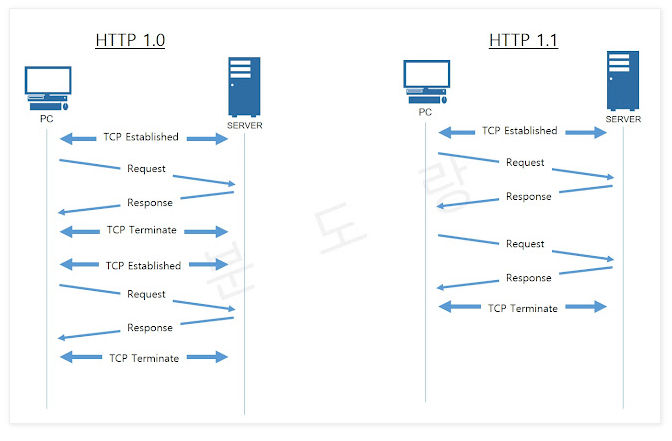
  <br  />
  Keep-alive 옵션의 차이
</p>

- `Keep-alive` 옵션이 생김 -> 한 개의 TCP 커넥션으로 여러 개의 파일을 송수신 할 수 있다.

<p align="center">
  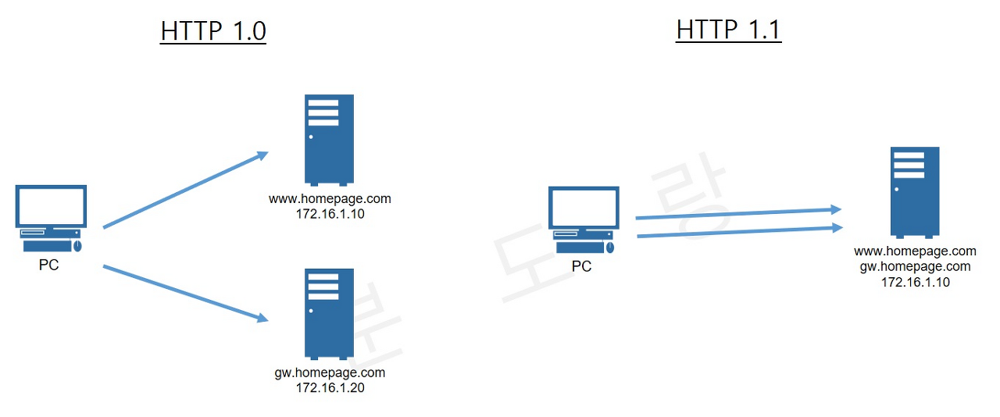
  <br  />
  HTTP 1.1 Pipelining
</p>

- `Pipelining`의 추가 -> 첫번째 요청에 대한 응답이 완전히 전송되기 이전에 두번째 요청 전송을 가능케 하여, 응답 속도를 높일 수 있다.

<p align="center">
  
  <br  />
  Virtual Hosting
</p>

- `Host Header`의 추가 -> 하나의 IP에 여러 개의 도메인을 운영할 수 있는 Virtual Hosting이 가능하다.

- `proxy-authentication`, `proxy-authorization` 헤더의 추가로 클라이언트와 서버 사이에 프록시가 존재할 때, 프록시가 사용자 인증을 요구할 수 있게 되었다.

그렇다면 단점은 없을까?

- 쿠키 등 많은 메타 데이터가 들어있고 압축되어 있지 않아 무겁다.
- 문서 안에 포함된 다수의 리소스를 처리하려면 대기 시간이 길어진다. 현재의 웹사이트는 점점 커지고 복잡해져, 점점 리소스 용량이 커지고 있다. 홈페이지의 FCP(First Contentful Paint)가 긴 경우 웹사이트의 상품성이 떨어진다. FCP를 1초 미만으로 낮추는 것은 HTTP/1.1로 힘들어졌다.
- 그렇다면 왜 힘들까?
  - 프로토콜 자체의 부하
  - TCP Protocol의 한계(slow start)
  - Pipelining의 비현실적 적용 환경 및 HOL Blocking 문제점
  - 순차적인 요청/응답 환경
- 같은 큐에 있는 패킷이 첫 번째 패킷에 의해 지연될 때 발생하는 성능저하인 `HOL Blocking` 발생

<p align="center">
  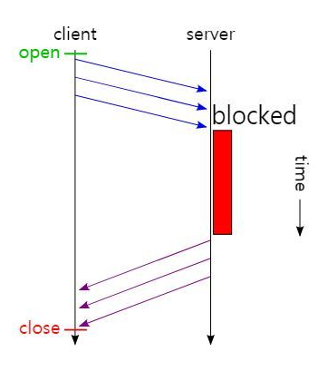
  <br  />
  HOL Blocking
</p>

HTTP/1.1 Request, Response 예시

```
GET /en-US/docs/Glossary/Simple_header HTTP/1.1
Host: developer.mozilla.org
User-Agent: Mozilla/5.0 (Macintosh; Intel Mac OS X 10.9; rv:50.0) Gecko/20100101 Firefox/50.0
Accept: text/html,application/xhtml+xml,application/xml;q=0.9,*/*;q=0.8
Accept-Language: en-US,en;q=0.5
Accept-Encoding: gzip, deflate, br
Referer: https://developer.mozilla.org/en-US/docs/Glossary/Simple_header

200 OK
Connection: Keep-Alive
Content-Encoding: gzip
Content-Type: text/html; charset=utf-8
Date: Wed, 20 Jul 2016 10:55:30 GMT
Etag: "547fa7e369ef56031dd3bff2ace9fc0832eb251a"
Keep-Alive: timeout=5, max=1000
Last-Modified: Tue, 19 Jul 2016 00:59:33 GMT
Server: Apache
Transfer-Encoding: chunked
Vary: Cookie, Accept-Encoding
```

## HTTP/2

구글이 시작한 `SPDY Protocol`에서 파생된 프로토콜.

그렇다면 SPDY Protocol은 무엇을 담고 있을까?

- 페이지 로딩 타임 50% 감소
- 구축 복잡성 최소화
- 웹 사이트 컨텐츠 변경 불필요

라고 한다.

그리하여 탄생된 HTTP/2는 지연 시간을 줄이고 응답 시간을 더 빠르게 할 수 있으며, 지원하는 기능은 다음과 같다.

- Binary Frame & MultiPlexing
- 헤더 압축
- 서버 푸시
- 요청의 우선순위 처리

각각의 기능이 무엇인지 알아봅시다.

### Binary Frame & Multiplexing

<p align="center">
  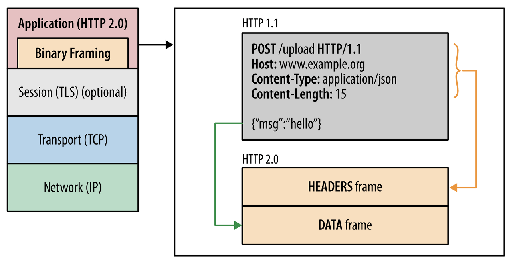
  <br  />
  Binary Frame 구조
</p>

<p align="center">
  
  <br  />
  MultiPlexing
</p>

바이너리 프레임을 이용해 멀티플렉싱을 지원한다. 즉, HTTP 메세지를 바이너리 형태의 프레임으로 나누고, 이를 전송 하면 수신 측에서 다시 조립한다.

또한 여러 개의 스트림을 사용하여 송수신하므로, 특정 스트림의 패킷이 손실되었다고 하더라도 해당 스트림에만 영향을 미치고 나머지 스트림은 멀쩡하게 동작할 수 있다.

이를 통해 병렬로 여러 요청/응답을 주고 받아, HOL Blocking을 해결할 수 있다.

그러나 HOLB의 완전한 문제 해결은 되지 않았다. TCP 프로토콜을 사용하는 이상, TCP 패킷이 네트워크 경로에서 손실되면 스트림에 공백이 생겨 그 다음에 오는 바이트들도 재전송으로 인해 전달이 되지 않아 지연이 생긴다.

## 헤더 압축

<p align="center">
  
  <br  />
  헤더 압축
</p>

- HTTP/1.1에서 문제가 되었던 크기가 큰 헤더 문제를, 헤더 압축을 써서 해결한다.
- 헤더 압축에 사용하는 알고리즘 : Huffman coding
- 허프만 코딩을 이용하여 HPACK 압축 형식을 갖는다.

### 허프만 코딩

- 문자열을 문자 단위로 쪼개 빈도수를 세어 빈도가 높은 정보는 적은 비트 수를 이용하여 표현하고, 빈도가 낮은 정보는 비트 수를 많이 사용하여 전체 데이터의 표현에 필요한 비트양을 줄이는 원리

## 서버 푸시

<p align="center">
  
  <br  />
  서버 푸시
</p>

- HTTP/1.1 에서는 클라이언트가 서버에 요청을 해야만 파일을 다운로드 받을 수 있었다.
- HTTP/2는 클라이언트의 요청 없이 서버가 바로 리소스를 푸시할 수 있다. -> 웹 페이지 접속시, HTML 파일을 조회하려면 css나 JavaScript 파일이 반드시 포함되기 마련인데, html을 읽으면서 그 안에 들어 있던 파일들을 서버에서 푸시하여 클라이언트에게 먼저 줄 수 있다. -> 요청 횟수 감소

## 우선순위 처리(Stream Prioritization)

- 각각의 Stream은 1~256의 가중치를 부여 받는다.
- 하나의 스트림은 다른 스트림에게 명확한 의존성을 갖는다.
- 하지만 Client가 Server에게 특정 순서대로 요청을 처리하도록 강요할 수는 없다.

> Reduced number of connections is a particularly important feature for improving performance of HTTPS deployments: this translates to fewer expensive TLS handshakes, better session reuse, and an overall reduction in required client and server resources.

본문의 말 처럼, Session을 재사용하는 등 Connection 수를 줄이는 것은 TLS Handshake와 같이 비용이 큰 연결을 현대에 사용하는 데에 굉장히 중요한 점이라는 데에서 HTTP/2 는 굉장히 좋은 프로토콜이라고 할 수 있다!

## HTTP/3

HTTP/3는 UDP 기반의 QUIC를 사용하여 통신하는 프로토콜이다.

HTTP/3를 살펴보기에 앞서 시장에서 이 프로토콜들을 얼마나 사용하는지 궁금하여 찾아보았다.

<p align="center">
  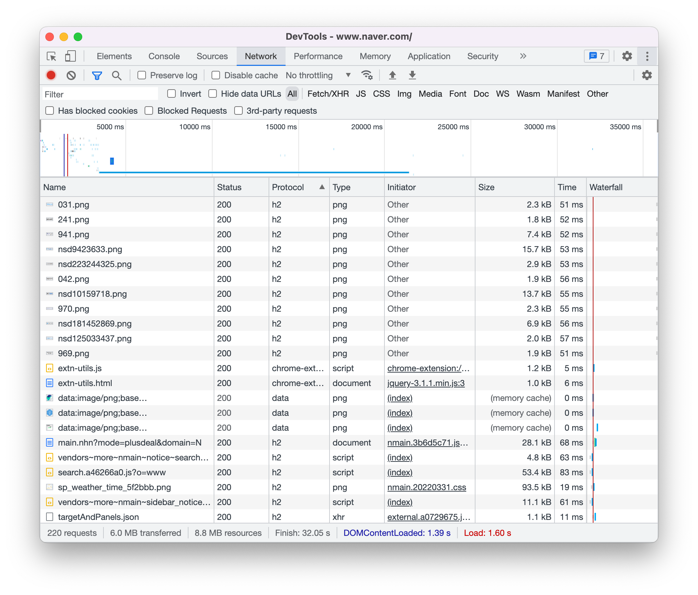
  <br  />
  네이버가 사용하는 HTTP 프로토콜
</p>

<p align="center">
  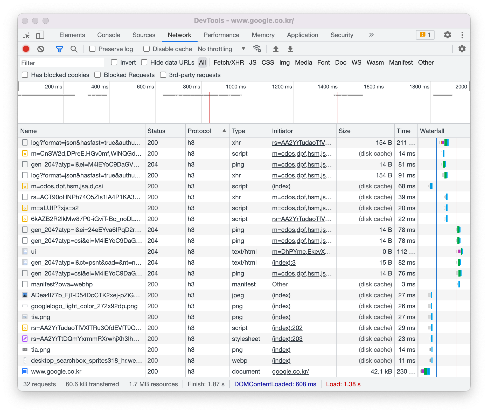
  <br  />
  구글이 사용하는 http protocol
</p>

<p align="center">
  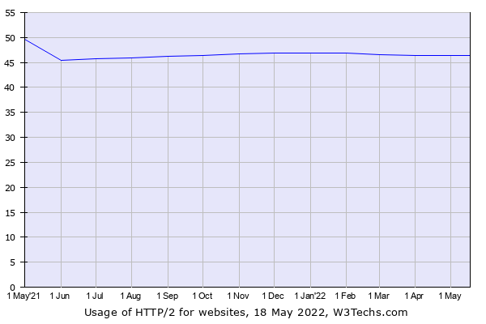
  <br  />
  HTTP/2 시장 점유율
</p>

<p align="center">
  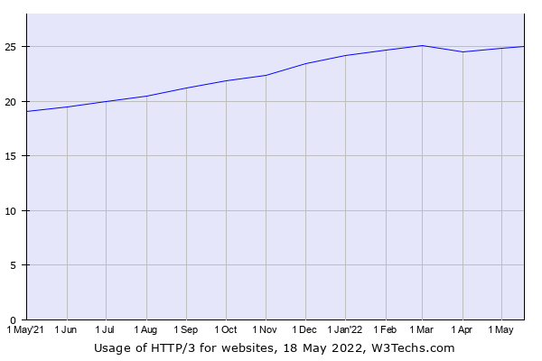
  <br  />
  HTTP/3 시장 점유율
</p>

네이버는 아직 HTTP/2 프로토콜(크롬 개발자 도구에서 h2라고 표시되는)을 사용하고 있고, 구글의 경우는 HTTP/3 프로토콜(h3)을 벌써 사용중이다.

W3Techs.com이라는 사이트에서 조사한 시장 점유율이다. HTTP/2는 딱히 변화가 없는 반면 HTTP/3 프로토콜의 점유율은 꾸준히 상승하고 있다.

즉, HTTP/3 프로토콜은 점점 더 시장을 점유할 것이기 때문에, 이에 대해서 꼭 알아야 한다는 필요성이 든다!

### 그렇다면 왜 HTTP/3 가 탄생하게 되었을까?

결론부터 말하면 HTTP/2는 느리다. TCP 프로토콜을 사용하기 때문이다. 그에 반해 HTTP/3 는 UDP를 사용한다. 이게 어떻게 이뤄지는 지 지금부터 설명해보겠습니다.

우리가 흔히 TCP에 대해서 알고있는 것은 신뢰성이 높은 대신 느리다는 것이다. TCP는 신뢰성을 보장 하기 위해 헤더에 여러가지 데이터를 넣어 놓고 있다. 거기다가 흐름 제어, 혼잡 제어를 담당해주는 정말 친절한 프로토콜이다.

대신 TCP를 사용하기 위해서는 통신 시작 시 3 Way Handshake, 종료 시 4 Way HandShake를 해줘야 하고, 여기다가 HTTP + TLS를 사용한다면 TLS Handshake까지 해줘야 한다.

HTTP/2는 HTTP/1과 마찬가지로 TCP를 사용하기 때문에 이 과정을 고치진 못했다. 대신, 핸드 쉐이크가 발생하는 것을 최소화함으로써 성능을 향상 시킨 것이다.

고로 이 과정을 고치려면 TCP Protocol을 뜯어 고치거나, 다른 Protocol을 사용해야 한다는 얘기다.

이 과정을 그림으로 나타내면 다음과 같다.

<p align="center">
  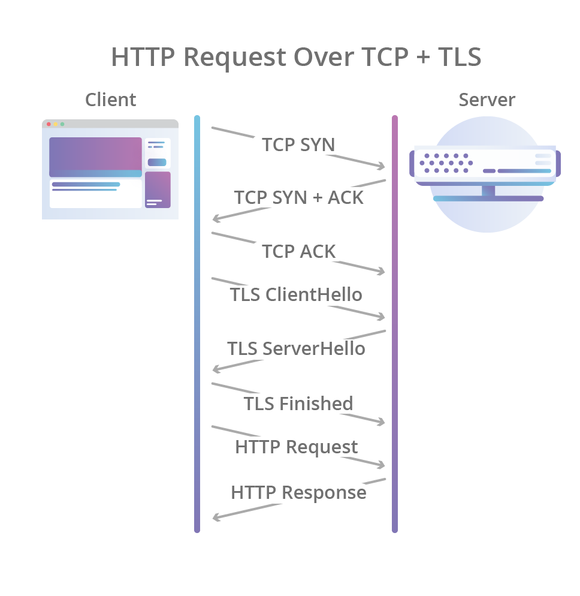
  <br  />
  HTTP TCP + TLS의 HandShake 과정
</p>

이 처럼, 새로운 세션 하나 만드려면 이만큼의 오버헤드가 발생한다는 문제점을 갖고 있다. 이것은 TCP 프로토콜의 고질 적인 문제다.

그래서 HTTP/3는 UDP Protocol을 선택함으로써 이 과정을 아예 생략하고 다른 방법을 사용하여 신뢰성을 확보함으로써 레이턴시를 줄이게 된 것이다.

<p align="center">
  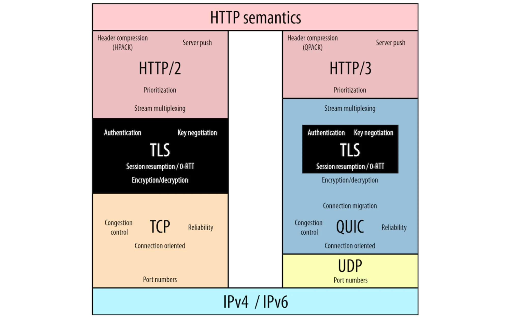
  <br  />
  HTTP/2와 HTTP/3의 구조 
</p>

이렇게 HTTP/3는 UDP기반 QUIC를 사용하여 통신하는 것이 가장 큰 차이점이다.

<p align="center">
  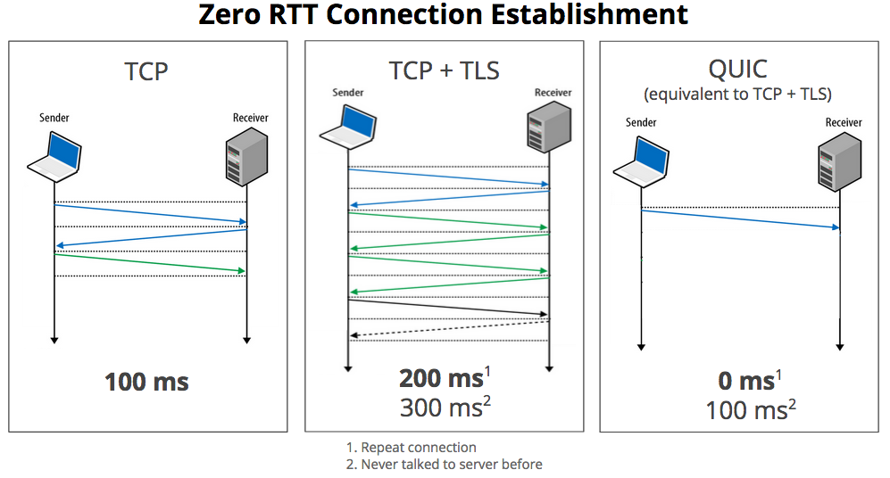
  <br  />
  커넥션 생성 과정 비교 
</p>

이로 인한 커넥션 생성 과정이 이렇게나 단축될 수 있다.
이게 가능한 이유가 너무 궁금하다. 이게 어떻게 가능할까?
QUIC에 대해 알면 이 궁금증이 다 해결될 수 있다.

### QUIC

일단 TCP헤더에는 정보가 너무나도 많다. 그래서 개발자가 추가적으로 TCP에 어떠한 기능을 추가하기가 굉장히 힘들다. TCP Option Bits도 최대 320 bits로 정해놓았다.

하지만 UDP 헤더는 데이터 전송에만 초점을 맞추고 있기 떄문에 헤더에 정말 아무것도 없다. UDP 헤더에는 출발점과 도착점, 패킷의 길이, Checksum 뿐이다. 따라서 개발자가 어떻게 구현하냐에 따라 TCP와 비슷한 수준의 신뢰성, 기능을 가질 수 있다는 것이다. 이게 핵심 이다.

그러니까 QUIC는 UDP를 커스터마이징하여 TCP와 비슷한 수준의 신뢰성을 갖지만 훨씬 빠른 프로토콜이 된 것이다.

그렇다면 어떻게 커스터마이징 한 것일까? 바로 첫번째 핸드쉐이크를 할 때 연결 설정에 필요한 정보와 데이터를 함께 보내버리는 것이다. TCP + TLS는 연결의 신뢰성을 보장하고, 암호화에 필요한 모든 정보를 교환하기 위해 여러번의 통신이 필요하지만, QUIC는 냅다 데이터를 꽂는 것이다.

2015년 IEEE Symposium에서 발표된 How Secure and Quick is QUIC?이라는 세션에서 이에 대한 얘기가 자세히 나온다.

[세션 링크](https://www.youtube.com/watch?v=vXgbPZ-1-us&t=353s)

<p align="center">
  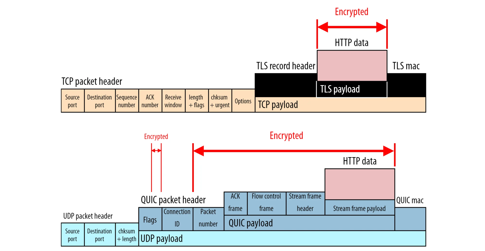
  <br  />
  HTTP/2와 QUIC 패킷 분석
</p>

핵심은, 클라이언트가 서버로 첫 요청을 보낼 때에는 Session Key를 모르는 상태이기 때문에 `Connection ID`를 이용한 초기화 키(Initial Key)를 이용하여 통신을 암호화 한다.

그리고 서버는 통신에 성공하면 그 설정을 캐싱해놓은 뒤에, 다음 연결 때 캐싱한 정보를 이용하여 바로 연결을 성립시키기 때문에 이론상으로 0 RTT 만에 연결 설정이 가능한 것이다.

이 `Connection ID`는 또 유용한 것이, 클라이언트와 서버 연결의 고유한 ID이기 때문에 중간에 클라이언트의 IP주소가 바뀌는 등의 일이 일어나도 핸드셰이크를 다시 진행할 필요 없이 계속 연결 유지가 가능하다. 왜냐하면 이 값은 랜덤한 값일 뿐, IP와 전혀 상관 없는 값이다. (현실에서는 Wi-fi였다가 LTE로 바뀌는 등 클라이언트의 IP주소가 바뀌는 경우가 비일비재하다.)

<p align="center">
  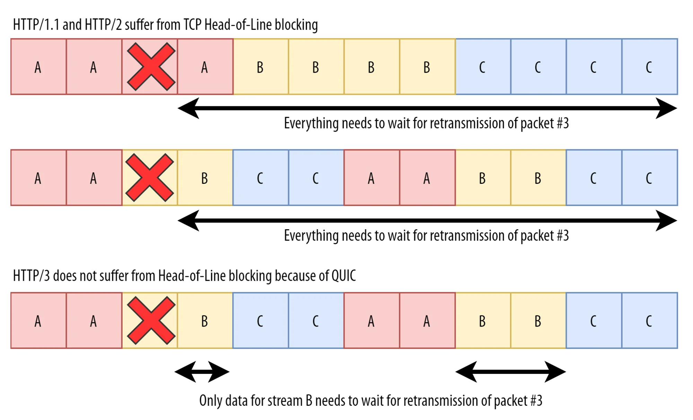
  <br  />
  패킷 로스 발생의 경우
</p>

또한 QUIC는 개별 파일을 구분하여 중간에 패킷 로스가 발생하여도, 해당 파일의 스트림만 정지 되도록 할 수 있다.

또한, QUIC은 `Packet Number`라는 패킷의 전송 순서를 나타내는 값을 헤더에 별도로 저장하면서, 패킷의 전송 순서를 명확하게 알 수 있어 기존 TCP의 재전송 모호성 문제를 해결하였다.

그러니까, TCP의 경우 타임스탬프를 사용할 수 있는 상황이라면 타임스탬프를 통해 패킷의 전송 순서를 파악할 수 있지만, 만약 사용할 수 없는 경우 시퀀스 번호에 기반하여 암묵적으로 전송 순서를 추론할 수 밖에 없지만, QUIC는 이런 불필요한 과정을 패킷마다 고유한 패킷 번호를 통해 타파함으로써 패킷 손실 감지에 걸리는 시간을 단축할 수 있는 것이다.

# Reference

https://developer.mozilla.org/ko/docs/Web/HTTP/Basics_of_HTTP/Evolution_of_HTTP#http1.1_–_표준_프로토콜

https://withbundo.blogspot.com/2021/02/http-http-10-http-11.html

https://web.dev/performance-http2/

면접을 위한 CS 전공지식 노트, 주홍철 지음

https://ykarma1996.tistory.com/86

https://evan-moon.github.io/2019/10/08/what-is-http3/

https://www.hamadevelop.me/http3/
