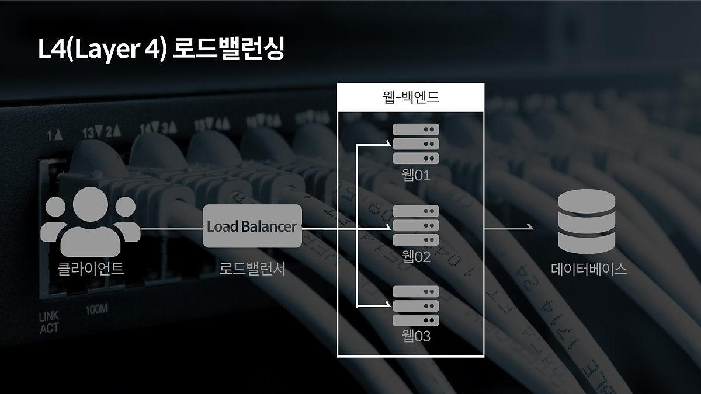
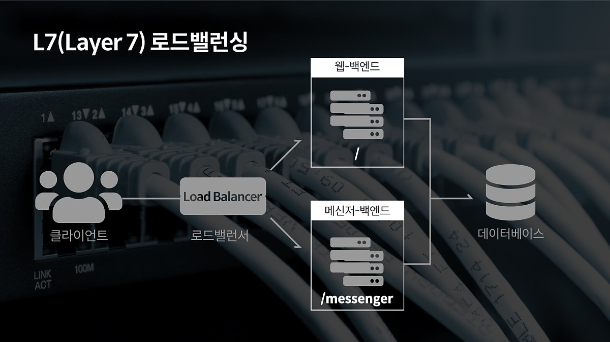
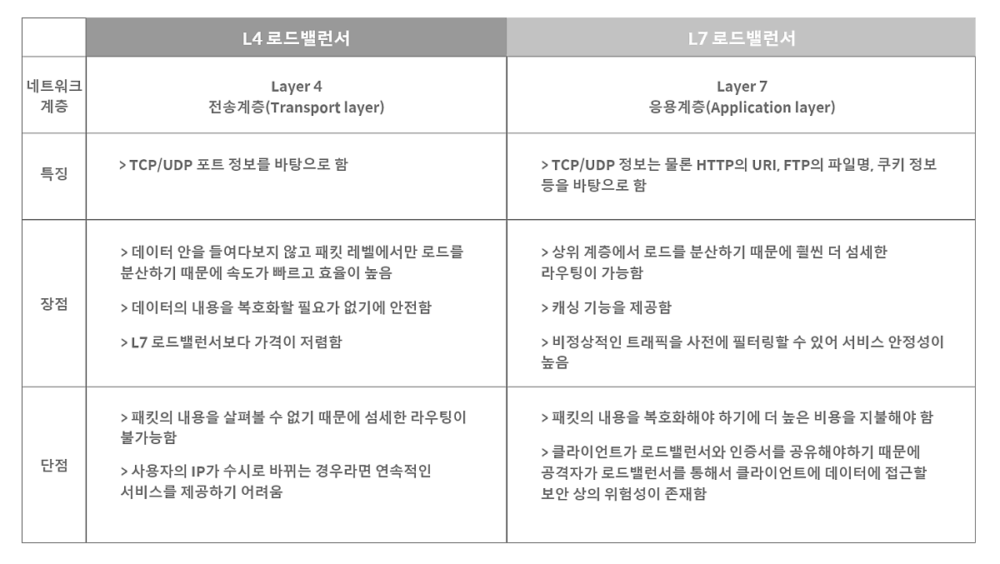

# 로드 밸런싱(Load Balancing)

사용자 수가 많아지면 아무리 성능이 뛰어난 서버라고 해도 모든 트래픽을 감당할 수 없다. -> 서버를 추가로 구비하고 여러 대의 서버에 동일한 데이터를 저장해 효과적으로 트래픽을 분산시킨다. -> 이 때 트래픽을 여러 대의 서버로 분산해주는 기술이 필요하다. -> 이 기술이 로드 밸런싱이다.

  
   
  로드밸런서의 아키텍처

## Scale-up 그리고 Scale-out

  
   
  Scale-up과 Scale-out

증가한 트래픽에 대처할 수 있는 방법은 `Scale-up` 과 `Scale-out` 두 가지가 있다.

- `Scale-up` : 서버 자체의 성능을 확장하는 것. 비유하자면 i3 CPU를 갖고 있는 컴퓨터를 i7 CPU로 업그레이드 하는 것이다.
- `Scale-out` : 기존 서버와 동일하거나 낮은 성능의 서버를 두 대 이상 증설하여 운영하는 것. 그러니까 서버 컴퓨터의 개수를 늘리는 것이다.

`Scale-out` 방식으로 서버를 증설하려면 트래픽을 여러 컴퓨터로 분산 시켜줘야 한다 -> **로드 밸런싱이 반드시 필요하다.**

## 로드 밸런서가 서버를 선택하는 알고리즘

- Round Robin : 서버에 들어온 요청을 순서대로 돌아가며 배정하는 방식. 클라이언트의 요청을 순서대로 분배하기 때문에 여러 대의 서버가 동일한 스펙을 갖고 있고, 서버와의 연결(세션)이 오래 지속되지 않는 경우에 활용하기 적합하다.

- Weighted Round Robin(가중 라운드 로빈) : 서버마다 가중치를 매기고 가중치가 높은 서버에 클라이언트의 요청을 우선적으로 배분한다. 주로 서버 트래픽 처리 능력이 상이한 경우 사용하는 분산 방식이다.

- IP Hash : 클라이언트 IP 주소를 특정 서버로 매핑하여 요청을 처리하는 방식. 클라이언트 IP를 해싱하기 때문에 사용자가 항상 동일한 서버로 연결되는 것을 보장한다.

- Least Connection (최소 연결 방식) : 요청이 들어온 시점에 가장 적은 연결상태를 보이는 서버에 우선적으로 트래픽을 배분한다. 자주 세션이 길어지거나 서버에 분배된 트래픽들이 일정하지 않은 경우에 사용하기 좋다.

- Least Response Time(최소 리스폰타임) : 서버의 현재 연결 상태와 응답시간을 모두 고려하여 트래픽을 배분한다. 가장 적은 연결 상태와 가장 짧은 응답시간을 보이는 서버에 우선적으로 로드를 배분하는 방식이다.

## 로드 밸런서의 종류

부하 분산에는 `L4`, `L7` 로드밸런서가 가장 많이 활용되는데, 그 이유는 `L4 로드밸랜서`부터 포트정보를 바탕으로 로드를 분산하느 것이 가능하기 때문이다.
한 대의 서버에 각기 다른 포트 번호를 부여하여 다수의 서버 프로그램을 운영하는 경우라면 최소 `L4 로드밸런서` 이상을 사용해야 한다.

### 그렇다면 저 숫자의 의미는 무엇일까?

네트워크 통신 시스템을 나타내는 7가지 계층(OSI 7 Layers)의 각각의 계층을 L1, L2, L3, .... ,L7 이라고 한다.

상위 계층에서 사용되는 장비는 하위 계층의 장비가 갖고 있는 기능을 모두 갖고 있다. -> 상위 계층에서 더욱 정교한 로드 밸런싱이 가능하다.

  
   
  OSI 7 계층과 TCP/IP 계층 비교

## L4 로드밸런서

  
   
  L4 로드밸런서

L4 로드밸런서는 Network Layer의 정보(IP, IPX 등)이나 Transport Layer의 정보(TCP, UDP)를 바탕으로 로드를 분산한다. IP주소, 포트번호, MAC주소, 전송 프로토콜에 따라 트래픽을 나누는 것이 가능하다.

AWS의 `NLB(Network Load Balancer)`와 같다.

## L7 로드밸런서

  
   
  L7 로드밸런서

L7 로드밸런서는 Application Layer에서 로드를 분산하기 때문에, HTTP 헤더, 쿠키 등과 같은 사용자의 요청을 기준으로 특정 서버에 트래픽을 분산하는 것이 가능하다.
즉, 패킷의 내용을 확인하고 그 내용에 따라 로드를 특정 서버에 분배가 가능한 것이다.
그리고, URL에 따라 부하를 분산시키거나 HTTP 헤더의 쿠키 값에 따라 부하를 분산하는 등 클라이언트의 요청을 보다 세분화 하여 서버에 전달할 수 있다.

또한, 특정한 패턴을 지닌 바이러스를 감지해 네트워크를 보호할 수 있고, DoS/DDoS와 같은 비정상적인 트래픽을 필터링할 수 있다.

AWS의 `ALB(Application Load Balancer)`와 같다.

  
   
  L4 로드밸런서와 L7 로드밸런서 비교

### 참고 링크

[가비아 포스트](https://m.post.naver.com/viewer/postView.nhn?volumeNo=27046347&memberNo=2521903)
[DevlopersIO](https://dev.classmethod.jp/articles/load-balancing-types-and-algorithm/)
