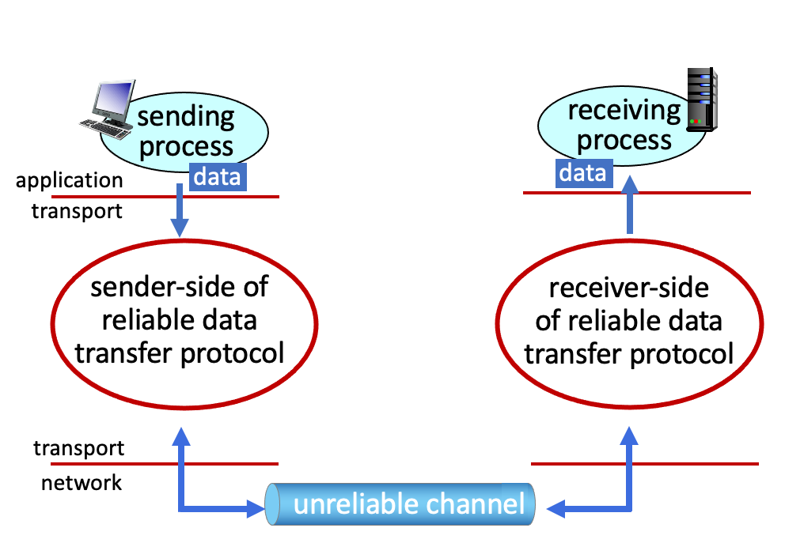
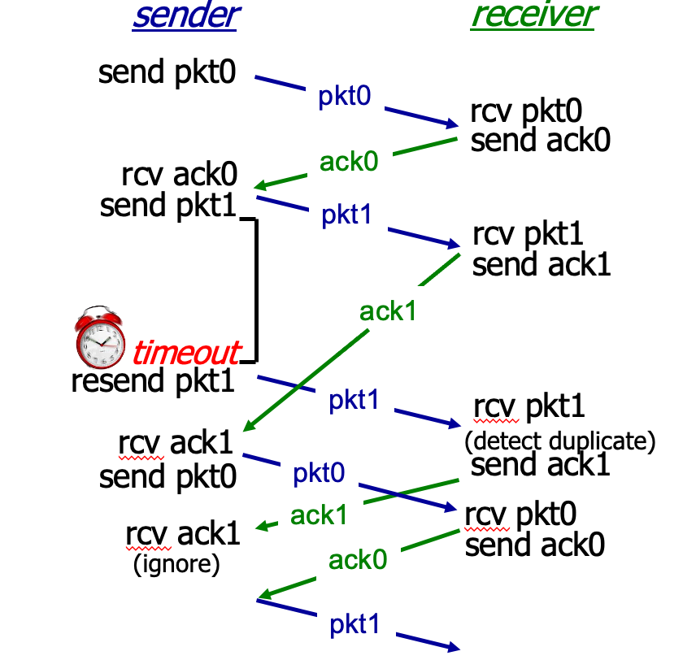
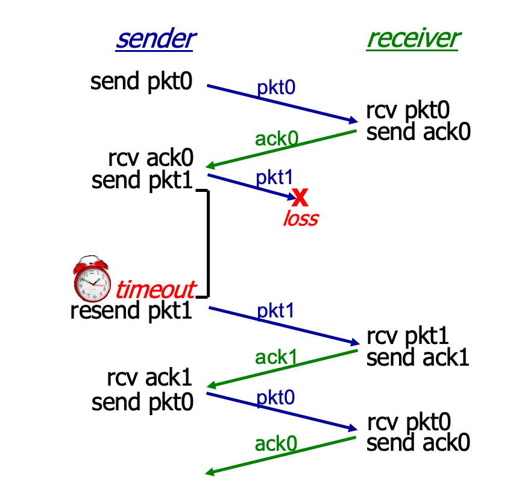
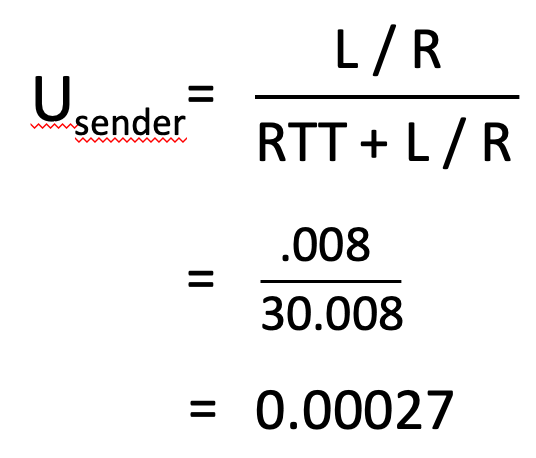
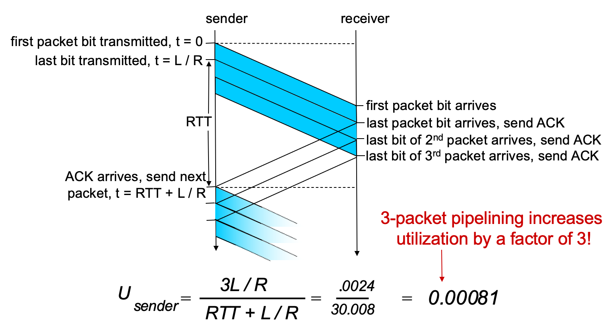
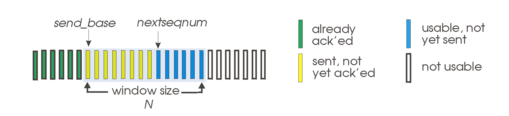
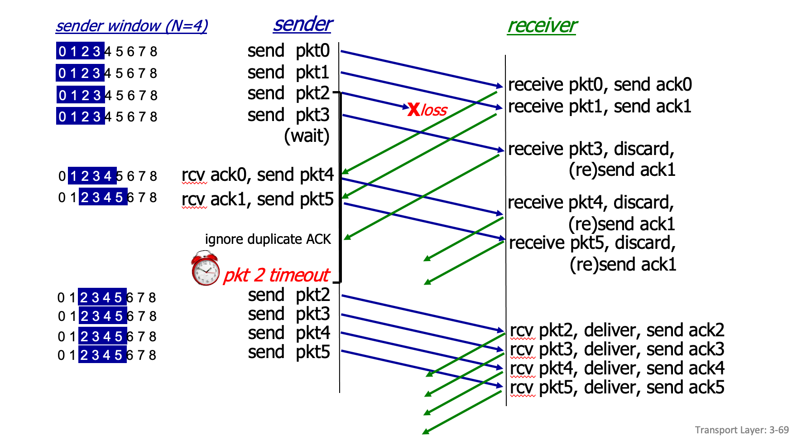
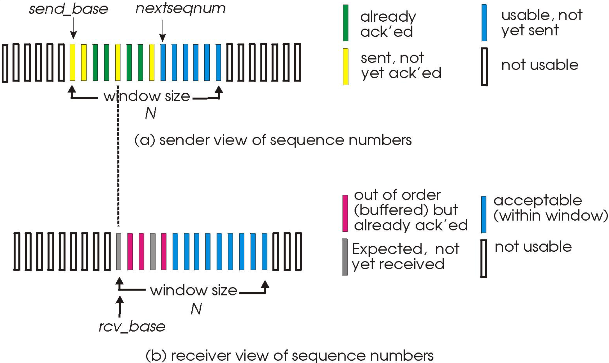
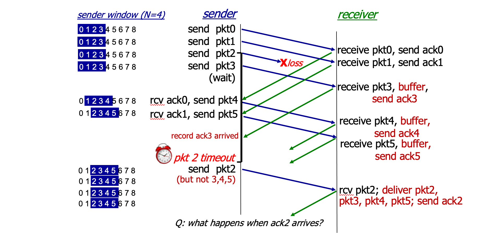
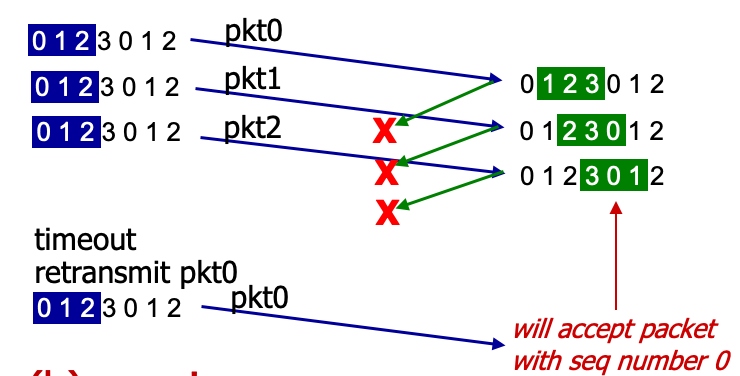

<!-- @format -->

# Reliable Data Transfer

데이터 전송에서 reliable 하다는 것은

1. packet error X
2. packet loss X
3. sequence error X

를 의미한다.

즉 reliable한 채널에선 **_데이터 손상 및 손실 X_**, **_데이터는 전송된 순서대로 전달됨_** 을 보장하는 것이다.

    

하지만 이러한 작업들은, reliable transfer protocol의 하위 계층이 신뢰적이지 않으므로 구현하기가 어렵다.

어떻게 하위 계층에서 받은 데이터가 reliable 하다고 보장할 수 있을까?

# Reliable Data Transfer 원리

### rdt 1.0

하위 채널이 reliable 하다고 가정하였다.

하위 채널이 reliable 하므로 각각 send, recv를 기다리면 되고 피드백도 제공할 필요가 없다!

### rdt 2.0

하위 채널에서 packet error가 발생한다고 가정하였다.

packet loss와 sequence error는 발생하지 않는다고 가정한다.

packet error를 다루기 위해선 다음 3가지 부가 프로토콜 기능이 필요하다.

- **Error Detection**  
   Error Detection의 경우 receiver가 검출할 수 있게 checksum bits를 추가하여 구현한다.
- **Feedback**  
  sender가 error 발생 여부를 알 수 있게 하기 위해 Feedback이 필요하다.
  ACK(ACKnowledgements) 와 NAK(Negative AcKnowledgements) 응답을 이용하여 구현한다.

  데이터가 손상되었다면 NAK 응답을 받을 것이고, 잘 도착했다면 ACK응답을 받을 것이다.

- **Retransmission**  
  만약 packet error가 발생했다면, NAK응답을 받을 것이고, NAK응답을 받게 되면 재전송해주는 과정이 필요하다.

위에 기술된 부가 프로토콜들을 적용하게 되면, packet error 처리는 꽉잡아놓는 느낌이 든다.

하지만, ACK, NAK packet도 error가 발생할 수 있다.

receiver가 ACK를 응답으로 보냈는데, error가 발생하여 sender에게 NAK으로 도착하게 된다면 재전송이 이루어 질 것이고, 잘못된 데이터들이 receiver에 도착하게 될 것이다.

이를 어떻게 하면 방지할 수 있을까?

### rdt 2.1

rdt 2.1에선 ACK, NAK packet error가 발생하여 이미 전달된 데이터가 다시 전달이 되어도 새로운 데이터인지 이미 받았던 데이터인지를 구분할 수 있게 sequence number를 추가하여 rdt 2.0의 문제를 해결하였다.

이제 packet error가 발생하여도 잘 처리할 수 있고 ACK, NAK에 에러가 발생하여 잘못 전달 되어도 잘 처리할 수 있다.

지금까지는 packet loss가 없다고 가정하여서 문제를 해결하였다.
ACK packet이 아예 손실되어 오지 않는다면 어떻게 해야할까?
rdt 2.1 프로토콜로는 해결할 수 없다.

### rdt 2.2

ACK, NAK 둘다 쓸 필요 없고, 잘 받은 packet에 대해서만 ACK를 주는 식으로 변경

### rdt 3.0

rdt 3.0에선 packet loss 를 해결하기 위해 timer를 사용하여 일정 시간이 지났음에도 ACK가 오지 않으면 손실되었다고 판단, 재전송하기로 하였다.

    
     
    packet loss

    
     
    ack loss

#### 정리

- packet error -> ACK packet으로 해결
- ACK error -> sequence number로 해결
- packet loss -> timer로 해결

# pipelined reliable data transfer protocol

앞서 여러 상황 가정을 통해 만든 rdt 3.0 프로토콜은 굉장히 완벽해보인다.

하지만, rdt 3.0 프로토콜은 `stop and wait` 프로토콜 이기 때문에 성능 문제가 존재한다.

이러한 성능 문제는 pipeline을 이용하여 해결할 수 있다.

  
   
  pipelining이 적용되지 않은 utilization

 

  
   
  rdt 3.0 프로토콜에 pipelining이 적용된 모습

위의 그림처럼 ACK를 받기전에 3개의 패킷 전송을 허용한다면, utilization이 3배가 되는 것을 볼 수 있다.

이러한 기술을 `pipelining` 이라고 부르며, 앞서 발생한 성능 문제는 `pipelining`을 이용하여 해결할 수 있다는 것을 볼 수 있다.

`pipelining`을 적용한 프로토콜들은 `Go-Back-N`, `Selective Repeat`, `TCP` 등의 프로토콜들이 있다.

# Go-Back-N

  

`Go-Back-N` 프로토콜은 sender가 buffer를 가지며, sender가 전송할 패킷을 정한다.

window size인 N의 크기만큼은 feedback 받지않고 한번에 전송할 수 있다.

receiver측은 "ACK k이" "k번 패킷까지 잘 받았다." 를 의미하는 `cumulative ACK` 를 사용하여 응답한다.

  

`Go-Back-N` 프로토콜은 위의 그림처럼 패킷을 주고 받게 된다.

1. 0번 패킷부터 3번 패킷까지 ACK응답이 오지않아도 한번에 보내는 것을 볼 수 있다.

2. ACK 0을 응답 받았으므로, sender buffer의 `send_base`를 1번에 위치시키고, 가장 큰 번호를 가진 패킷인 4번 패킷을 전송한다.

3. ACK 1을 응답 받았으므로, sender의 buffer `send_base`를 2번에 위치시키고, 가장 큰 번호를 가진 패킷인 5번 패킷을 전송한다.

4. 2번 패킷이 유실되어 `timeout`이 발생하였다. N=4 이므로, 2번 패킷부터 5번패킷까지 재전송 한다.

이 예시의 window size는 4로 굉장히 작기 때문에, 재전송을 할 때의 로드가 크지 않은 것처럼 보일 수 있다.

그러나 실제 window size는 굉장히 크다. 따라서 패킷이 유실될 확률도 더 높고, 패킷이 유실될 때마다 window size만큼 재전송을 하게 된다면 너무 느릴것이다.

`Go-Back-N` 프로토콜은 `pipelining`을 이용하여 `stop-and-wait` 프로토콜의 단점인 느린 성능을 나름 극복한 것처럼 보인다. 하지만 `Go-Back-N` 프로토콜은 패킷 하나의 오류때문에 많은 패킷들을 재전송 하는 경우가 발생한다.

# Selective Repeat

`Selective Repeat` 프로토콜은 앞서 `pipelining`을 적용한 `Go-Back-N` 프로토콜의 재전송 문제를 유실된 패킷만 재전송하는 방식으로 해결하였다.

이를 구현하기 위해선 다음과 같이 sender, receiver 둘 다 buffer를 가지고, 같은 크기의 window size를 가져야한다.

### Sender

`Go-Back-N` 프로토콜과 동일하게 `pipelining`을 사용하므로 window size만큼의 패킷을 응답 없이 보낼 수 있다.

만약, 2번 패킷이 유실되어 receiver로부터 ACK를 받지 못하고 결국 `timeout`이 발생하였다고 가정해보자.

`Go-Back-N` 프로토콜에선 2번 ~ 2+n-1번 패킷까지 재전송을 하였다

반면 `Selective Repeat` 프로토콜에선 2번 패킷만을 재전송해주면 된다.

**즉, ACK를 받지 못한 패킷들만 재전송 해주면 된다!**

### Receiver

receiver buffer의 window size 범위 안의 패킷이 전송되면 순서가 맞지 않더라도 일단 저장을 한다.

만약, 2번 패킷이 유실되어 받지 못하고 계속해서 뒷 순서의 패킷을 전송받게 된다면 buffer에 다 저장을 한다.

timeout이 발생하여 2번 패킷이 재전송 되어 도착한다면 ACK 2를 보내주고 buffer에 저장된 패킷들을 확인하여 전송이 완료된 곳으로 `rcv_base` 를 증가시킨다.

### Dilemma

  

위의 그림과 같이 window size가 sequence number의 크기와 비슷하다면, 유실된 패킷이 재전송 된건지, 새로운 패킷이 온건지 알 수가 없다.

이러한 문제는 sequence number의 크기를 window size 크기보다 2배이상 크게 만들면 해결할 수 있다.

[다음으로 이어집니다.](TCP.md)
