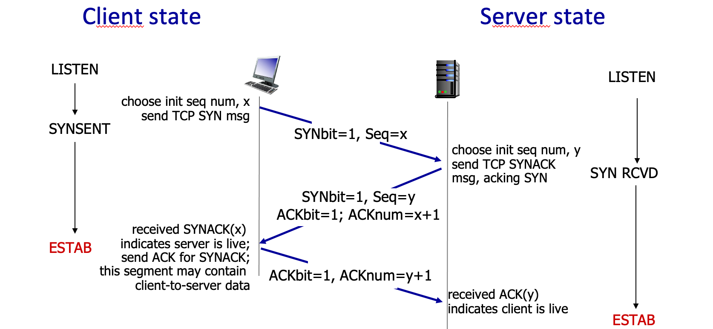
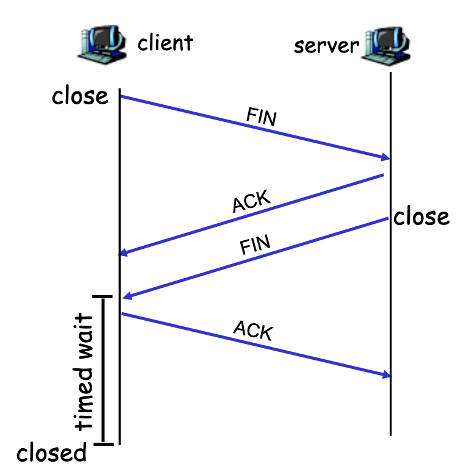

<!-- @format -->

# TCP

TCP란 Transmission Control Protocol의 약자로 transport layer의 전송 프로토콜 중 하나이다.

다음과 같은 특징들을 갖고있다.

- point-to-point  
   항상 1:1로 통신한다.

- reliable
  앞서 보았던 rdt 프로토콜들에서 발생했던 문제점을 전부 해결하였다.

- pipelined
  `stop-and-wait` 프로토콜의 단점인 성능 문제를 해결하기 위함.

- full duplex data
  서로 다른 host에 TCP 연결이 존재한다면, application layer 데이터는 A -> B로 흐르는 동시에 B -> A 로도 흐를 수 있다.  
   즉, sender, receiver를 잘 구분하지 않는다.
- connection-oriented
  TCP는 다른 프로세스에게 데이터를 보내기 전에, 두 프로세스가 서로 `handshake`를 한다.

- flow controlled  
  sender는 window size 만큼의 패킷을 전송할 수 있지만, receiver buffer의 크기만큼만 보낸다.

# TCP 3-way handshake

TCP 연결이 맺어지기 위해선 `3-way handshake`가 필요하다.

    

`3-way handshake`의 순서는 다음과 같다.

1. `client`가 `server` 에게 `SYN` 비트와 첫번째 sequence number를 전송한다.

   즉 **SYN=1**, **seq=x** 를 담은 `segment`를 전송한다.

   이 `segment`는 `SYN segment`라고 불린다.

2. `server`는 `client`의 요청에 대한 응답 `segment`에는 다음과 같은 3가지 정보가 담겨있다.

   **SYN=1**, **seq=y**, **ack=x+1**

   **seq=y** 의 의미는 `server`의 첫 sequence number를 주는 것이고,
   **ACK=x+1** 의 의미는 `client`의 sequence number를 잘 받았다고 응답 하는 것이다.

   이 `segment`는 `SYNACK segment` 라고 불린다.

3. `client`가 `SYNACK` 세그먼트를 수신한 것은 `server`가 잘 동작하고 있고 연결받을 준비가 되었다는 것을 의미한다.
   `SYNACK` 세그먼트에 대해서 응답을 해주어야 한다. 이 때의 응답은 `server`가 보낸 sequence number를 잘 받았다는 것을 의미하는 **ACK=y+1** 를 보낸다.

   또한 이번 전송부터 `client`는 `server`에 데이터를 보낼 수 있으며, `client` 입장에선 TCP 연결이 생성되었으므로 `SYN` 비트가 0으로 수정된다.

`3-way handshake` 그림을 보면 알 수 있듯이 보낸 요청에 대한 응답이 와야 연결이 생성된다(ESTAB).

만약 `2-way handshake` 였다면, `server` 측에선 자신들이 보낸 요청에 대한 응답이 오지 않아, 연결이 잘 형성 됐는지 유실됐는지 알 수 없을 것이다.

# TCP 4-way handshake

TCP 연결을 더 이상 사용하지 않아 종료하고 싶을땐 `4-way handshake`를 사용한다.

    

만약 `client`가 연결 종료를 희망한다고 가정하자.

1. `FIN` bit를 1로 설정한 segment를 `server`에 보낸다.(FIN_WAIT_1)
2. `server`는 FIN=1인 segment를 수신하게 되면, ACK를 보내고 연결종료를 준비(CLOSE_WAIT)한다.
3. `server`에서 `client`로 FIN=1을 전송하고 마지막 ACK 응답을 기다린다.(LAST_ACK)
4. `client`에서 FIN=1을 수신하면, ACK를 보내고 설정된 시간동안 기다린다.(TIME_WAIT)
5. `server`에서 ACK를 수신하면 `server` 측의 모든 자원은 해제된다.(CLOSED)
6. `client`에서 설정된 시간이 지나면 `client` 측의 모든 자원은 해제된다.(CLOSED)

4번에서 왜 일정 시간을 기다려야 할까?

만약 어떤 패킷이 재전송과같은 이유로 `server`측에서 보낸 `FIN` 보다 늦게 전송이 되었다고 가정하자.

`server`의 `FIN`을 받자마자 종료해버리면, 이 재전송된 패킷은 drop되고 데이터도 영원히 유실될 것이다.

따라서 일정시간동안 기다린 뒤, 완전히 연결을 종료한다.
