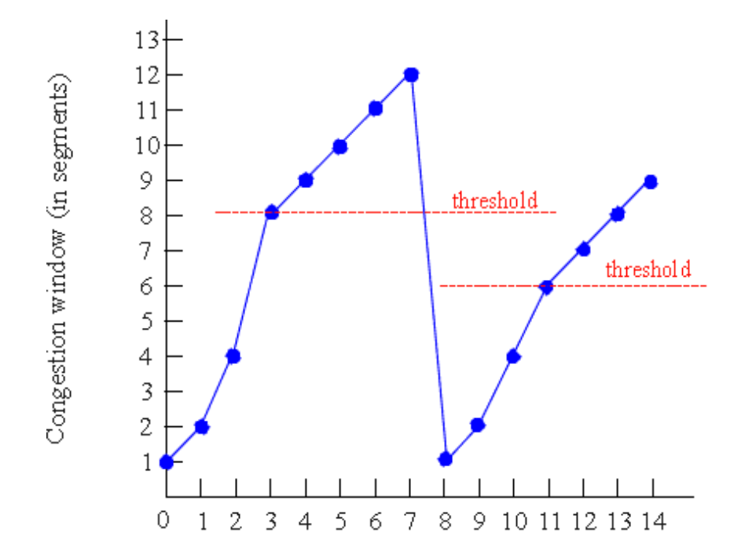

<!-- @format -->

# TCP Congestion Control

TCP는 패킷이 유실되면 재전송을 하기 때문에 경우에 따라 네트워크의 부하가 심해질 수 있다.  
그러므로 네트워크의 상태를 유추하여 속도를 조절해야 한다. (직접적인 피드백 X)

### 1. Congwin

Congest Window의 약자로, ACK를 확인하지 않고 한번에 보낼 수 있는 세그먼트의 갯수를 뜻한다.  
예를 들어, CongWin = 7 일 경우 7개의 세그먼트를 보내고, ACK를 확인한다.

### 2. treshold

CongWin의 크기의 증가를 좌우하는 변수이다. 만약 CongWin의 크기가 Treshold보다 작을 경우, 지수적으로 증가하고 클 경우 선형적으로 증가한다.

# 3 Main Phases

위의 그림을 보면 세가지의 단계가 나누어져있는 것을 확인할 수 있다.

1. Slow Start : 1에서부터 시작해서 지수적으로 CongWin의 크기를 증가시킨다.

2. Additive increase : CongWin의 크기를 1MSS씩 증가시킨다.

3. Multiplicative decrease : 패킷 손실이 감지되면, CongWin의 크기를 감소시키는데 multiplicative factor 의 비율만큼 감소시킨다.

## AIMD

Main Phase의 2, 3번만 사용하면 `AIMD` 방식이다.

$$
CongWin(t+1) =
    \begin{cases}
      CongWin(t) + a & \text{if congestion is not detected}\\
      CongWin(t) \times b & \text{if congestion is detected}
    \end{cases}
$$

이 방식은 decrease가 발생한 뒤, 다시 CongWin을 회복하는데 걸리는 시간이 너무 오래걸리므로 `Slow Start` 방식을 추가한다.

# TCP Tahoe and Reno

TCP Tahoe와 TCP Reno는 treshold 전까지 CongWin의 크기가 지수적 증가를 하고, 이후엔 선형적 증가를 하는 것은 동일하다.

두 프로토콜은 패킷 손실이 감지되었을 때의 동작 방식이 다르다.

## TCP Tahoe

`TCP Tahoe`의 경우 패킷 손실이 감지되었을 때, Treshold의 값을 패킷 손실이 탐지된 CongWin 값의 절반으로 변경하고 다시 `Slow Start` 단계부터 시작한다.

## TCP Reno

`TCP Reno` 의 경우, 패킷 손실의 감지된 원인에 따라 다르게 대처한다.

윈도우도 이 방식을 차용함.

1. Time out  
   -> `Tahoe` 처럼 Slow Start부터 시작

2. 3 duplicated ACK  
   -> Fast Recovery : CongWin의 사이즈를 절반, Threshold도 절반으로 줄이고 선형적으로 증가시킴
