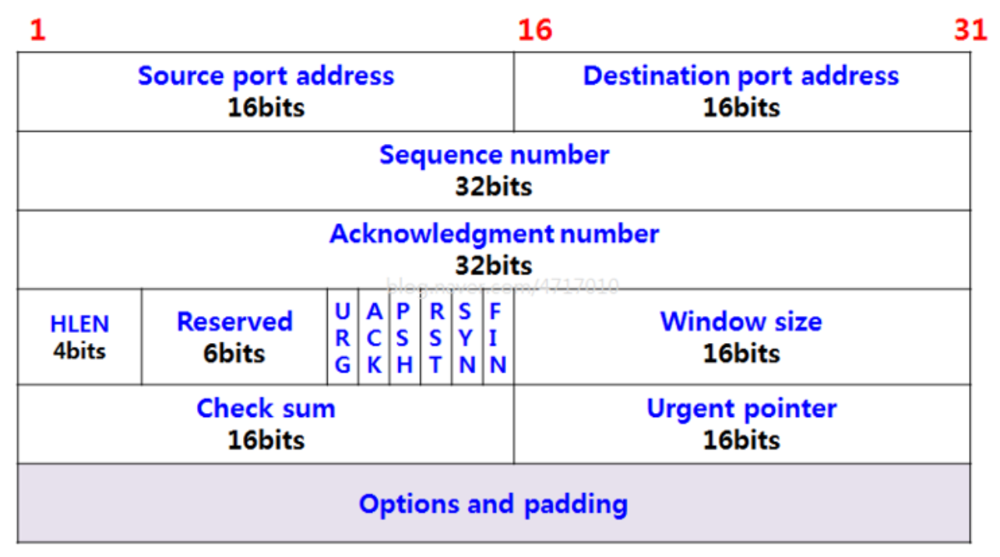

<!-- @format -->

# TCP Flow Control

TCP 전송은 기본적으로 각 소켓들이 생성될 때마다 송신버퍼, 수신버퍼를 생성한다.

데이터를 다른 소켓으로 전송할 땐 송신버퍼에 데이터를 저장하고, 상대의 수신버퍼로 보낸다.

이 때, 수신자의 수신버퍼가 꽉 차있거나, 데이터의 크기보다 작다면 패킷이 손실될 것이다.

이와 같은 상황을 예방하기 위해 TCP는 `Flow Control`을 사용한다.

application layer에서 수신버퍼를 read해야 버퍼가 비워진다.

안하게되면? 수신버퍼는 꽉차게 될 것이다.

그러면 TCP는 UDP와 달리 재전송을 하므로.. 계속 재전송.... 낭비..

이런 상황을 미루어 볼 때 고려해야할 것은 **수신 버퍼가 비워지는 속도** 이다.

이걸 정확하게 알 순 없지만, 매번 전송과 피드백에서 세그먼트의 헤더에 Window size 라는 변수를 추가해주어 자신의 남은 버퍼의 크기를 알려줄 수 있다.

- window size = min(rwnd, cwnd)
  - rwnd - Receiver WiNDow. 수신버퍼의 남은 크기
  - cwnd - Congestion WiNDow. Congestion Control 할 때 한번에 보낼 수 있는 기준이 되는 변수

이렇게 받은 window size의 크기만큼 수신자는 ACK를 기다리지 않고 데이터를 보낼 수 있다.

rwnd는 수신버퍼의 남은 크기, cwnd는 네트워크 상황에 따라 변하므로 window size도 동적으로 변하는 것을 알 수 있다.

## Corner Case

_Problem_  
만약 패킷을 보냈는데, rwnd = 0 을 피드백으로 받았다. 그러면 더이상 안보내게 되는데, 언제까지 안보내야할까?

공간이 날때까지 안보내면된다. 근데 전송하질 않는데 수신버퍼에 공간이 났는지 어떻게 알지?

_Solution_
계쏙 빈 segment를 하나씩 보내서 rwnd의 크기를 체크한다.

## SWS (Silly Window Syndrome)

작은 크기의 데이터 전송을 위해, TCP + IP 헤더 (40byte) 가 소모되는 상황

이를 예방하기 위해선 송신자, 수신자 각각의 해결방안이 있다.

- 송신자측

  - `Nagle Algorithm` : 패킷을 보낼 수 있는 상황이어도 rwnd의 크기가 너무 작을 경우 송신을 보류하다가 일정 크기(보통 1MSS) 이상이 모이게 되면 그 때 보낸다.

- 수신자측

  - `Clark's Solution` :
    수신버퍼가 매우 작아서 비효율적인 통신이 될 것 같을 때, window size = 0 으로 보내서 수신 처리 속도가 굉장히 느리다고 송신자에게 알림. 최소 1MSS정도의 크기가 생긴 뒤 window size를 늘린다.
