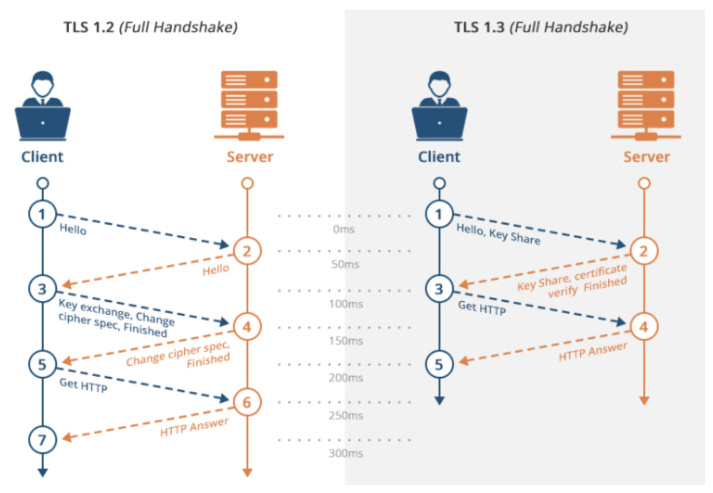
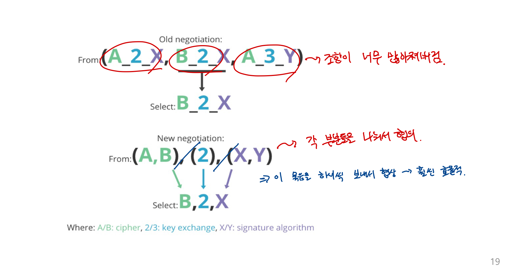
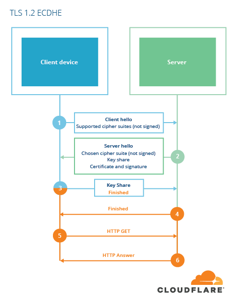
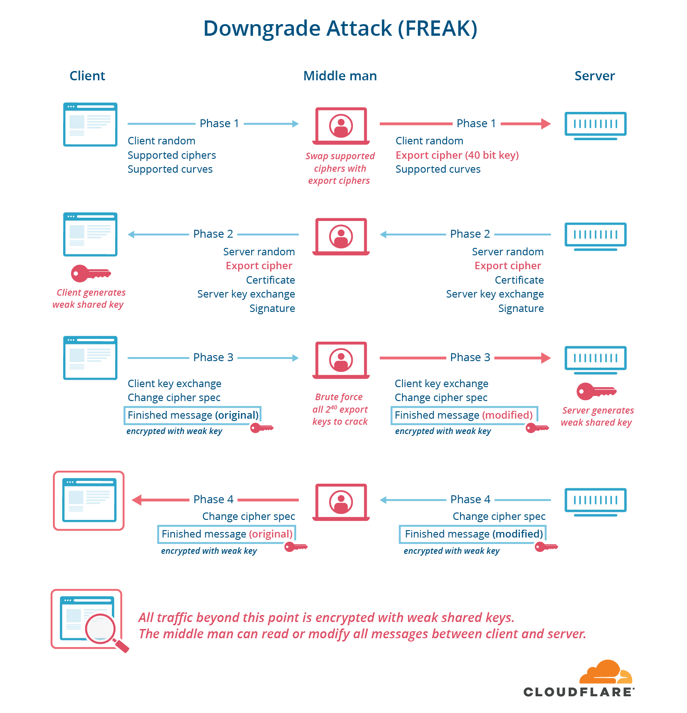
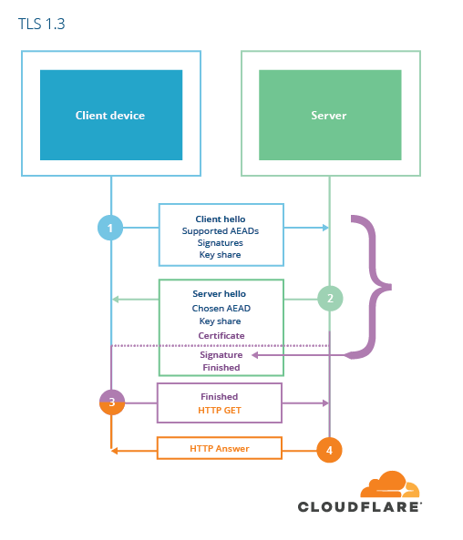

# TLS Handshake

넷보 시험을 복습도 할겸 중요한 것중 하나인 TLS HandShake에 대해서 알아보겠습니다.

## TLS(Transport Layer Secret)

TLS는 개인 정보 보호 및 안전한 전송을 위해 암호화하는 프로토콜이다. TCP와 UDP와 같은 일반적인 인터넷 통신에 안전한 계층을 추가하는 방식이고, 이 기술을 구현하기 위해 웹 서버에 설치하는 것이 SSL/TLS 인증서다.

  
  SSL/TLS가 적용되는 구조
   

그림에서와 같이 SSL/TSL 인증서는 Transport Layer에서 적용되는 보안 프로토콜이다. TCP 위에 존재하며, 이 프로토콜은 CA와 PKI를 이용한다.

### TLS를 사용하는 이유

우리가 통신을 할때, 대칭 키를 이용하여 암호화를 하는데, 이 대칭키를 나눌 때 비대칭 키 암호화를 사용해서 나눈다. 그렇다면 어떻게 비대칭 키 암호화를 사용하여 안전하게 나눌 수 있을까? 이 생각에서 시작된 프로토콜이다.

즉, 어떻게 비대칭키를 안전하게 나누어서 사용할지 정의하는 프로토콜이다. CIA를 만족하기 위한 프로토콜.

#### 깨알 복습

- 대칭 키, 비대칭 키를 섞어서 사용하는 이유? : 비대칭 키는 주고받는게 정말 안전하지만, 매번 사용하기에는 정말 느리다. 대칭키는 빠르지만 주고 받는 것이 안전하지 못하다. 그래서 이 장점을 섞기 위해 대칭키를 안전하게 나누기 위해 비대칭 키를 이용하는 것이다.

## TLS 메커니즘

TLS는 이 3가지 메커니즘을 기반으로 하고 있다. 이 3가지 프로토콜이 TLS의 가장 기본적인 동작이다.

1. Cipher Suite Negotiation

   - Cipher Suite란, 암호화 Fucntions and Techinques의 모음이다.
   - Cipher Suite에 들어 있는 정보들 : 키 교환 알고리즘(DH), 인증 알고리즘(RSA), 데이터 암호화 알고리즘(DES, 3DES, AES), 데이터 무결성 알고리즘(SHA 시리즈)

  
   
  Cipher Suite의 구성

2. Authentication

   - 인증서로, 두 가지 방식의 서명에 기반을 하고 있다.
   - 올바른 개인키를 사용하여 올바른 pre-master secret을 사용할 수 있게끔 보장하기 위한 것이다.
   - RSA : 소인수분해의 어려움을 기반으로 하고 있는 공개 키 시스템
   - ECDSA : 타원곡선 기반으로 만든 디지털 서명

3. Key Exchange

   - RSA 교환과, DH Key교환을 사용하고 있었으나, TLS 1.3부터는 DH Key 교환만 사용하고 있다.
   - RSA, DH 모두 PFS를 만족하지 못하지만, `Ephemeral DH Key Exchange`를 사용하면 세션마다 다른 pre-master secret을 교환하기 때문에 PFS를 만족할 수 있다.
   - 안전하게 pre-master secret만 전달되면, 그 다음부터는 서버와 클라이언트가 동일한 키로 통신할 수 있게 된다.
   - Finished : K값을 구했으니, K값으로 해싱해서 보낸다는 것을 확인시켜주는 것

## HandShake 과정

  
   
  TLS HandShake 1

이 과정을 조금 더 직관적으로 나타내면 아래 그림과 같다.

  
   
  TLS HandShake 2

TLS HandShake는 그림에서와 같이 TCP 3 Way HandShake(파란색)를 통해 TCP 연결이 열린 후에 발생한다.

1. 클라이언트가 서버에 패킷을 전송하면서 HandShake를 시작합니다. 클라이언트가 사용 가능한 Cipher Suite 목록, Session ID, SSL Protocol Version, Random Byte 등을 전달합니다. 아래 사진을 보면 Client가 사용 가능한 Cipher Suite를 Server에 제공하는 것을 볼 수 있습니다.

  
   
  Clienthello Packet

2. Clinet가 보내온 패킷에서 Cipher Suite 중 하나를 선택한 뒤에, Client에게 이를 알리는 Server Hello Packet을 보냅니다.또한 자신의 SSL Protocl Version 및 인증서도 같이 보냅니다. 아래 사진을 보면 아까는 여러개 였던 Cipher Suite가 하나로 선택된 것을 볼 수 있습니다.

  
   
  Serverhello Packet

3. Server가 보낸 SSL 인증서를 Client가 검증합니다. 인증서 내부에는 Server가 발행한 공개키가 들어 있습니다. 따라서 Client는 Server가 보낸 SSL 인증서를 CA 공개키를 사용하여 복호화 합니다.(서버의 인증서는 당연히 CA 개인키로 암호화 되어있을 것입니다.) 복호화 함으로써 인증서를 검증하게 되는 것입니다.

  
   
  Certificate Packet

4. 클라이언트는 `예비 마스터 암호(Pre-master Secret)` 이라고 하는 무작위 바이트 문자열을 전송합니다. 아까 받은 서버 인증서의 공개키로 암호화하여 전송합니다. 서버와 클라이언트는 클라이언트 무작위 바이트, 서버 무작위 바이트, 그리고 예비 마스터 암호를 이용해 세션 키를 생성합니다. 모두 같은 결과가 나와야 합니다.

5. 클라이언트는 암호 사양 변경 알림을 서버에 보내 클아이언트가 메세지를 암호화하는데 새로운 세션 키 사용을 시작함을 나타내고, 클라이언트 완료 메세지를 보냅니다.

6. 서버는 암호 사양 변경을 수신하여 세션 키를 사용하기 시작하며 대칭 키 암호화로 전환합니다. 서버는 클라이언트에 서버 완료 메세지를 보냅니다.

이러면 TLS HandShake가 완료되어, 설정한 보안 채널을 통해 데이터를 암호화하여 안전하게 교환할 수 있게 됩니다.

## TLS 1.3

위에 예시에서 사용한 것들은 모두 TLS 1.2입니다.

현재는 TLS 1.3 프로토콜이 정의되었으며, TLS 1.2와 비교하여 더 빠른 속도와 보안 강화 및 성능 향상 등의 기능을 제공하게 되었는데, 차이점에 대해서 알아봅시다.

1. DHE 나 ECDHE 만 사용하게 되면서, `pre-master secret` 을 전송하지 않게 되었습니다. 또한, PFS를 보장하게 되었습니다.
2. Handshake에서 Negotiations 횟수를 줄이게 되었습니다.
3. Cipher Suite에서 사용할 수 있는 알고리즘 개수를 줄였습니다.
4. 전체 Handshake에 서명이 사용되도록 변경하였습니다.(원래는 Server hello를 보낼때만 서명을 했습니다)

크게 중요한 것은 이 네 가지 정도가 되겠습니다. 그림을 보면서 자세히 알아봅시다.

### HandShake RTT 단축

  
   
  TLS 1.2와 1.3의 비교

- TLS 1.3은 (EC)DHE 를 키 교환 알고리즘으로 사용하게 되며, 추후에 세션에 재통신 하게 되는 경우 PSK(Pre Shared Key)를 사용하기 때문에 키 교환 알고리즘 협상이 없기 때문에 1 RTT 만에 키 교환이 가능하게 됩니다.

### 암호화 모음 관리 단순화

  
   
  TLS 1.3 Negotiation

- TLS 1.3 처럼 모든 경우를 조합하여 보내는 것이 아니라, 암호화, 키 교환, 사인 알고리즘 별로 묶어서 보냄으로써 나눠서 선택할 수 있도록 합니다.
- 모든 경우를 조합하여 보내는 것보다 훨씬 효율적입니다.

### Signature

  
   
  TLS 1.2 ECDHE

TLS 1.2의 ECDHE를 이용한 HandShake 과정인데, 이 과정 설계 자체에 허점이 존재합니다. 어떤 허점일까요!?

  
   
  Freak

바로 Downgrade Attack(FREAK) 입니다. 이게 무엇이냐면, ClientHello에 서명을 하지 않기 때문에 중간자 공격으로 신호를 가로 챈다음에, 서버에 약한 암호화 알고리즘을 사용하도록 헤더를 변경하여 보냅니다. 이는 서버나 클라이언트가 눈치 챌 수가 없습니다.

이때, 약한 암호화란, 수출용 암호화로써 예전에는 낮은 보안등급 암호화가 수출용 소프트웨어에 있었고, 이는 brute-force로 충분히 뚫을 수 있는 정도의 암호화 였습니다.

고로, 중간자가 결국 brute-force로 encrpyted 된 메세지를 읽거나 수정할 수 있게 되는 것입니다.

이것은 설계 자체의 문제이므로, TLS 1.3 에서는 이러한 공격을 막기 위해 모든 과정에 서명을 넣도록 하였습니다.

  
   
  TLS 1.3 ECDHE

이렇게 하면 클라이언트와 서버는 서명을 비교하여 데이터를 올바르게 잘 받았는지 확인할 수 있게 됩니다. 고로 중간자 공격이 불가능해지는 것입니다.

# Reference

홍익대학교 이윤규 교수님의 네트워크 보안 강의 및 PDF

https://www.cloudflare.com/ko-kr/learning/ssl/what-happens-in-a-tls-handshake/

https://www.itworld.co.kr/news/113007

https://aws-hyoh.tistory.com/entry/HTTPS-통신과정-쉽게-이해하기-3SSL-Handshake

https://tlseminar.github.io/first-few-milliseconds/
