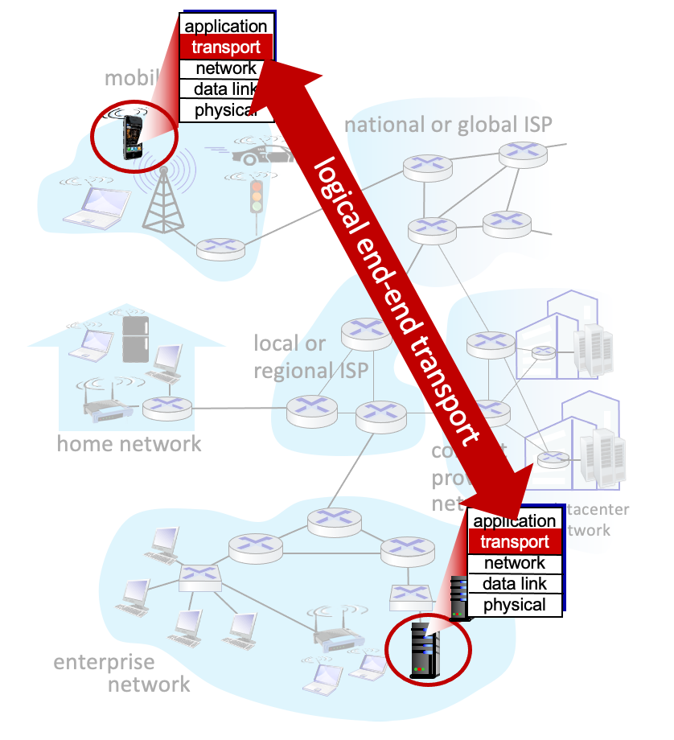
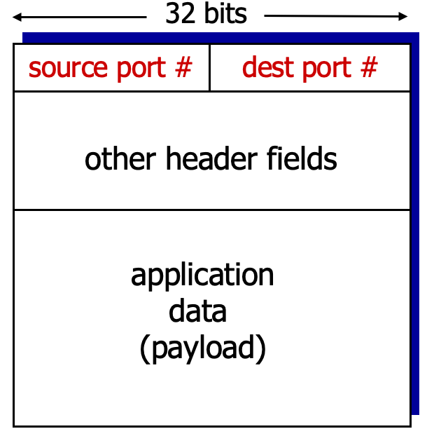

<!-- @format -->

# Transport Layer

## Transport Layer란

    

application layer와 network layer의 사이에 존재하는 계층이다.

application layer의 아래 계층으로, 서로 다른 호스트에서 동작하는 프로세스들 간의 `논리적 통신` 을 제공한다.

또한 transport layer protocol은 network router가 아닌 end-system 에서만 사용된다.

> 논리적 통신이란, application의 관점에서 보면 프로세스들이 동작하는 host들 끼리 직접 연결된 것 처럼 보인다는 것을 의미한다.

 

## Transport Layer의 Sender

sender의 transport layer에선, socket에서 받은 `message`를 transport layer packet인 `segment`로 변환한다.

 

## Transport Layer의 Receiver

receiver의 transport layer에선, network layer로부터 받은 `segment`를 알맞은 socket에 전달해준다.

 

# Multiplexing

`multiplexing` 이란 sender host에서 시행되는데, `socket` 들로부터 받은 data를 모아 `segment`로 변환하고 하위계층인 network layer로 전달하는 작업을 의미한다.

 

# Demultiplexing

`demultiplexing` 이란 receiver host에서 시행되는데, `segment`의 데이터를 적절한 socket에 전달하는 작업을 의미한다.

 

# 어떻게 demultiplexing을 하는가?

    

> receiver 입장에서 보았을 때, network layer에서 받은 segment의 데이터를 어떤 socket에 넣어주어야 하는지 어떻게 알 수 있을까?

처음에 `multiplexing` 을 할 때 추가하였던, transport layer header안의 정보를 이용하면 알 수 있다.

header 내부의 데이터엔 src port#, dst port# 와 같은 정보가 들어있기 때문에, 이러한 정보를 읽어서 적절한 socket에 segment의 데이터를 넣어줄 수 있다.

 

# TCP와 UDP의 demultiplexing 방식 차이

### TCP

TCP는 1:1로 연결을 유지하여 통신하는 connection-oriented 프로토콜 이다.

TCP는 계속하여 연결되어 있으므로, sender의 정보도 중요하다.

TCP socket은 segment header 내부에 존재하는 다음 4개의 값을 이용하여 식별된다.

1. src IP
2. src port number
3. dst IP
4. dst port number

이것을 `connection-oriented demux` 라고 한다.

e. g)  
2개의 segment가 있을 때, dst IP, dst port # 의 값은 같지만, src IP, src port # 의 값이 다르다면, 다른 TCP socket을 의미하므로 데이터를 전달받는 프로세스가 각각 다를 것이다.

### UDP

UDP는 연결을 유지하지 않는 connectionless 프로토콜 이다.

따라서 UDP는 TCP와는 다르게 sender의 정보가 중요하지 않다.

그러므로 UDP는 mux를 할때에도 src IP, src port number를 header에 추가하지 않는다.

UDP socket은 segment header 내부에 존재하는 다음 2개의 값으로 식별된다.

1. dst IP
2. dst port number

이것을 `connectionless demux` 라고 한다.

### Web Server

Web Server는 단 한개의 프로세스만을 사용한다. ~~8080 port~~

그런데 어떻게 사용자마다 다른 화면, 다른 응답을 줄 수 있을까?

Web Server는 각 사용자마다 thread를 생성하여 대응한다.

이렇게 사용자마다 생성된(할당된) thread들이 각각의 socket 역할을 하는 것이다.

그러므로 한개의 프로세스만을 사용하더라도 사용자들마다 다른 응답을 줄 수 있다.
